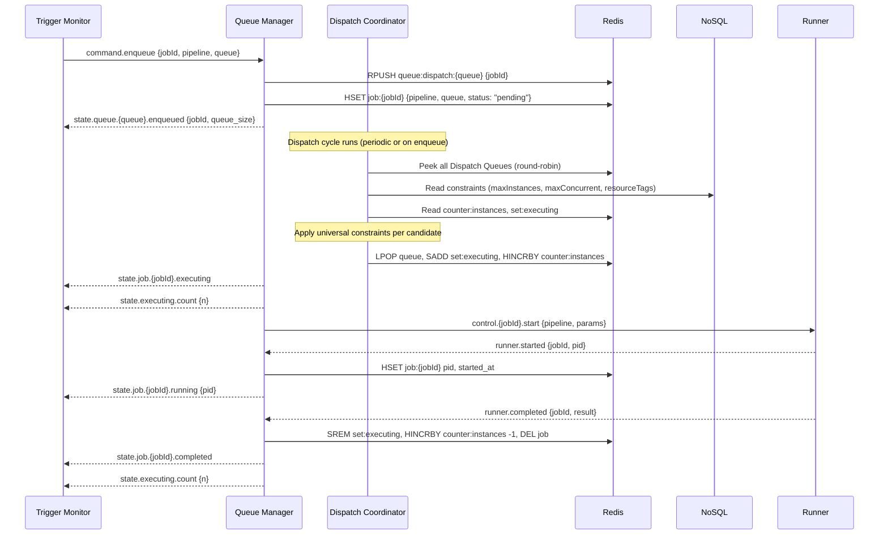
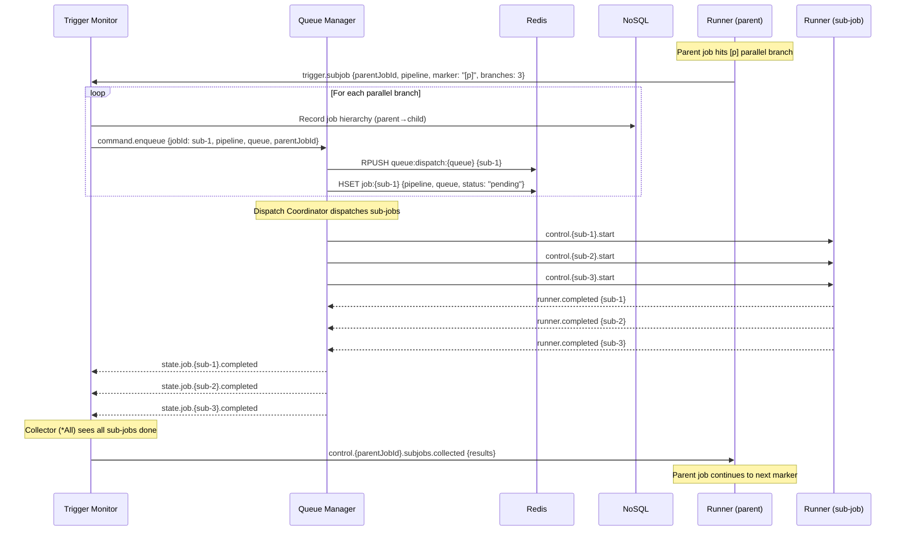
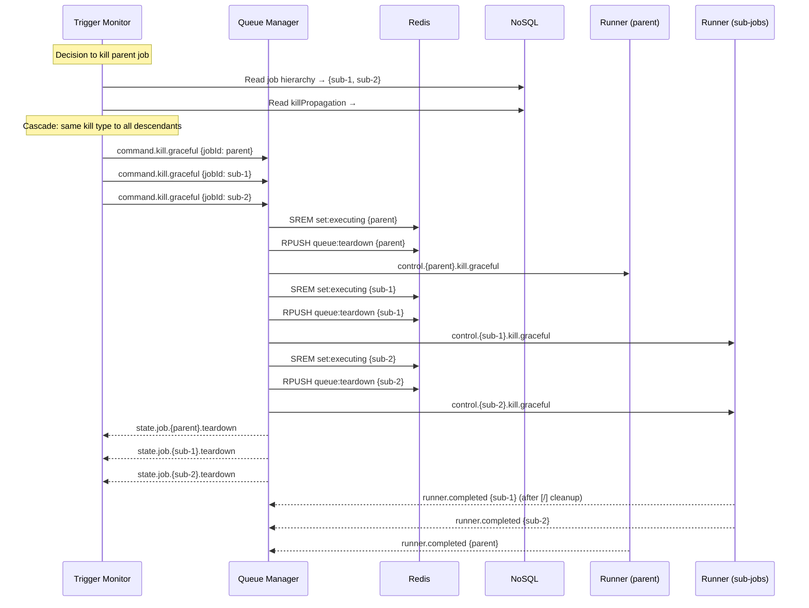
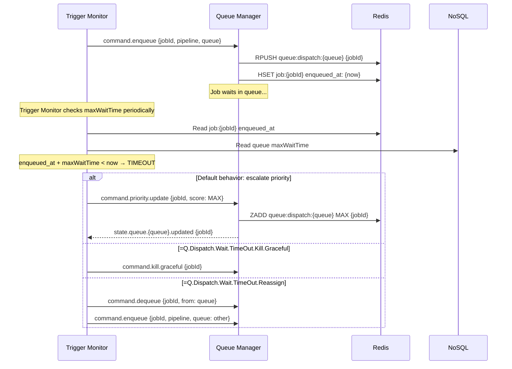
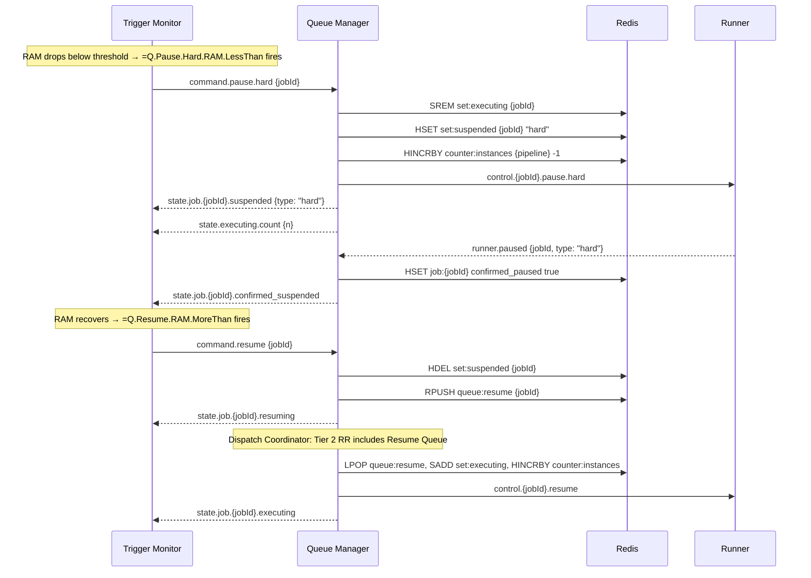

# Queue Manager Architecture

<!-- @concepts/pipelines/queue -->
<!-- @Q -->

The Queue Manager is responsible for dispatching triggered pipelines to execution. It manages multiple Dispatch Queues, lifecycle state transitions (pause, resume, kill), and cross-queue constraint enforcement via the Dispatch Coordinator.

## Infrastructure

The Queue Manager runs as a Rust service backed by two external services:

| Service | Role | License |
|---------|------|---------|
| **NATS JetStream** | Messaging — signals, events, inter-service communication | Apache 2.0 |
| **Redis / Valkey** | State — queue ordering, counters, sets, atomic dispatch | Valkey: BSD 3-Clause |

NATS handles communication. Redis handles runtime state. **NoSQL** stores queue definitions and job hierarchy. The Queue Manager logic (Dispatch Coordinator) runs in Rust.

### Storage Split

| Data | Store | Reason |
|------|-------|--------|
| Queue ordering (LIST/ZSET), Executing/Suspended Sets | Redis | Fast atomic operations, microsecond latency |
| Job runtime state (status, timestamps, pid) | Redis | Frequently read/written by dispatch loop |
| Queue definitions (`{Q}` schema fields) | NoSQL | Immutable at runtime, loaded at startup |
| Job hierarchy (parent→children) | NoSQL | Only read by Trigger Monitor for kill propagation |

### Host-Based Dispatch

Each queue has a `.host` field (default: `"localhost"`). **1 queue = 1 host** — the Queue Manager routes dispatch signals via NATS to the Runner on the target host. Offloading work to another host means switching queues (via `=Q.Reassign` or `=Q.Dispatch.Wait.TimeOut.Reassign`).

## Containers in Redis

### Dispatch Queues (one per `{Q}` definition)

Each `{Q}` definition creates a Dispatch Queue. The Redis data structure depends on the queue's strategy:

| Strategy | Redis Structure | Enqueue | Next Candidate |
|----------|-----------------|---------|----------------|
| FIFO | LIST | `RPUSH` | `LINDEX 0` (peek), `LPOP` (dispatch) |
| LIFO | LIST | `RPUSH` | `LINDEX -1` (peek), `RPOP` (dispatch) |
| Priority | SORTED SET | `ZADD` with priority score | `ZREVRANGE 0 0` (peek), `ZPOPMAX` (dispatch) |

```
"queue:dispatch:DefaultQueue"     LIST   [jobA, jobB, jobC]
"queue:dispatch:GPUQueue"         LIST   [jobD, jobE]
"queue:dispatch:BatchQueue"       ZSET   {jobF:99, jobG:50, jobH:10}
```

### Resume Queue

Pipelines moving from Suspended Set back to execution. Always FIFO (resume in unpause order). Participates as an equal peer in Tier 2 round-robin dispatch.

```
"queue:resume"                    LIST   [jobX, jobY]
```

### Teardown Queue

Pipelines that received a graceful kill. Waiting to finish current work and run `[/]` cleanup. Always FIFO.

```
"queue:teardown"                  LIST   [jobZ]
```

### Executing Set

Pipelines currently running. Used for global constraint checks (maxInstances, maxConcurrent).

```
"set:executing"                   SET    {jobA, jobD, jobF}
```

### Suspended Set

Pipelines paused (soft or hard). Tracks pause type for resource accounting.

```
"set:suspended"                   HASH   {jobX: "soft", jobY: "hard"}
```

### Supporting State

```
"counter:instances"               HASH   {ProcessData: 3, GPU.Render: 1}
```

### job:{jobId} (HASH)

```
pipeline:           string    — pipeline name
queue:              string    — assigned Dispatch Queue
status:             string    — current #QueueState variant
params:             string    — serialized pipeline input parameters
enqueued_at:        string    — ISO timestamp
dispatched_at:      string?   — ISO timestamp
started_at:         string?   — ISO timestamp
suspended_at:       string?   — ISO timestamp
pid:                int?      — OS process ID (from Runner ACK)
confirmed_paused:   bool?     — Runner confirmed suspension
```

Job hierarchy (parentJobId, children) lives ONLY in NoSQL — not in Redis. For kill propagation, the Trigger Monitor reads the hierarchy from NoSQL, pre-computes the full descendant list, and sends individual `command.kill` signals for each.

## NoSQL Schema (definitions)

### Queue Definition (from `{Q} #Queue:Name`)

```
Stored at: %Queue.DispatchQueue:Name

strategy:           #QueueStrategy     — FIFO | LIFO | Priority
host:               #String            — target host (default: "localhost")
maxInstances:       int                — queue-level default
maxConcurrent:      int                — queue-level default
resourceTags:       #Array:ResourceTag — default resource tags
killPropagation:    #KillPropagation   — Cascade | Downgrade
maxWaitTime:        string             — max queue wait time
description:        string             — human-readable
controls:           [Q] nested         — =Q.Pause.*, =Q.Resume.*, =Q.Kill.*
```

### Job Hierarchy (runtime tree)

```
Stored as: job tree rooted at pipeline instance

{jobId}
├── pipeline:       string             — pipeline name
├── parentJobId:    string?            — parent (null for root)
├── children:       [jobId, ...]       — sub-jobs
├── marker:         string             — [r], [p], [b], [?]
└── status:         #QueueState        — current state
```

Only the Trigger Monitor reads the hierarchy — to pre-compute kill lists and manage collector logic (`*First`/`*Nth`/`*All`). The Queue Manager never queries NoSQL for hierarchy data.

## Dispatch Coordinator

The Dispatch Coordinator is the unified dispatch logic. It runs as an **atomic Redis Lua script** to prevent race conditions between constraint checks and state mutations.

### Two-Tier Round-Robin Dispatch

No queue has absolute priority. The Dispatch Coordinator uses a two-tier round-robin:

```
Tier 1 RR — User Dispatch Queues:
   ┌─ Queue A (FIFO)
   ├─ Queue B (LIFO)
   └─ Queue C (Priority)
       │ round-robin picks one candidate
       ▼

Tier 2 RR — All peers, fair:
   ┌─ Dispatch candidate (from Tier 1)
   ├─ Resume Queue
   └─ Teardown Queue
       │ round-robin between all three
       ▼
Dispatch Constraints → Executing Set
```

Tier 1 round-robins across user-defined Dispatch Queues to pick one candidate. Tier 2 round-robins that candidate against the Resume and Teardown queues — all are equal participants.

### Faithfulness Principle

The Dispatch Coordinator never overrides or reorders a queue's internal strategy. If GPUQueue (LIFO) says D goes before E, the Dispatch Coordinator will never dispatch E before D. Between queues there is no imposed ordering.

### Constraint Checks (per candidate)

Before dispatching any candidate, the Lua script checks:

1. **maxInstances** — `HGET counter:instances {pipeline}` vs pipeline's limit
2. **maxConcurrent** — `SCARD set:executing` vs pipeline's limit
3. **resourceTag** — resource exclusion (e.g., only one `#GPU`-tagged pipeline at a time)

If a candidate fails constraints, it remains in its queue and the Dispatch Coordinator moves to the next candidate from the next queue.

### Atomic Dispatch Operation

When a candidate passes all constraints:

1. Pop candidate from its queue
2. `SADD set:executing {jobId}`
3. `HINCRBY counter:instances {pipeline} 1`
4. Return job ID for NATS dispatch signal

All steps execute atomically within the Lua script.

## Reactive Signal Table

`f(signal, state) → (new_state, output_signals)`

Every signal is a command from the Trigger Monitor (or ACK from Runner). The Queue Manager just obeys.

### command.enqueue

```
Input:  {jobId, pipeline, queue, params, priority?, parentJobId?, marker?}

State Write:
    IF strategy == Priority:
        ZADD queue:dispatch:{queue} {priority} {jobId}
    ELSE:
        RPUSH queue:dispatch:{queue} {jobId}
    HSET job:{jobId} {pipeline, queue, status: "pending", enqueued_at}

Output: state.queue.{queue}.enqueued {jobId, pipeline, queue_size}
```

### command.dispatch

```
Input:  {jobId}

State Write:
    pop {jobId} from its queue
    SADD set:executing {jobId}
    HINCRBY counter:instances {pipeline} 1
    HSET job:{jobId} status "executing" dispatched_at {now}

Output: state.job.{jobId}.executing {pipeline, queue}
        state.executing.count {n}
        control.{jobId}.start → Runner
```

### command.pause.soft

```
Input:  {jobId}

State Write:
    SREM set:executing {jobId}
    HSET set:suspended {jobId} "soft"
    HINCRBY counter:instances {pipeline} -1
    HSET job:{jobId} status "suspended.soft" suspended_at {now}

Output: state.job.{jobId}.suspended {type: "soft"}
        state.executing.count {n}
        control.{jobId}.pause.soft → Runner
```

### command.pause.hard

```
Input:  {jobId}

State Write:
    SREM set:executing {jobId}
    HSET set:suspended {jobId} "hard"
    HINCRBY counter:instances {pipeline} -1
    HSET job:{jobId} status "suspended.hard" suspended_at {now}

Output: state.job.{jobId}.suspended {type: "hard"}
        state.executing.count {n}
        control.{jobId}.pause.hard → Runner
```

### command.resume

```
Input:  {jobId}

State Write:
    HDEL set:suspended {jobId}
    RPUSH queue:resume {jobId}
    HSET job:{jobId} status "resuming"

Output: state.job.{jobId}.resuming
        state.queue.resume.size {n}
```

### command.kill.graceful

```
Input:  {jobId}

State Write:
    SREM set:executing {jobId}
    RPUSH queue:teardown {jobId}
    HINCRBY counter:instances {pipeline} -1
    HSET job:{jobId} status "teardown"

Output: state.job.{jobId}.teardown
        state.executing.count {n}
        control.{jobId}.kill.graceful → Runner
```

### command.kill.hard

```
Input:  {jobId}

State Write:
    SREM set:executing {jobId}
    HINCRBY counter:instances {pipeline} -1
    DEL job:{jobId}

Output: state.job.{jobId}.killed
        state.executing.count {n}
        control.{jobId}.kill.hard → Runner
```

### command.priority.update

```
Input:  {jobId, score}

State Write:
    ZADD queue:dispatch:{queue} {score} {jobId}

Output: state.queue.{queue}.updated {jobId, new_score}
```

### command.dequeue

```
Input:  {jobId, queue}

State Write:
    LREM/ZREM queue:dispatch:{queue} {jobId}
    DEL job:{jobId}

Output: state.queue.{queue}.dequeued {jobId}
```

Used by `=Q.Dispatch.Wait.TimeOut.Reassign` — Trigger Monitor sends `command.dequeue` followed by `command.enqueue` to move a job between queues.

### command.queue.register

```
Input:  {name, strategy}

State Write:
    SADD queues:registered {name}
    Read full definition from NoSQL (%Queue.DispatchQueue:{name})
    Create Redis container (LIST or ZSET based on strategy)

Output: state.queue.{name}.registered {strategy}
```

### runner.started (ACK)

```
Input:  {jobId, pid}

State Write:
    HSET job:{jobId} pid {pid} started_at {now}

Output: state.job.{jobId}.running {pipeline, pid}
```

### runner.paused (ACK)

```
Input:  {jobId, type}

State Write:
    HSET job:{jobId} confirmed_paused true

Output: state.job.{jobId}.confirmed_suspended {type}
```

### runner.completed

```
Input:  {jobId, result}

State Write:
    SREM set:executing {jobId}
    HINCRBY counter:instances {pipeline} -1
    DEL job:{jobId}

Output: state.job.{jobId}.completed {pipeline, result}
        state.executing.count {n}
```

### runner.failed

```
Input:  {jobId, error}

State Write:
    SREM set:executing {jobId}
    HINCRBY counter:instances {pipeline} -1
    DEL job:{jobId}

Output: state.job.{jobId}.failed {pipeline, error}
        state.executing.count {n}
```

## Signal Data Payloads

### Command Signals (Trigger Monitor → Queue Manager)

```
command.enqueue
{
    jobId:          string    — unique job identifier
    pipeline:       string    — pipeline name (e.g., "GPU.RenderFrames")
    queue:          string    — target Dispatch Queue name
    params:         serial    — pipeline input parameters
    priority:       int?      — priority score (Priority queues only)
    parentJobId:    string?   — parent job ID (for sub-jobs)
    marker:         string?   — originating marker: [r], [p], [b], [?]
}

command.dispatch
{
    jobId:          string    — job to dispatch from queue to Executing Set
}

command.pause.soft  { jobId: string }
command.pause.hard  { jobId: string }
command.resume      { jobId: string }
command.kill.graceful { jobId: string }
command.kill.hard   { jobId: string }

command.priority.update
{
    jobId:          string    — job to reprioritize
    score:          int       — new priority score
}

command.dequeue
{
    jobId:          string    — job to remove from queue
    queue:          string    — source queue
}

command.queue.register
{
    name:           string    — queue name (e.g., "GPUQueue")
    strategy:       string    — FIFO | LIFO | Priority
    Note: full definition read from NoSQL at registration time
}

command.drain   { queue: string }
command.flush   { queue: string }
```

### State Signals (Queue Manager → Trigger Monitor)

```
state.job.{jobId}.executing     { jobId, pipeline, queue }
state.job.{jobId}.suspended     { jobId, pipeline, type: "soft"|"hard" }
state.job.{jobId}.resuming      { jobId, pipeline }
state.job.{jobId}.teardown      { jobId, pipeline }
state.job.{jobId}.completed     { jobId, pipeline, result? }
state.job.{jobId}.failed        { jobId, pipeline, error }
state.job.{jobId}.killed        { jobId, pipeline }
state.job.{jobId}.running       { jobId, pipeline, pid }
state.job.{jobId}.confirmed_suspended { jobId, type: "soft"|"hard" }

state.executing.count           { count, members: string[] }

state.queue.{queue}.enqueued    { jobId, pipeline, queue_size }
state.queue.{queue}.dequeued    { jobId }
state.queue.{queue}.updated     { jobId, new_score }
state.queue.{queue}.registered  { name, strategy }
state.queue.resume.size         { count }
```

### Control Signals (Queue Manager → Runner)

```
control.{jobId}.start           { jobId, pipeline, params }
control.{jobId}.pause.soft      { jobId }
control.{jobId}.pause.hard      { jobId }
control.{jobId}.kill.graceful   { jobId }
control.{jobId}.kill.hard       { jobId }
```

### Runner Signals (Runner → Trigger Monitor)

```
trigger.subjob
{
    parentJobId:    string    — parent job requesting sub-jobs
    pipeline:       string    — pipeline name for sub-jobs
    marker:         string    — [r], [p], [b], [?]
    branches:       int       — number of parallel branches (for [p])
    params:         serial[]  — parameters for each branch
}
```

### ACK Signals (Runner → Queue Manager)

```
runner.started      { jobId, pid }
runner.completed    { jobId, result? }
runner.failed       { jobId, error }
runner.paused       { jobId, type: "soft"|"hard" }
```

## NATS Subject Namespace

All inter-service communication flows through NATS subjects:

### Trigger Events (Trigger Monitor → Queue Manager)

```
polyglot.trigger.fire.{pipeline}         — trigger condition met, enqueue pipeline
```

### Dispatch Events (Queue Manager → Runner)

```
polyglot.queue.dispatched.{jobId}        — pipeline dispatched, start executing
```

### Lifecycle Control (Queue Manager → Runner)

```
polyglot.queue.control.{jobId}.pause.soft     — finish current work, then suspend
polyglot.queue.control.{jobId}.pause.hard     — suspend immediately
polyglot.queue.control.{jobId}.resume         — resume execution
polyglot.queue.control.{jobId}.kill.graceful  — finish work + [/] cleanup, then terminate
polyglot.queue.control.{jobId}.kill.hard      — terminate immediately
```

### Runner Acknowledgments (Runner → Queue Manager)

```
polyglot.runner.started.{jobId}          — pipeline is now executing
polyglot.runner.completed.{jobId}        — pipeline finished successfully
polyglot.runner.failed.{jobId}           — pipeline failed
polyglot.runner.paused.{jobId}           — pipeline suspended (ACK)
```

### Resource Monitoring (Resource Monitor → Queue Manager)

```
polyglot.resource.cpu                    — CPU usage metrics
polyglot.resource.ram                    — RAM availability metrics
```

### Pipeline State (Queue Manager → any subscriber)

```
polyglot.state.{pipeline}.{event}        — state changes for cross-pipeline conditions
```

## End-to-End Flow

### Normal Execution

```
1. Trigger Monitor detects event
   → NATS: publish "polyglot.trigger.fire.ProcessData"

2. Queue Manager receives trigger
   → Redis: RPUSH "queue:dispatch:DefaultQueue" "job:001"
   → Redis: HSET "job:job:001" pipeline ProcessData queue DefaultQueue ...

3. Dispatch Coordinator runs (Lua script)
   → Tier 1 RR: pick candidate from Dispatch Queues → job:001 from DefaultQueue
   → Tier 2 RR: round-robin between candidate, Resume Queue (empty), Teardown Queue (empty) → job:001
   → Check constraints → all clear
   → Redis: LPOP, SADD set:executing, HINCRBY counter:instances
   → NATS: publish "polyglot.queue.dispatched.job:001"

4. Runner starts pipeline
   → NATS: publish "polyglot.runner.started.job:001"
   → NATS: publish "polyglot.state.ProcessData.running"

5. Pipeline completes
   → NATS: publish "polyglot.runner.completed.job:001"
   → Redis: SREM set:executing, HINCRBY counter:instances -1, DEL job:job:001
```

### Pause / Resume Flow

```
1. Resource Monitor: RAM drops below threshold
   → NATS: publish "polyglot.resource.ram" {available: 2800}

2. Queue Manager checks conditions → matches =Q.Pause.Hard for job:001
   → NATS: publish "polyglot.queue.control.job:001.pause.hard"

3. Runner suspends process, frees CPU+RAM
   → NATS: publish "polyglot.runner.paused.job:001"

4. Queue Manager updates state
   → Redis: SREM set:executing job:001
   → Redis: HSET set:suspended job:001 "hard"
   → Redis: HINCRBY counter:instances ProcessData -1

5. RAM recovers above threshold
   → NATS: publish "polyglot.resource.ram" {available: 5500}

6. Queue Manager checks resume conditions → matches =Q.Resume
   → Redis: HDEL set:suspended job:001
   → Redis: RPUSH queue:resume job:001

7. Dispatch Coordinator runs
   → Tier 2 RR includes Resume Queue → job:001
   → Constraints re-checked → all clear
   → Redis: LPOP queue:resume, SADD set:executing, HINCRBY counter:instances
   → NATS: publish "polyglot.queue.control.job:001.resume"
```

### Graceful Kill Flow

```
1. Execution time exceeds threshold
   → Queue Manager: matches =Q.Kill.Graceful for job:001

2. Queue Manager updates state
   → Redis: SREM set:executing job:001
   → Redis: RPUSH queue:teardown job:001
   → Redis: HINCRBY counter:instances ProcessData -1

3. Dispatch Coordinator dispatches from Teardown Queue
   → NATS: publish "polyglot.queue.control.job:001.kill.graceful"

4. Runner finishes current work, runs [/] cleanup, terminates
   → NATS: publish "polyglot.runner.completed.job:001"
   → Redis: LPOP queue:teardown, DEL job:job:001
```

### Sub-Job Flow

When a pipeline hits a `[p]`, `[r]`, or `[b]` marker, the Runner sends a `trigger.subjob` signal to the Trigger Monitor (not the Queue Manager). The Trigger Monitor creates job IDs, records parent→child relationships in NoSQL, and sends `command.enqueue` with `parentJobId` to the Queue Manager. Sub-jobs go through the normal dispatch flow.

```
1. Runner hits [p] marker in job:001
   → NATS: publish "trigger.subjob" {parentJobId: "job:001", pipeline, marker, params}

2. Trigger Monitor creates sub-job
   → NoSQL: record job:002 as child of job:001
   → NATS: publish "command.enqueue" {jobId: "job:002", pipeline, queue, parentJobId: "job:001"}

3. Queue Manager enqueues sub-job
   → Redis: RPUSH queue:dispatch:{queue} job:002
   → Redis: HSET job:job:002 {pipeline, queue, status: "pending", ...}

4. Normal dispatch flow — sub-jobs are treated like any other job
```

**Kill propagation:** When a parent job is killed, the Trigger Monitor pre-computes the full descendant list from NoSQL and sends individual `command.kill` signals for each descendant. The Queue Manager never queries NoSQL — it only processes the kill commands it receives. The queue's `#KillPropagation` setting (`#Cascade` or `#Downgrade`) determines whether sub-jobs receive the same kill type or a downgraded one.

## Properties

| Property | How Achieved |
|----------|--------------|
| **No decisions** | Queue Manager only reacts to command signals — never evaluates conditions |
| **Deterministic** | Same command + same Redis state = same outcome, always |
| **Reactive** | Every state change is triggered by a NATS signal |
| **Faithful** | Queue ordering is preserved — Dispatch Coordinator never reorders a queue's strategy |
| **Fair** | Two-tier RR: Tier 1 across Dispatch Queues, Tier 2 across Dispatch+Resume+Teardown — all peers |
| **Atomic** | Each signal handler runs as one Redis Lua script |
| **Testable** | Pure function — mock state, feed signal, assert output |
| **Replayable** | Record signal log → replay → exact same state transitions |
| **Optimizable** | Pre-compute, short-circuit, batch — all possible because deterministic |

## Precomputation

Because every signal handler is `f(signal, state) → (new_state, output_signals)` — a pure function — the Queue Manager can optimize without changing behavior.

### 1. Constraint Pre-evaluation

When a job is enqueued, the Queue Manager has all constraint data in Redis (`maxInstances`, `maxConcurrent`, `resourceTags`). It can precompute constraint results and cache them:

```
On enqueue(jobId):
    constraint_result = check(maxInstances, maxConcurrent, resourceTags)
    HSET job:{jobId} constraint_precomputed {pass|fail|reason}
```

When `command.dispatch` fires, the cached result is read instead of re-evaluated. Caches invalidate only when the Executing Set changes (job starts, completes, pauses, or resumes) — a known, finite set of events.

Invalidation signal: any `state.executing.*` broadcast → recompute constraints for all waiting candidates.

### 2. Short-circuit on State Broadcast

When the Queue Manager broadcasts `state.executing.count`, the Trigger Monitor can short-circuit constraint checks:

- If `executing_count < min(maxConcurrent)` across all waiting candidates → ALL pass maxConcurrent without per-candidate evaluation
- If `instances[pipeline] < maxInstances` for a pipeline → ALL instances of that pipeline pass without checking each one
- If no `#GPU` tagged job is executing → ALL GPU-tagged candidates pass resourceTag check

This turns O(n) constraint checks into O(1) for common cases.

### 3. Batch Dispatch

The Trigger Monitor's simulated dispatch builds a list of all dispatchable candidates in one round-robin pass. The Queue Manager processes the batch atomically:

```
f(command.dispatch_batch, state) → (new_state, output_signals)
─────────────────────────────────────────────────────────────────
Input:  command.dispatch_batch {jobIds: [job1, job2, job3]}

State Write (single Lua script):
    FOR each jobId in jobIds:
        pop jobId from its queue
        SADD set:executing {jobId}
        HINCRBY counter:instances {pipeline} 1
        HSET job:{jobId} status "executing" dispatched_at {now}

Output: state.dispatch_batch.completed {dispatched: [job1, job2, job3]}
        state.executing.count {n}
        control.{job1}.start → Runner
        control.{job2}.start → Runner
        control.{job3}.start → Runner
```

One Lua script, one atomic operation, N jobs dispatched. No intermediate state visible between individual dispatches.

### What Does NOT Precompute

The Queue Manager never precomputes **conditions** (RAM thresholds, CPU usage, time limits). Those live in `=Q.Pause.Hard.RAM.LessThan` and similar pipelines — the Trigger Monitor evaluates conditions and sends commands. The Queue Manager only precomputes state-derivable facts: constraint pass/fail, queue ordering, instance counts.

## Sequence Diagrams

### 1. Normal Dispatch Flow



### 2. Sub-job Creation (parallel branch)



### 3. Kill Propagation (Cascade)



### 4. Dispatch Wait Timeout



### 5. Pause / Resume Flow



## Design Rationale

### Why Redis for State

- **Atomic Lua scripts** — Dispatch Coordinator constraint checks and state mutations execute as one atomic operation. No race conditions.
- **Data structure fit** — LIST for FIFO/LIFO, SORTED SET for Priority, SET for Executing, HASH for Suspended and metadata.
- **Dynamic priority** — `ZADD` / `ZINCRBY` allow real-time reprioritization triggered by events.
- **Lightweight** — single binary, in-memory, microsecond latency.

### Why NATS for Messaging

- **Decoupled services** — Trigger Monitor, Queue Manager, Runner, Resource Monitor communicate only via NATS subjects.
- **Subject-based routing** — `polyglot.queue.control.{jobId}.pause.soft` routes precisely.
- **JetStream persistence** — critical events can be persisted for crash recovery and replay.
- **Embeddable** — NATS server can embed in the Polyglot runtime process.
- **Lightweight** — ~20MB, no external dependencies.

### Why This Split

| Concern | Wrong Service | Right Service |
|---------|--------------|---------------|
| Queue ordering | NATS (no ordering primitives) | Redis (LIST, ZSET) |
| Atomic constraint checks | NATS (no transactions) | Redis (Lua scripts) |
| Event signals | Redis (pub/sub is fire-and-forget) | NATS (persistent, routable) |
| Cross-service communication | Redis (not designed for this) | NATS (designed for this) |

Redis handles state and ordering. NATS handles communication. Neither duplicates the other's work.
