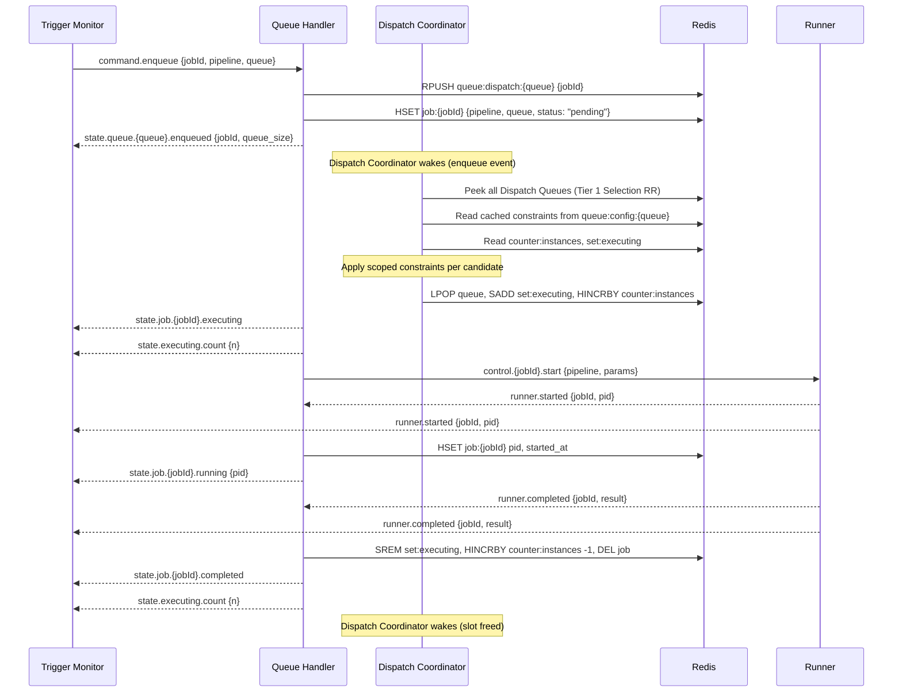
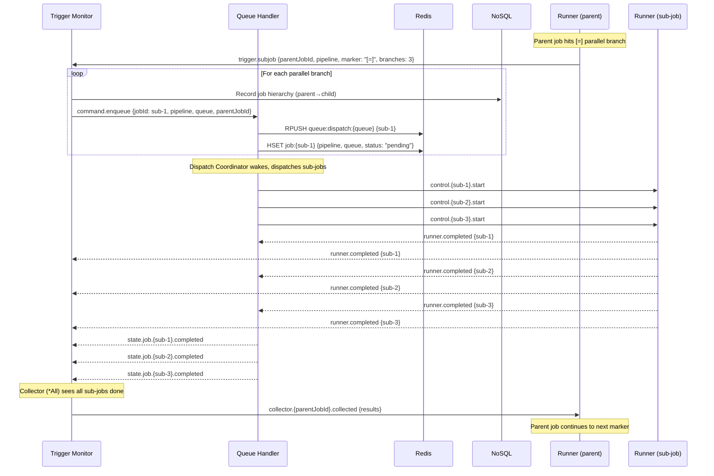
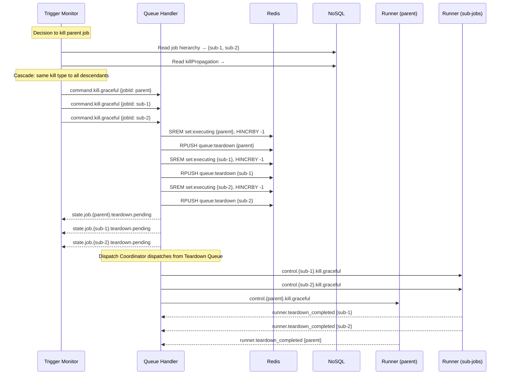
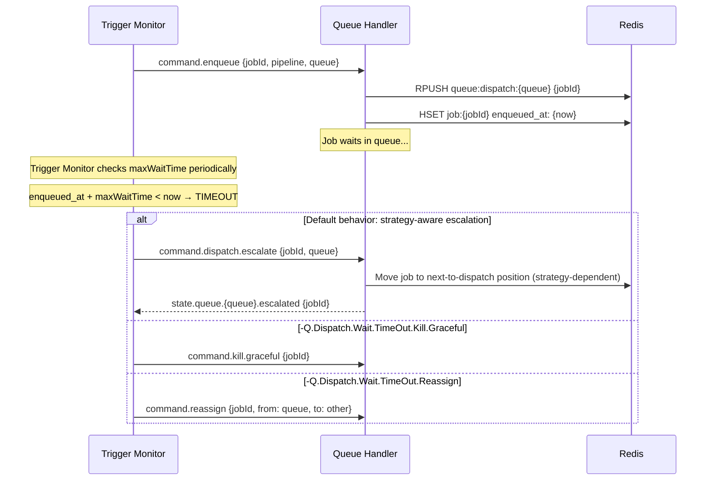
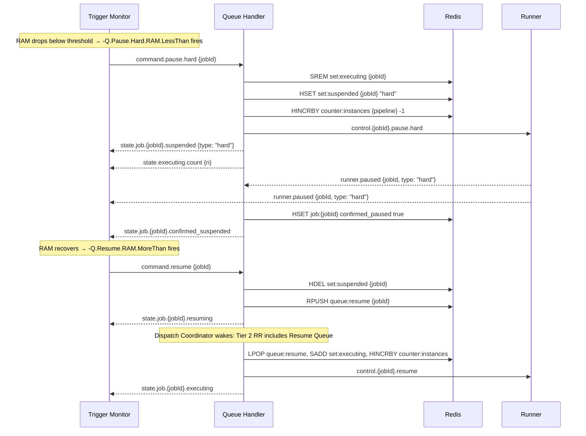

# Sequence Diagrams

<!-- @queue-manager/end-to-end-flow -->
<!-- @queue-manager/dispatch-coordinator -->

## 1. Normal Dispatch Flow

## 2. Sub-job Creation (parallel branch)

## 3. Kill Propagation (Cascade)

## 4. Dispatch Wait Timeout

## 5. Pause / Resume Flow

---

See also: [[end-to-end-flow]], [[dispatch-coordinator]], [[reactive-signals]]
