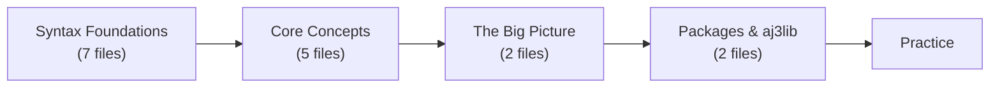

# Aljam3 Language Reference

<!-- @c:vision:Core Philosophy -->
<!-- @c:glossary:Aljam3 Code -->
<!-- @audit/README -->

Read the files below in order to learn how to write Aljam3 Code. The progression builds from syntax fundamentals through core concepts to the unified tree that connects everything.

## Phase 1: Syntax Foundations

| # | File | Covers |
|---|------|--------|
| 1 | line-structure.md | 3-space indentation, one expression per line |
| 2 | comments.md | [ ] and { } single-line, [ ]< multi-line |
| 3 | identifiers.md | Prefixes (@#=$!%), . fixed / : flexible separators |
| 4 | blocks.md | {X} definitions, [X] block elements, full registry |
| 4b | constructors.md | {$} constructor blocks — compile-time guaranteed values, no error surface |
| 5 | types/INDEX.md | Type system, RawString, #String, structs, enums (read INDEX then sub-pages) |
| 6 | operators.md | Assignment (<<, >>, <~, ~>), comparison, negation, range, arithmetic |
| 7 | io.md | < input / > output parameters, IO line patterns |

## Phase 2: Core Concepts

| # | File | Covers |
|---|------|--------|
| 8 | variable-lifecycle.md | Declared → Default → Final → Failed → Released |
| 9 | collections/INDEX.md | array, serial, = expand, * collect (read INDEX then sub-pages) |
| 10 | conditionals.md | [?] chains, exhaustiveness, logical operators, nesting |
| 11 | pipelines/INDEX.md | {-} mandatory structure: trigger, IO, queue, wrapper, execution (read INDEX then sub-pages) |
| 12 | errors.md | Error model, scoping, chain addressing, recovery |

## Phase 3: The Big Picture

| # | File | Covers |
|---|------|--------|
| 13 | data-is-trees.md | Everything is a tree — how all concepts connect via `%` |
| 14 | metadata.md | Full `%` tree field listings, live fields, access patterns |

## Phase 4: Packages & Standard Library

| # | File | Covers |
|---|------|--------|
| 15 | packages.md | {@ } declaration, address format, imports |
| 16 | aj3lib/INDEX.md | Namespace registry → per-namespace reference files |

## Phase 5: Practice

| File | Covers |
|------|--------|
| scenarios/INDEX.md | 500 real-world automation scenarios (6 thematic files) |

## For Designers

See [[technical/INDEX|docs/technical/INDEX.md]] — Designer section for EBNF grammar, edge cases, and compile rules.

## For Architects

See [[technical/INDEX|docs/technical/INDEX.md]] — Architect section for runtime architecture and metadata tree specs.

## Adding New Spec Files

When a new spec file is created, add it to the appropriate phase table above.
The `/pg:*` commands read this index dynamically — no command files need changing.
