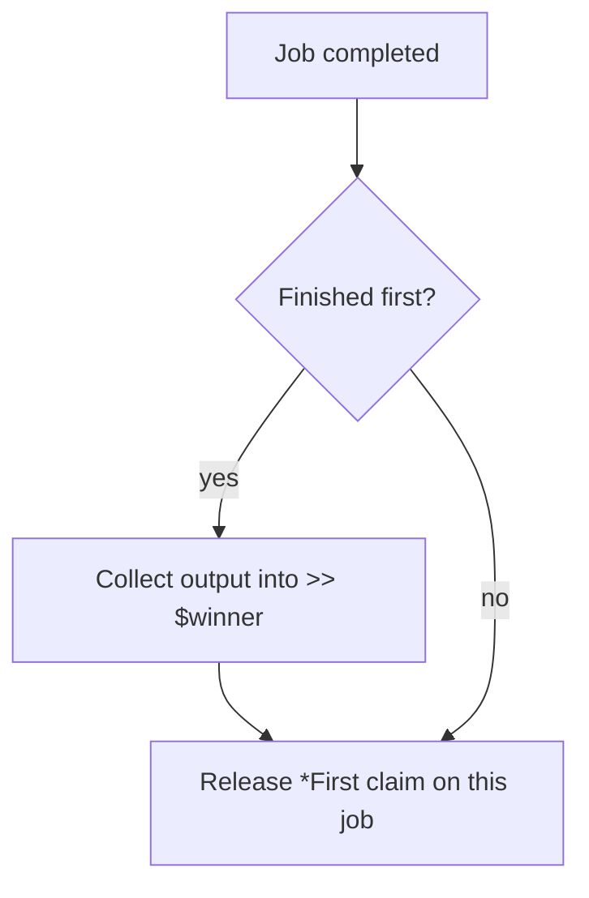

# *First

Sugar for `*Nth` with n=1. Takes the first arriving value; all other inputs are cancelled. All `(*) <<` inputs must be the same type.

## Syntax

```aljam3
[*] *First
   (*) << $candidateA
   (*) << $candidateB
   (*) >> $winner
```

## Inputs

| Name | Type | Description |
|------|------|-------------|
| `<< $var` | same type | Race candidate (repeat for each) |

## Outputs

| Name | Type | Description |
|------|------|-------------|
| `>> $var` | same as inputs | First value to arrive |

## Job Reconciliation

Algorithm for THIS job when it completes:



- **Finished first:** output collected, claim released
- **Not first:** claim released, output unused

The TM sends a kill signal to a job only when all collector claims on it have been released. See [[concepts/collections/collect#Compound Collector Strategies]].

## Errors

None.

## Permissions

None.

## Related

- [[aj3lib/collectors/Sync/INDEX|Collect-All & Race Collectors]]
- [[aj3lib/collectors/Sync/Nth|*Nth]] -- generic race form
- [[aj3lib/collectors/Sync/All|*All]] -- collect-all alternative
