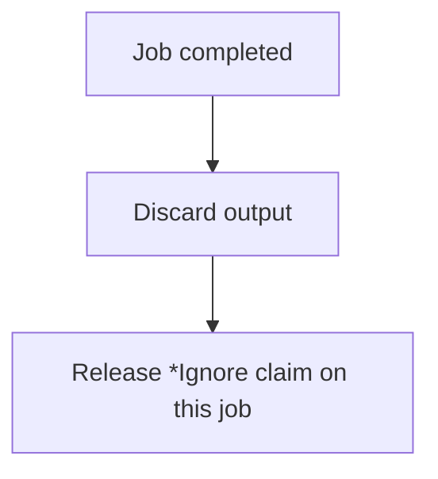

# *Ignore

Explicit collector discard. The variable exists but is released -- used when a parallel pipeline produces output that is not needed.

For inline discard without creating a variable, use `$*` instead.

## Syntax

```aljam3
[*] *Ignore
   (*) << $unneededVar
```

## Inputs

| Name | Type | Description |
|------|------|-------------|
| `<< $var` | any | Variable to discard |

## Outputs

None.

## Job Reconciliation

Algorithm for THIS job when it completes:



- **On completion:** output discarded, claim released

The TM sends a kill signal to a job only when all collector claims on it have been released. See [[concepts/collections/collect#Compound Collector Strategies]].

## Errors

None.

## Permissions

None.

## Related

- [[jm3lib/collectors/Sync/INDEX|Collect-All & Race Collectors]]
- [[concepts/collections/collect|Collect Operators]]
