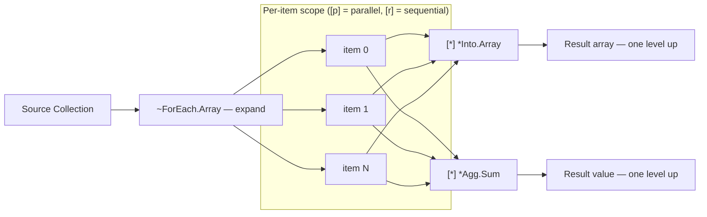

# Collections

<!-- @glossary:Polyglot Code -->
<!-- @operators -->
<!-- @blocks -->
Collections in Polyglot Code ([[glossary#Polyglot Code]]) are data structures that hold multiple items. They are processed using expand (`~`) and collect (`*`) operators — see [[operators#Collection Operators]] and [[blocks#Data Flow]] for block element reference. Expand operators live at `%~` and collect operators at `%*` in the metadata tree — see [[data-is-trees#How Concepts Connect]].

## Collection Types

| Type | Description | Schema |
|------|-------------|--------|
| `array` | Ordered collection — a struct with enumerated flat keys starting at 0 | Fixed (`.`) |
| `serial` | Schema-free data structure. Always uses flexible fields (`:`) even if dot notation is used in access. Converts to/from JSON-like formats | Flexible (`:`) |
| `#` (struct) | User-defined **struct** declared with `{#}`. Predefined fixed schema | Fixed (`.`) |

For type annotations and basic type details, see [[types]].

## Expand Operators (`~`)

Expand operators iterate over a collection, producing a **mini-pipeline** for each item. The execution marker on the expand line controls parallelism:
- `[p] ~ForEach.Array` — mini-pipelines run in **parallel**
- `[r] ~ForEach.Array` — mini-pipelines run **sequentially**

<!-- @variable-lifecycle -->
Variables declared inside a mini-pipeline are scoped to that iteration — they cannot be accessed outside. See [[variable-lifecycle#Released]].

| Operator | Iterates | IO |
|----------|----------|-----|
| `~ForEach.Array` | Each item in an array | `<Array`, `>item` |
| `~ForEach.Array.Enumerate` | Each item with index | `<Array`, `>index`, `>item` |
| `~ForEach.Serial` | All key-item pairs in a serial (all levels) | `<Serial`, `>key`, `>item` |
| `~ForEach.Level` | Siblings at a specified level only | `<level`, `>key`, `>item` |

The expand operator's IO must match its signature — `~ForEach.Array` requires `<Array` and `>item`, `~ForEach.Array.Enumerate` requires `<Array`, `>index`, and `>item` (PGE-307). Similarly, each collect operator's IO must match its contract (PGE-308).

Every expand scope must contain at least one collector. A nested expand without an inner collector is a compile error — inner items cannot flow to outer collectors (PGE-309). Conversely, a `*Into` or `*Agg` collector outside any expand scope is invalid (PGE-311).

### `~ForEach.Level` — Level-Specific Iteration

Unlike `~ForEach.Serial` which iterates all keys, `~ForEach.Level` iterates only the siblings at a specific level of a serialized structure. The `~` suffix on the input path marks the iteration point:

```polyglot
[r] ~ForEach.Level
   [~] <level << #SomeData.SubField.~
   [~] >key >> $key
   [~] >item >> $item
```

## Collect Operators (`*`)

<!-- @io:Direct Output Port Writing -->
Collect operators gather outputs from mini-pipelines back into a single value, accessible **one level up** from the expand scope. Multiple collectors can operate within the same expand scope.

Collector invocation uses an execution marker (`[r]` sequential, `[p]` parallel) — just like expand operators. Collector IO lines use `[*]` (matching the `*` operator prefix) — see [[io#IO Line Pattern]]. Collectors can write directly to pipeline output ports — see [[io#Direct Output Port Writing]].

Use `[r]` when collectors have dependencies between them, `[p]` when they are independent.



### `*Into` — Collect into Collection

| Operator | Collects into | IO |
|----------|---------------|-----|
| `*Into.Array` | Array | `<item`, `>Array` |
| `*Into.Serial` | Serial | `<key`, `<value`, `>Serial` |
| `*Into.Level` | Serialized siblings | `<key`, `<value`, `>Serial` |

### `*Agg` — Reduce to Single Value

| Operator | Produces | IO |
|----------|----------|-----|
| `*Agg.Sum` | Sum of numeric inputs | `<number`, `>sum` |
| `*Agg.Count` | Count of items | `<item`, `>count` |
| `*Agg.Average` | Average of numeric inputs | `<number`, `>average` |
| `*Agg.Max` | Maximum numeric value | `<number`, `>max` |
| `*Agg.Min` | Minimum numeric value | `<number`, `>min` |
| `*Agg.Concatenate` | Concatenated string | `<string`, `>result` |

## Sync & Race Collectors

<!-- @io:Wait and Collect-Into Markers -->
Sync and race collectors operate **outside** expand scopes — they work on variables produced by parallel `[p]` pipeline calls. They use `[*] <<` (wait input) and `[*] >>` (collect output) forms (see [[io#Wait and Collect IO]]).

### Parallel Boundaries

Parallel execution enforces strict variable isolation:

- A variable inside a `[p]` scope cannot be pushed into from outside that scope (PGE-301)
- A `[p]` output variable cannot be pulled before its `[*]` collector has executed (PGE-303)
- A `[p]` parallel and its `[*]` collector must pair within valid section boundaries — same scope, or `[\]` setup to `[/]` cleanup. A `[p]` in setup cannot be collected in the execution body (PGE-304). See [[pipelines#Parallel Forking in Setup]] for the pairing constraint.

### `*All` — Sync Barrier

Waits for ALL listed variables to become Final. Uses `[*] <<` only — no `[*] >>`. Variables stay accessible after.

No type constraint on inputs.

```polyglot
[p] =Fetch.Profile
   [=] <id << $userId
   [=] >profile >> $profile

[p] =Fetch.History
   [=] <id << $userId
   [=] >history >> $history

[ ] Wait for both — $profile and $history stay accessible after
[*] *All
   [*] << $profile
   [*] << $history

[ ] Both variables available here
[r] =Report.Generate
   [=] <profile << $profile
   [=] <history << $history
```

### `*First` / `*Second` / `*Nth` — Race Collectors

Wait for the Nth variable to become Final. The winner is stored in `[*] >>`; all other inputs are **cancelled**.

All `[*] <<` inputs must be the **same type** (PGE-306). `[*] >>` output is required.

`*First` and `*Second` are sugar for `*Nth` with `n=1` and `n=2`.

```polyglot
[p] =Search.EngineA
   [=] <query << $query
   [=] >result >> $resultA

[p] =Search.EngineB
   [=] <query << $query
   [=] >result >> $resultB

[p] =Search.EngineC
   [=] <query << $query
   [=] >result >> $resultC

[ ] Take the first to arrive — other two are cancelled
[*] *First
   [*] << $resultA
   [*] << $resultB
   [*] << $resultC
   [*] >> $fastest

[ ] *Nth — generic form; take the 2nd to arrive
[*] *Nth
   [*] <n;int << 2
   [*] << $resultA
   [*] << $resultB
   [*] << $resultC
   [*] >> $backup
```

### Discarding Parallel Output

Two ways to intentionally discard output from a `[p]` parallel pipeline, both satisfying PGE-302:

**`$*` — inline discard.** Use when you never need the value. No variable is created — the output is immediately released at the declaration site:

```polyglot
[p] =Audit.Log
   [=] <event << $event
   [=] >auditId >> $*              [ ] discarded inline — no variable created
```

**`*Ignore` — explicit collector discard.** Use when you want a named variable for debugging or future code changes. The variable exists but is explicitly released:

```polyglot
[p] =Audit.Log
   [=] <event << $event
   [=] >auditId >> $auditId

[ ] We triggered the audit but don't need the ID
[*] *Ignore
   [*] << $auditId
```

Prefer `$*` for clean discards. Prefer `*Ignore` when the variable may be needed later during development.

**`[b]` — fire-and-forget parallel.** `[b]` has no collectible output (PGE-305). When `[b]` invokes a pipeline that declares outputs, those outputs are silently discarded — the compiler warns (PGW-301). An `[!]` error handler under a `[b]` call is unreachable dead code (PGW-302).

### Multi-Wave Parallel Pattern

Multiple `[*] *All` barriers create sequential waves of parallel work:

```polyglot
[ ] Wave 1
[p] =Fetch.A ...
[p] =Fetch.B ...
[*] *All
   [*] << $a
   [*] << $b

[ ] Wave 2 — uses $a and $b
[p] =Enrich.A ...
[p] =Enrich.B ...
[*] *All
   [*] << $enrichedA
   [*] << $enrichedB

[ ] Sequential final step
[r] =Assemble ...
```

## Example: Expand, Transform, and Collect

Expand an array of integers in parallel, double each value, collect the doubled values into a new array, and compute the sum:

```polyglot
...
{=} =DoubleAndSum
[ ] Triggers, queue config, and wrapper assumed defined
...
[ ] Input: an array of integers
[=] <numbers;array << $InputNumbers
[ ] Output: doubled array and total sum
[=] >doubled;array >> $DoubledNumbers
[=] >total;int >> $TotalSum

[ ] Expand — one mini-pipeline per item, run in parallel
[p] ~ForEach.Array.Enumerate
   [~] <Array << $InputNumbers
   [~] >index >> $idx
   [~] >item >> $num

   [ ] Double the number inside mini-pipeline scope
   [r] $doubled;int << $num * 2

   [ ] Collect doubled values back into array (one level up)
   [p] *Into.Array
      [*] <item << $doubled
      [*] >Array >> $DoubledNumbers

   [ ] Also aggregate the sum (one level up)
   [p] *Agg.Sum
      [*] <number << $doubled
      [*] >sum >> $TotalSum
...
```

## Fallback in Expand Context

<!-- @errors:Error Fallback Operators -->
When a pipeline call inside an expand scope may error, use `[>] <!` fallback to provide a default value per iteration instead of failing the entire expand:

```polyglot
[p] ~ForEach.Array
   [~] <Array << $files
   [~] >item >> $file

   [r] =File.Text.Read
      [=] <path << $file
      [=] >content >> $text
         [>] <! ""

   [r] *Into.Array
      [*] <item << $text
      [*] >Array >> $results
```

If any file fails to read, `$text` gets `""` for that iteration instead of entering the Failed state. The expand continues for all items. See [[errors#Error Fallback Operators]] for the full fallback model.

## Compile Rules

Parallel execution, expand/collect, and race collector rules enforced at compile time. See [[compile-rules/PGE/{code}|{code}]] for full definitions.

| Code | Name | Section |
|------|------|---------|
| PGE-301 | No Push Across Parallel Boundaries | Parallel Boundaries |
| PGE-302 | Parallel Output Must Be Collected | Discarding Parallel Output |
| PGE-303 | Pull Isolation Until Collection | Parallel Boundaries |
| PGE-304 | Section-Boundary Pairing | Parallel Boundaries |
| PGE-305 | `[b]` Has No Collectible Output | Discarding Parallel Output |
| PGE-306 | Race Collector Type Homogeneity | Race Collectors |
| PGE-307 | Expand Operator Input Mismatch | Expand Operators |
| PGE-308 | Collect Operator IO Mismatch | Collect Operators |
| PGE-309 | Nested Expand Without Collect | Expand Operators |
| PGE-311 | Collector Without Expand | Collect Operators |
| PGW-301 | `[b]` Called Pipeline Has Discarded Outputs | Discarding Parallel Output |
| PGW-302 | Error Handler on Fire-and-Forget | Discarding Parallel Output |
