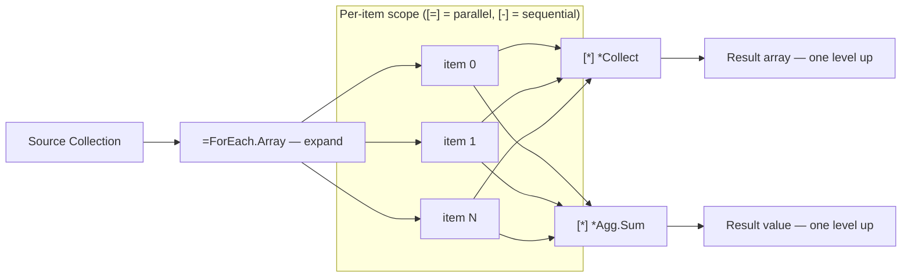
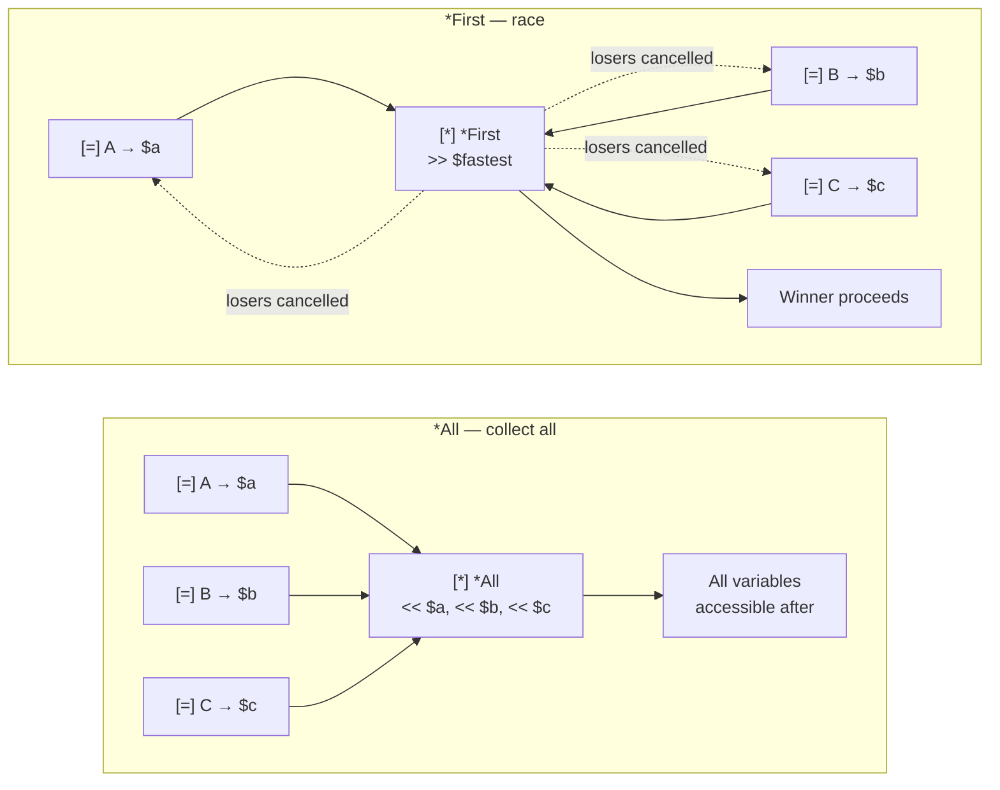

<!-- @concepts/collections/INDEX -->
<!-- @u:technical/ebnf/12-collections -->
<!-- @u:technical/spec/collector-definitions -->
<!-- @u:variable-lifecycle#Released -->

## Collect Operators (`*`)

<!-- @u:io:Direct Output Port Writing -->
Collect operators gather outputs from mini-pipelines back into a single value, accessible **one level up** from the [[concepts/collections/expand|expand]] scope. Multiple collectors can operate within the same expand scope.

Collector invocation uses an execution marker (`[-]` sequential, `[=]` parallel) — just like expand operators. Collector IO lines use `(*)` (matching the `*` operator prefix) — see [[io#IO Line Pattern]]. Collectors can write directly to pipeline output ports — see [[io#Direct Output Port Writing]].

**Parallel marker pairing:** `[=]` and `[b]` mean "run in parallel with the next `[=]` or `[b]` sibling at the same indentation level." A `[=]` or `[b]` line whose next sibling is not `[=]` or `[b]` is a compile error ([[PGE01040\|PGE01040]]) — there is nothing to parallelize against. Use `[-]` for standalone collectors or when collectors depend on each other; use `[=]` only when multiple sibling collectors are independent.



### `*Collect` — Collect into Collection

| Operator | Collects into | IO |
|----------|---------------|-----|
| `*Collect` | Any collection type | `<item`, optionally `<key`, `>Array`/`>Map`/`>Data` |

### `*Agg` — Reduce to Single Value

| Operator | Produces | IO |
|----------|----------|-----|
| `*Agg.Sum` | Sum of numeric inputs | `<number`, `>sum` |
| `*Agg.Count` | Count of items | `<item`, `>count` |
| `*Agg.Average` | Average of numeric inputs | `<number`, `>average` |
| `*Agg.Max` | Maximum numeric value | `<number`, `>max` |
| `*Agg.Min` | Minimum numeric value | `<number`, `>min` |
| `*Agg.Concatenate` | Concatenated string | `<string`, `>result` |

## Collect-All & Race Collectors

<!-- @u:io:Wait and Collect-Into Markers -->
Collect-all and race collectors operate **outside** expand scopes — they work on variables produced by parallel `[=]` pipeline calls. They use `(*) <<` (wait input) and `(*) >>` (collect output) forms (see [[io#Wait and Collect IO]]).

### Invocation vs IO

Collectors follow the same bracket convention as other operators: square brackets `[X]` invoke, parenthetical brackets `(X)` wire IO.

```ebnf
collector_invoke = "[*]" , "*" , collector_name ;
collector_io     = "(*)" , ( "<<" , "$" , var_name
                           | ">>" , "$" , var_name
                           | "<" , param_name , "<<" , source ) ;
collector_name   = "All" | "First" | "Second" | "Nth" | "Ignore"
                 | "Collect" | "Agg." , agg_op ;
```

`[*]` is the **invocation marker** — it appears once on the collector header line, analogous to `[-]` (sequential call) and `[=]` (parallel call). `(*)` is the **IO marker** — it appears on each data-wiring line underneath, analogous to `(-)` for pipeline IO and `(=)` for expand IO.



### Parallel Boundaries

Parallel execution enforces strict variable isolation:

- A variable inside a `[=]` scope cannot be pushed into from outside that scope (PGE03001)
- A `[=]` output variable cannot be pulled before its `[*]` collector has executed (PGE03003)
- A `[=]` parallel and its `[*]` collector must pair within valid section boundaries — same scope, or `[\]` setup to `[/]` cleanup. A `[=]` in setup cannot be collected in the execution body (PGE03004). See [[concepts/pipelines/wrappers#Parallel Forking in Setup]] for the pairing constraint.

### `*All` — Collect All

Waits for ALL listed variables to become Final. Uses `(*) <<` only — no `(*) >>`. Variables stay accessible after.

No type constraint on inputs.

**Positional implicit IO:** Each `(*) << $var` line maps to a positional input parameter (`<args.0`, `<args.1`, ...) inferred by the compiler from the variable's type.

```aljam3
[=] -Fetch.Profile
   (-) <id << $userId
   (-) >profile >> $profile

[=] -Fetch.History
   (-) <id << $userId
   (-) >history >> $history

[ ] Wait for both — $profile and $history stay accessible after
[*] *All
   (*) << $profile
   (*) << $history

[ ] Both variables available here
[-] -Report.Generate
   (-) <profile << $profile
   (-) <history << $history
```

### `*First` / `*Second` / `*Nth` — Race Collectors

Wait for the Nth variable to become Final. The winner is stored in `(*) >>`; all other inputs are **cancelled**.

All `(*) <<` inputs must be the **same type** (PGE03006). `(*) >>` output is required.

`*First` and `*Second` are sugar for `*Nth` with `n=1` and `n=2`.

**Positional implicit IO:** Like `*All`, each `(*) << $var` maps to a positional input (`<args.0`, `<args.1`, ...). For single-output collectors (`*First`, `*Second`), the compiler infers the output type from the input type — the `(*) >> $winner` declaration is explicit but its type is implicit.

```aljam3
[=] -Search.EngineA
   (-) <query << $query
   (-) >result >> $resultA

[=] -Search.EngineB
   (-) <query << $query
   (-) >result >> $resultB

[=] -Search.EngineC
   (-) <query << $query
   (-) >result >> $resultC

[ ] Take the first to arrive — other two are cancelled
[*] *First
   (*) << $resultA
   (*) << $resultB
   (*) << $resultC
   (*) >> $fastest

[ ] *Nth — generic form; take the 2nd to arrive
[*] *Nth
   (*) <n#int << 2
   (*) << $resultA
   (*) << $resultB
   (*) << $resultC
   (*) >> $backup
```

### Discarding Parallel Output

Two ways to intentionally discard output from a `[=]` parallel pipeline, both satisfying PGE03002:

**`$*` — inline discard.** Use when you never need the value. No variable is created — the output is immediately released at the declaration site:

```aljam3
[=] -Audit.Log
   (-) <event << $event
   (-) >auditId >> $*              [ ] discarded inline — no variable created
```

**`*Ignore` — explicit collector discard.** Use when you want a named variable for debugging or future code changes. The variable exists but is explicitly released:

```aljam3
[=] -Audit.Log
   (-) <event << $event
   (-) >auditId >> $auditId

[ ] We triggered the audit but don't need the ID
[*] *Ignore
   (*) << $auditId
```

Prefer `$*` for clean discards. Prefer `*Ignore` when the variable may be needed later during development.

**`[b]` — fire-and-forget parallel.** `[b]` has no collectible output (PGE03005). When `[b]` invokes a pipeline that declares outputs, those outputs are silently discarded — the compiler warns (PGW03001). An `[!]` error handler under a `[b]` call is unreachable dead code (PGW03002).


### Multi-Wave Parallel Pattern

Multiple `[*] *All` barriers create sequential waves of parallel work:

```aljam3
[ ] Wave 1
[=] -Fetch.A ...
[=] -Fetch.B ...
[*] *All
   (*) << $a
   (*) << $b

[ ] Wave 2 — uses $a and $b
[=] -Enrich.A ...
[=] -Enrich.B ...
[*] *All
   (*) << $enrichedA
   (*) << $enrichedB

[ ] Sequential final step
[-] -Assemble ...
```

## Reconciliation

<!-- @c:glossary#Reconciliation -->
Every parallel job must be **reconciled** ([[glossary#Reconciliation|c:Reconciliation]]) — the process by which parallel job outputs are collected and parallel jobs are terminated. Collectors are the reconciliation layer: they determine both what happens to the data and what happens to the jobs.

### Output Reconciliation

| Strategy | Operators | Result |
|----------|-----------|--------|
| Aggregation | `*Agg.*` | Reduce parallel outputs into one scalar value |
| Collection Transformation | `*Collect` | Populate a collection from parallel outputs |
| Race Selection | `*First`, `*Nth` | Select one output, discard the rest |
| Barrier | `*All` | Wait for all outputs — variables stay accessible |
| Discard | `$*`, `*Ignore`, `[b]` | Intentionally discard job output |

`*Collect` and `*Agg.*` operate **inside** expand scopes — they gather per-item results from mini-pipelines. `*All`, `*First`, and `*Nth` operate **outside** expand scopes — they synchronize parallel `[=]` pipeline calls.

### Job Reconciliation

The collector determines *when* collection is satisfied. In all cases, jobs whose output has been collected are terminated:

- `*All`, `*Collect`, `*Agg.*` — every associated job completes naturally
- `*First` / `*Nth` — winner collected, remaining associated jobs are cancelled
- `$*` / `*Ignore` / `[b]` — output discarded, job completes but output is released

### Compound Collector Strategies

A parallel job can be referenced by multiple collectors. The rule:

> **A job is cancelled only when ALL collectors referencing it agree it can be cancelled.**

When `*First` is satisfied, it releases its claim on remaining jobs — but does not issue a cancel signal. If `*All` also references those jobs, they continue running until `*All` is also satisfied. A job is cancelled only when it has zero remaining collector claims.

```aljam3
[=] -Search.A
   (-) >result >> $a
[=] -Search.B
   (-) >result >> $b
[=] -Search.C
   (-) >result >> $c

[ ] *First takes the fastest — but does not cancel B/C yet
[*] *First
   (*) << $a
   (*) << $b
   (*) << $c
   (*) >> $fastest

[ ] *All needs all three — B and C continue running
[*] *All
   (*) << $a
   (*) << $b
   (*) << $c

[ ] After *All completes, all jobs have zero claims — terminated
[-] -Report.Generate
   (-) <fastest << $fastest
   (-) <a << $a
   (-) <b << $b
   (-) <c << $c
```

The compiler validates compound collector usage: if `*First` references a variable, and no other collector would allow the associated job to continue, the compiler confirms the cancellation is intentional. If another collector (`*All`) also references the same variable, the compiler confirms the combined strategy is consistent.

### Permission Safety

<!-- @c:permissions -->
Concurrent parallel jobs may not hold write permission to the same resource path — this is a compile error (PGE10008). Read permission to the same resource is allowed. See [[permissions#Parallel Write Exclusion]].

This makes reconciliation safe by construction: parallel jobs are pure readers, and only the sequential code after collection can write. No runtime locks, no mutexes — the permission system forbids write contention at compile time.

## See Also

- [[concepts/collections/expand|Expand Operators]] — `=` operators that produce items for collectors
- [[concepts/collections/reassemble|Reassemble Operators]] — `=*` atomic expand + collect operators
- [[concepts/pipelines/wrappers|Wrappers]] — parallel forking in setup with `[*] *All` in cleanup
- [[concepts/collections/examples|Examples]] — complete expand/transform/collect patterns
- [[permissions#Parallel Write Exclusion]] — PGE10008 parallel write exclusion rule
