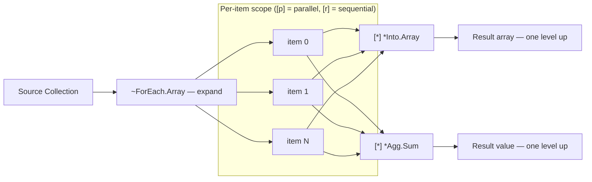

<!-- @concepts/collections/INDEX -->

## Collect Operators (`*`)

<!-- @io:Direct Output Port Writing -->
Collect operators gather outputs from mini-pipelines back into a single value, accessible **one level up** from the [[concepts/collections/expand|expand]] scope. Multiple collectors can operate within the same expand scope.

Collector invocation uses an execution marker (`[r]` sequential, `[p]` parallel) — just like expand operators. Collector IO lines use `[*]` (matching the `*` operator prefix) — see [[io#IO Line Pattern]]. Collectors can write directly to pipeline output ports — see [[io#Direct Output Port Writing]].

Use `[r]` when collectors have dependencies between them, `[p]` when they are independent.



### `*Into` — Collect into Collection

| Operator | Collects into | IO |
|----------|---------------|-----|
| `*Into.Array` | Array | `<item`, `>Array` |
| `*Into.Map` | Map | `<key`, `<value`, `>Map` |
| `*Into.Serial` | Serial | `<key`, `<value`, `>Serial` |
| `*Into.Level` | Serialized siblings | `<key`, `<value`, `>Serial` |
| `*Into.Dataframe` | Dataframe | `<row`, `>Dataframe` |

### `*Agg` — Reduce to Single Value

| Operator | Produces | IO |
|----------|----------|-----|
| `*Agg.Sum` | Sum of numeric inputs | `<number`, `>sum` |
| `*Agg.Count` | Count of items | `<item`, `>count` |
| `*Agg.Average` | Average of numeric inputs | `<number`, `>average` |
| `*Agg.Max` | Maximum numeric value | `<number`, `>max` |
| `*Agg.Min` | Minimum numeric value | `<number`, `>min` |
| `*Agg.Concatenate` | Concatenated string | `<string`, `>result` |

## Sync & Race Collectors

<!-- @io:Wait and Collect-Into Markers -->
Sync and race collectors operate **outside** expand scopes — they work on variables produced by parallel `[p]` pipeline calls. They use `[*] <<` (wait input) and `[*] >>` (collect output) forms (see [[io#Wait and Collect IO]]).


### Parallel Boundaries

Parallel execution enforces strict variable isolation:

- A variable inside a `[p]` scope cannot be pushed into from outside that scope (PGE03001)
- A `[p]` output variable cannot be pulled before its `[*]` collector has executed (PGE03003)
- A `[p]` parallel and its `[*]` collector must pair within valid section boundaries — same scope, or `[\]` setup to `[/]` cleanup. A `[p]` in setup cannot be collected in the execution body (PGE03004). See [[concepts/pipelines/wrappers#Parallel Forking in Setup]] for the pairing constraint.

### `*All` — Sync Barrier

Waits for ALL listed variables to become Final. Uses `[*] <<` only — no `[*] >>`. Variables stay accessible after.

No type constraint on inputs.

```polyglot
[p] =Fetch.Profile
   [=] <id << $userId
   [=] >profile >> $profile

[p] =Fetch.History
   [=] <id << $userId
   [=] >history >> $history

[ ] Wait for both — $profile and $history stay accessible after
[*] *All
   [*] << $profile
   [*] << $history

[ ] Both variables available here
[r] =Report.Generate
   [=] <profile << $profile
   [=] <history << $history
```

### `*First` / `*Second` / `*Nth` — Race Collectors

Wait for the Nth variable to become Final. The winner is stored in `[*] >>`; all other inputs are **cancelled**.

All `[*] <<` inputs must be the **same type** (PGE03006). `[*] >>` output is required.

`*First` and `*Second` are sugar for `*Nth` with `n=1` and `n=2`.

```polyglot
[p] =Search.EngineA
   [=] <query << $query
   [=] >result >> $resultA

[p] =Search.EngineB
   [=] <query << $query
   [=] >result >> $resultB

[p] =Search.EngineC
   [=] <query << $query
   [=] >result >> $resultC

[ ] Take the first to arrive — other two are cancelled
[*] *First
   [*] << $resultA
   [*] << $resultB
   [*] << $resultC
   [*] >> $fastest

[ ] *Nth — generic form; take the 2nd to arrive
[*] *Nth
   [*] <n#int << 2
   [*] << $resultA
   [*] << $resultB
   [*] << $resultC
   [*] >> $backup
```

### Discarding Parallel Output

Two ways to intentionally discard output from a `[p]` parallel pipeline, both satisfying PGE03002:

**`$*` — inline discard.** Use when you never need the value. No variable is created — the output is immediately released at the declaration site:

```polyglot
[p] =Audit.Log
   [=] <event << $event
   [=] >auditId >> $*              [ ] discarded inline — no variable created
```

**`*Ignore` — explicit collector discard.** Use when you want a named variable for debugging or future code changes. The variable exists but is explicitly released:

```polyglot
[p] =Audit.Log
   [=] <event << $event
   [=] >auditId >> $auditId

[ ] We triggered the audit but don't need the ID
[*] *Ignore
   [*] << $auditId
```

Prefer `$*` for clean discards. Prefer `*Ignore` when the variable may be needed later during development.

**`[b]` — fire-and-forget parallel.** `[b]` has no collectible output (PGE03005). When `[b]` invokes a pipeline that declares outputs, those outputs are silently discarded — the compiler warns (PGW03001). An `[!]` error handler under a `[b]` call is unreachable dead code (PGW03002).

### Multi-Wave Parallel Pattern

Multiple `[*] *All` barriers create sequential waves of parallel work:

```polyglot
[ ] Wave 1
[p] =Fetch.A ...
[p] =Fetch.B ...
[*] *All
   [*] << $a
   [*] << $b

[ ] Wave 2 — uses $a and $b
[p] =Enrich.A ...
[p] =Enrich.B ...
[*] *All
   [*] << $enrichedA
   [*] << $enrichedB

[ ] Sequential final step
[r] =Assemble ...
```

## See Also

- [[concepts/collections/expand|Expand Operators]] — `~` operators that produce items for collectors
- [[concepts/pipelines/wrappers|Wrappers]] — parallel forking in setup with `[*] *All` in cleanup
- [[concepts/collections/examples|Examples]] — complete expand/transform/collect patterns
