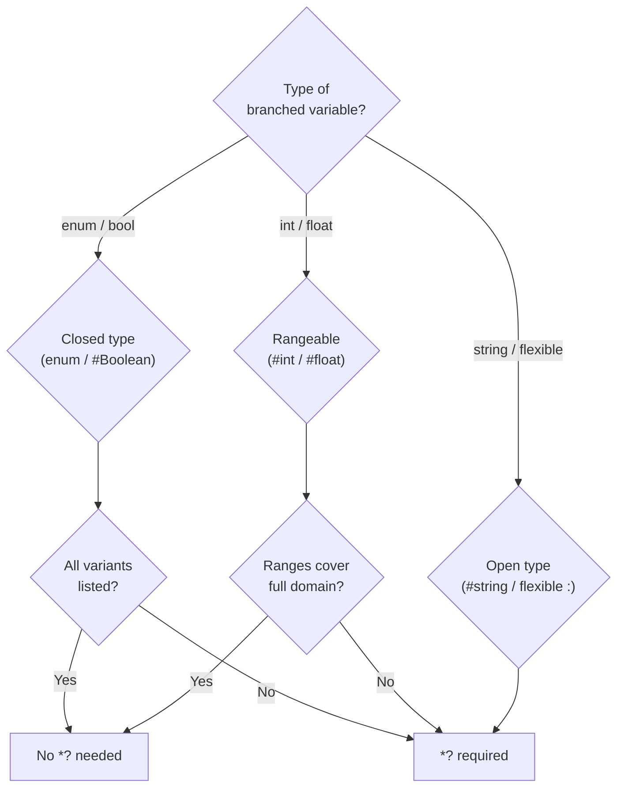

# Conditionals

<!-- @u:operators -->
<!-- @u:blocks:Control Flow -->
<!-- @u:blocks:Logical -->
<!-- @u:technical/ebnf/11-control-flow -->
<!-- @u:technical/edge-cases/11-control-flow -->
<!-- @u:technical/edge-cases/22-control-flow-gaps -->
<!-- @u:technical/compile-rules/algorithms/compound-exhaustiveness -->

Conditionals in Polyglot Code use `[?]` block elements to branch execution based on comparisons. Each branch is a standalone test — there is no "subject" line that introduces a value to match against. See [[operators#Comparison Operators]] for the full operator table and [[blocks#Control Flow]] for marker reference.

## Conditional Chains

Sequential `[?]` blocks form a conditional chain. Each branch contains an explicit comparison and indented execution lines:

```polyglot
[?] $status =? #Status.Ok
   [-] >result << "Success"

[?] $status =? #Status.Warn
   [-] >result << "Warning"

[?] $status =? #Status.Fail
   [-] >result << "Failure"
```

Every `[?]` line must include a comparison operator — bare lines like `[?] $variable` are invalid ([[PGE06009|PGE06009]]). Every branch must contain at least one executable statement; use `[-] -DoNothing` for intentionally empty branches ([[PGE06010|PGE06010]]).

## Exhaustiveness

All conditional chains must be exhaustive — every possible value of the branched type must have a defined path ([[PGE06001|PGE06001]]). Exhaustiveness is proven in two ways:

1. **Static proof** — the compiler verifies all values are covered (closed types)
2. **`*?` catch-all** — required for open types where static proof is impossible

### Enum Exhaustiveness

Enums are closed types. When all variants are listed, no `*?` is needed ([[PGE06002|PGE06002]]):

```polyglot
{#} #Direction
   [.] .North
   [.] .South
   [.] .East
   [.] .West

[ ] All variants covered — no *? needed
[?] $dir =? #Direction.North
   [-] $label#string << "N"
[?] $dir =? #Direction.South
   [-] $label#string << "S"
[?] $dir =? #Direction.East
   [-] $label#string << "E"
[?] $dir =? #Direction.West
   [-] $label#string << "W"
```

Partial coverage with `*?` covering the rest is also valid:

```polyglot
[?] $dir =? #Direction.North
   [-] $label#string << "N"
[?] *?
   [-] $label#string << "other"
```

`#Boolean` follows the same rule — list both `#Boolean.True` and `#Boolean.False`, or use `*?`.

### Numeric Exhaustiveness

Numeric types (`#int`, `#float`) are open but rangeable. Ranges must cover the full domain or include `*?` ([[PGE06003|PGE06003]]). Overlapping ranges are flagged as warnings ([[PGE06004|PGE06004]]):

```polyglot
[?] $code =? 200
   [-] $status#string << "ok"
[?] $code =? 404
   [-] $status#string << "not_found"
[?] $code =? 500
   [-] $status#string << "error"
[?] *?
   [-] $status#string << "unknown"
```

### Match Syntax

<!-- @u:EBNF:match_line -->

When every `[?]` arm performs the same operation — mapping one value to another — use match syntax. Match nests `[?]` arms under a `[-] $source >> $target` header:

```polyglot
[ ] Match form — equivalent to the [?] chain above
[-] $code >> $status#string
   [?] 200 >> "ok"
   [?] 404 >> "not_found"
   [?] 500 >> "error"
   [?] *? >> "unknown"
```

This desugars to the verbose form shown in the Numeric Exhaustiveness example above. The two forms are equivalent.

**Rules:**

1. The source variable (`$code`) must be in **Final** state — its value is fully resolved
2. The target variable (`$status`) receives the matched result via push
3. Arms are **assignment-only** — no side effects, pipeline calls, or nested logic
4. `[?] *?` is the wildcard catch-all — same syntax in both verbose and match forms
5. All exhaustiveness rules ([[PGE06001|PGE06001]] through [[PGE06013|PGE06013]]) apply to the desugared form
6. [[PGE06009|PGE06009]] does not apply to match arms — they use `value >> result` form, not `$var operator value`

**Enum match — exhaustive without wildcard:**

```polyglot
[-] $dir >> $label#string
   [?] #Direction.North >> "N"
   [?] #Direction.South >> "S"
   [?] #Direction.East >> "E"
   [?] #Direction.West >> "W"
```

All variants of `#Direction` are listed, so no `*?` is needed — same rule as the verbose form ([[PGE06002|PGE06002]]).

**Not a match:** If `[-] $x >> $y` has no indented `[?]` children, it is a plain assignment — not a match header.

### String and Flexible Field Exhaustiveness

Strings are open sets — `*?` is always required ([[PGE06006|PGE06006]]). Flexible fields (`:`) are also open — `*?` is always required ([[PGE06007|PGE06007]]).

### Exhaustiveness Summary

| Type | Value Set | `*?` Required? |
|------|-----------|----------------|
| Enum (`{#}` with `[.]` fields) | Closed (finite) | No — if all variants listed |
| `#Boolean` | Closed (2 variants) | No — if both listed |
| `#int` / `#float` | Open but rangeable | No — if ranges cover full domain; otherwise yes |
| `#string` | Open (infinite) | Yes — always |
| Flexible field (`:`) | Open | Yes — always |
| Compound (`[&]`/`[+]`/`[^]`) | Complex | Depends on variable types |



## Logical Operators

Compound conditions combine multiple predicates using block-element logical markers. See [[blocks#Logical]] for marker definitions.

### `[&]` — AND

Both conditions must hold:

```polyglot
[?] $age >=? 18
[&] $verified =? #Boolean.True
   [-] $access << #AccessLevel.Granted
[?] *?
   [-] $access << #AccessLevel.Denied
```

### `[+]` — OR

At least one condition holds:

```polyglot
[?] $role =? #Role.Admin
[+] $role =? #Role.Superuser
   [-] $elevated#bool << #Boolean.True
[?] *?
   [-] $elevated#bool << #Boolean.False
```

### `[^]` — XOR

Exactly one of two conditions holds — not both, not neither:

```polyglot
[?] $isAdmin =? #Boolean.True
[^] $isSudo =? #Boolean.True
   [-] $elevated#bool << #Boolean.True
[?] *?
   [-] $elevated#bool << #Boolean.False
```

### `[-]` — NOT

Negate the preceding condition. For simple negation, prefer negation operators (`=!?`, `<!?`, etc.) over `[-]` — see [[operators#Negation Operators]].

### Compound Exhaustiveness

When logical operators combine conditions, the compiler evaluates whether the compound expression partitions the input space ([[PGE06008|PGE06008]]). If any variable is an open type, `*?` is required. Overlapping compound conditions are flagged ([[PGE06005|PGE06005]]). Tautological branches (always true) and contradictory branches (always false) are compile errors ([[PGE06013|PGE06013]]).

## Nested Conditionals

A `[?]` branch can contain inner `[?]` chains. Each nesting level is independently exhaustive:

```polyglot
[?] $role =? #Role.Admin
   [?] $region =? #Region.EU
      [-] $policy#string << "GDPR"
   [?] $region =? #Region.US
      [-] $policy#string << "CCPA"
   [?] *?
      [-] $policy#string << "Global"
[?] $role =? #Role.User
   [-] $policy#string << "Standard"
[?] *?
   [-] $policy#string << "None"
```

The outer chain branches on `$role`. Inside the Admin branch, a separate chain branches on `$region` — this inner chain has its own `*?` because `#Region` may have more than EU and US variants.

## Switching on Metadata

Conditionals can switch on live metadata fields like pipeline `%status`:

```polyglot
[?] -DataSync%status
   [?] #AwaitTrigger
      [-] $msg#string << "idle"
   [?] #Running
      [-] $msg#string << "in progress"
   [?] #Failed
      [-] $msg#string << "failed"
      [b] -Alert.Send
         (-) <msg << "DataSync failed"
   [?] #Disabled
      [-] $msg#string << "pipeline disabled"
   [?] *?
      [-] $msg#string << "unknown state"
```

See [[syntax/types/hierarchy#Live Type Modifier]] and [[concepts/pipelines/chains#Querying Pipeline Status]] for metadata access patterns.

## Wildcard Rules

- Only one `*?` per chain ([[PGE06011|PGE06011]])
- `*?` must be the last branch — branches after `*?` are unreachable dead code ([[PGE06012|PGE06012]])
- `*?` catches everything the preceding branches did not

## Compile Rules Reference

| Rule | Name | What it catches |
|------|------|-----------------|
| [[PGE06001\|PGE06001]] | Conditional Must Be Exhaustive | Missing coverage for any possible value |
| [[PGE06002\|PGE06002]] | Enum Exhaustiveness | Missing enum variants without `*?` |
| [[PGE06003\|PGE06003]] | Numeric Range Not Exhaustive | Incomplete numeric range coverage |
| [[PGE06004\|PGE06004]] | Numeric Range Overlap | Overlapping range branches |
| [[PGE06005\|PGE06005]] | Compound Condition Overlap | Overlapping compound expressions |
| [[PGE06006\|PGE06006]] | String Exhaustiveness | Missing `*?` on string conditionals |
| [[PGE06007\|PGE06007]] | Flexible Field Exhaustiveness | Missing `*?` on flexible field conditionals |
| [[PGE06008\|PGE06008]] | Compound Condition Exhaustiveness | Incomplete compound condition coverage |
| [[PGE06009\|PGE06009]] | Conditional Missing Comparison Operator | Bare `[?] $variable` without operator |
| [[PGE06010\|PGE06010]] | Empty Conditional Scope | Branch with no executable statement |
| [[PGE06011\|PGE06011]] | Duplicate Wildcard Catch-All | More than one `*?` in a chain |
| [[PGE06012\|PGE06012]] | Unreachable Branch After Wildcard | Branches placed after `*?` |
| [[PGE06013\|PGE06013]] | Tautological Branch Condition | Always-true or always-false compound expression |
