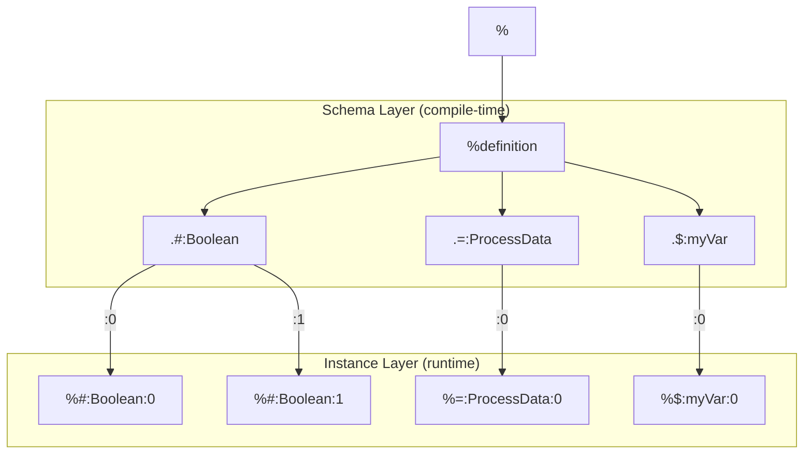

# Everything is a Tree

<!-- @types:RawString -->
<!-- @identifiers:Serialized Identifiers -->

All Polyglot data is serialized strings. Every object — structs, pipelines, variables, collections, errors, macros, packages — is a branch on one unified tree rooted at `%`. Understanding this tree is the key to understanding how every concept in Polyglot Code connects.

## All Data is Serialized Strings

Polyglot has one true primitive: `RawString` — a sequence of literal raw characters (see [[syntax/types/basic-types#RawString — The True Primitive]]). Everything else — `#String`, `int`, `float`, `#Boolean`, arrays, serials, user structs — is built on top of `RawString` through schemas that constrain how the string is interpreted.

This means every Polyglot object is ultimately a tree of strings with typed structure layered on top.

## Leaf-Only Values

A universal invariant governs every tree in Polyglot: a node is either a **branch** or a **leaf**, never both.

- **Branch nodes** have children but no value — they exist purely for structure and navigation (namespace or enum grouping)
- **Leaf nodes** hold a `RawString` value but have no children — they are the terminal data
- A node CANNOT have both a value and children

This is not a per-type property — it is a universal invariant that applies to every data tree. No `%` metadata flag controls it; the compiler enforces it unconditionally.

## Tree Shape and Leaf Content

Types describe their tree structure through two additional prefix tiers beyond `#`:

- `##` **schemas** describe tree shape — depth, key types, ordering, uniformity (e.g., `##Scalar`, `##Flat`, `##Contiguous`)
- `###` **field types** describe leaf content nature — `###Value` for typed data leaves, `###Enum` for variant selector leaves

Child nodes in a tree are accessed with the `<` operator: `$myMap<name`, `$matrix<0<1`. Fixed fields use `.` as before.

See [[syntax/types/prefix-system#Three-Tier Prefix System]] for the full prefix table, [[syntax/types/schema-properties#Approved ## Schema Types]] for all schema definitions, and [[syntax/types/prefix-system#The < Operator]] for accessor details.

## The Structured Tree

The `%` root has fixed branches for every object type in Polyglot:

```
%
├── #   Structs          — type definitions ({#} blocks)
├── =   Pipelines        — async workflows ({=} blocks)
├── ~   Expanders         — expand operators (~ForEach.*)
├── *   Collectors        — collect operators (*Into.*, *Agg.*, *All, *First)
├── $   Variables         — runtime data ($name, $result)
├── M   Macros            — reusable logic ({M} blocks)
├── !   Errors            — error trees ({!} blocks, stdlib !File.*, !No.*, etc.)
├── @   Packages          — package addresses (@Local:999::MyPkg)
├── _   Permissions       — IO capability declarations ([_] blocks)
└── definition            — compile-time schema templates
```

Most branches use flexible (`:`) fields for their instances — `%#:Boolean`, `%=:MyPipeline`, `%$:myVar`. Exceptions: `%_` uses only `.` fixed fields (Polyglot-defined permissions), `%!` uses `.` for Polyglot-defined namespaces (with `:` under `.Error` for user extensions), and `%definition` stores compile-time structural templates.

## How Concepts Connect

Each concept you have learned maps to a branch in the tree:

| You learned | In | Tree branch | Instance example |
|-------------|----|-------------|------------------|
| Struct types | [[syntax/types/structs#Struct Types]] | `%#` | `%#:UserRecord:0` |
| Pipelines | [[concepts/pipelines/INDEX|pipelines]] | `%=` | `%=:ProcessData:0` |
| Variables | [[variable-lifecycle]] | `%$` | `%$:myVar:0` |
| Expand operators | [[concepts/collections/expand#Expand Operators]] | `%~` | `%~:ForEach.Array:0` |
| Collect operators | [[concepts/collections/collect#Collect Operators]] | `%*` | `%*:Into.Array:0` |
| Error trees | [[errors]], `{!}` blocks | `%!` | `%!.File.NotFound` |
| Packages | [[packages]] | `%@` | `%@:Local:999::MyPkg` |
| Permissions | [[permissions]] | `%_` | `%_.File.read` |
| Macros | [[blocks]] `{M}` | `%M` | `%M:W.Tracing:0` |

## Schema vs Instance

The tree has two layers:

- **Schema** (compile-time) — `%definition.{type}:{ref}` defines the structural template
- **Instance** (runtime) — `%{type}:{ref}:{instance}.{fields}` holds actual values

```
%definition.#:Boolean       ← schema: lists .True and .False as valid fields
%#:Boolean:0                ← instance 0: has ONE active field (.True or .False)
%#:Boolean:1                ← instance 1: independent, its own active field
```

One definition can have many instances. A pipeline that runs three times concurrently has instances `:0`, `:1`, `:2` — each with its own metadata values.

Each instance runs independently and contains its own **jobs** — the units of work created at IO boundaries within the pipeline. Jobs are identified by UID (not sequential numbers) and tracked at `%=:Pipeline:N.jobs:UID`. See [[glossary]] for the formal distinction between Instance and Job.

The following diagram shows how schema definitions produce runtime instances across three key branches:



### Worked Examples

| Path | Reads |
|------|-------|
| `%definition.#:UserRecord` | The schema for `#UserRecord` — field names, types, structure |
| `%=:ProcessData:0.status` | Instance 0 of `=ProcessData` — its current `live` status |
| `%$:myVar:0.state` | Instance 0 of `$myVar` — its lifecycle state (Declared, Default, Final, Failed, Released) |

## Key Tree Rules

### Enum Instances — Active-Field-Only

An enum instance collapses to ONE active field. The definition lists all valid branches, but a specific instance has only the active one:

```
%definition.#:Boolean       ← schema: .True, .False (both listed)
%#:Boolean:0.True           ← instance 0: .True is active, .False does NOT exist
```

Push atomically clears the previous field and sets the new one. Reading a non-active field returns no path.

### String Subtypes — Nested Under `:String`

`int` lives at `%#:String:int` — nested under `:String` at a flexible level. The alias `#int` in user code resolves to `#String.int`. Each subtype uses the `#String` schema with `.regex` pre-filled:

```
%#:String:int               ← .string#RawString + .regex#RawString (regex = "^-?[0-9]+$")
%#:String:float             ← .string#RawString + .regex#RawString (regex = "^-?[0-9]+\.[0-9]+$")
%#:String:emailAddress      ← user-defined: .regex = "^[a-zA-Z0-9+_.-]+@[a-zA-Z0-9.-]+$"
```

See [[syntax/types/basic-types#Numeric Types — #String Subtypes]] for details.

### IO Ports — Nested Typed Sections

Pipeline instances carry their IO as nested fixed sections:

```
%=:ProcessData:0
├── .<                      ← input ports (fixed typed section)
│   └── .filepath#path
└── .>                      ← output ports (fixed typed section)
    └── .content#string
```

## Reading the Tree

The general path notation is:

```
%{type}:{ref}:{instance}.{fields}
```

| Segment | Meaning |
|---------|---------|
| `%` | Tree root — the metadata accessor |
| `{type}` | Object type prefix (`#`, `=`, `$`, `~`, `*`, `M`, `!`, `@`, `_`) |
| `:{ref}` | Object name (flexible field) |
| `:{instance}` | Instance number (flexible field) |
| `.{fields}` | Fixed field path within the instance |

**Shorthand in code:** `=MyPipeline%status` reads `%=:MyPipeline:<current>.status` — the current instance is implicit.

For the full field listings (which metadata each branch carries, `live` vs user-declared), see [[metadata]]. For the formal path grammar and instance rules, see [[metadata-tree/INDEX|technical/spec/metadata-tree]].
