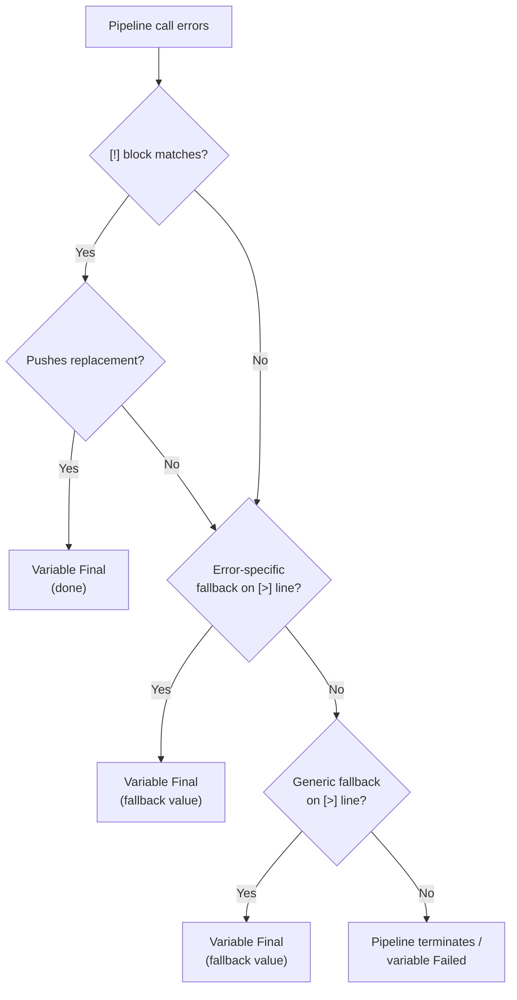

# Error Handling

<!-- @pipelines:Error Handling -->
<!-- @variable-lifecycle:Failed -->
<!-- @data-is-trees -->
<!-- @stdlib/errors/errors -->

Errors in Polyglot Code use the `!` prefix and live at the `%!` branch of the metadata tree (see [[data-is-trees#How Concepts Connect]]). They follow the same [[identifiers]] rules as all Polyglot objects — `.` for fixed fields, `:` for flexible fields. Every error leaf is typed `#Error` (see [[stdlib/errors/errors#`#Error` Struct]]).

## Defining Custom Errors (`{!}`)

Custom error trees are defined with `{!}` blocks (see [[blocks#Definition Elements]]). Each leaf is typed `;#Error`:

```polyglot
{!} !Validation
   [.] .Empty;#Error
   [.] .TooLong;#Error
   [.] .InvalidEmail;#Error
```

This creates three error identifiers: `!Validation.Empty`, `!Validation.TooLong`, `!Validation.InvalidEmail`. Stdlib error namespaces (`!File`, `!No`, `!Timeout`, `!Math`, `!Validation`, `!Permission`, `!Error`) are built-in and require no definition. `!Error` is the only namespace with user-extensible children (see [[stdlib/errors/errors#`!Error` — User-Extensible Namespace]]). See [[stdlib/errors/errors#Built-in Error Namespaces]] for the complete list.

## Declaring Pipeline Errors (`[=] !`)

A pipeline that can raise errors **must** declare them in its IO section using `[=] !ErrorName`:

```polyglot
{=} =ValidateUser
   [=] <name;string
   [=] >validated;string
   [=] >status;string
   [=] !Validation.Empty
   [=] !Validation.TooLong
   [t] =T.Call
   [Q] =Q.Default
   [W] =W.Polyglot
   ...
```

Error declarations are mandatory — a pipeline without `[=] !...` is non-failable. The compiler uses this to enforce:
- **PGE-705** — `[!] >>` raises an error not declared by the pipeline
- **PGE-706** — `[=] !ErrorName` declared but never raised in the execution body
- **PGW-701** — caller adds `[!]` handler on a non-failable pipeline call (dead code)
- **PGW-704** — caller adds `[>] <!` fallback on output from a non-failable pipeline call (dead code)
- **PGE-707** — caller does not address all declared errors (exhaustive handling required)

## Raising Errors (`[!] >>`)

In the execution body, `[!] >> !ErrorName` raises a declared error. The raise block fills `#Error` fields with `[=]` lines:

```polyglot
[?] $name =? ""
   [!] >> !Validation.Empty
      [=] .Message << "Name is required"
      [=] .Info:field << "name"
[?] $name.length >? 100
   [!] >> !Validation.TooLong
      [=] .Message << "Name exceeds 100 characters"
      [=] .Info:field << "name"
      [=] .Info:maxLength << 100
[?] *?
   [r] >validated << $name
   [r] >status << "ok"
```

`.Name` is auto-filled by the runtime (e.g., `"Validation.Empty"`). `.Message` and `.Info` are set at the raise site.

**Default behavior:** When `[!] >>` fires, **all pipeline outputs go Failed** unless the raise block provides fallback values (see [[errors#Output Fallback on Raise]]).

## Output Fallback on Raise

Inside a `[!] >>` block, the author can push fallback values to specific outputs. Outputs not mentioned go Failed:

```polyglot
[!] >> !Validation.Empty
   [=] .Message << "Name is required"
   [=] >status << "invalid"
      [>] %FallbackMessage << "Pipeline returns invalid status on empty input"
   [ ] >validated not mentioned — goes Failed
```

`[>] %FallbackMessage` documents **why** this fallback exists. It is displayed by PGW-702 when a caller overrides the fallback with `[>] <!`.

### Fallback Warning Rules

| Author fallback? | `%FallbackMessage`? | Caller `<!`? | Result |
|-----------------|---------------------|-------------|--------|
| Yes | Missing | — | **PGW-703** to author: missing message |
| Yes | `""` (suppressed) | Yes | Override silently — author allows it |
| Yes | `"reason"` | Yes | **PGW-702** to caller: shows author's reason |
| Yes | `"reason"` | No | Normal — caller uses author's fallback |
| No | — | Yes | Normal `<!` behavior |

- **PGW-702** — caller `[>] <!` overrides a pipeline-defined fallback that has `%FallbackMessage`. See [[compile-rules/PGW/PGW-702-caller-overrides-pipeline-fallback]].
- **PGW-703** — author sets output fallback in `[!] >>` without `[>] %FallbackMessage`. Suppress with `%FallbackMessage << ""`. See [[compile-rules/PGW/PGW-703-missing-fallback-message]].

## Error Scoping

`[!]` error blocks are scoped to the specific `[r]` call that can produce them (PGE-701), indented under the call (after its `[=]` IO lines). Under a single `[r]` call, no two `[!]` blocks may handle the same error name (PGE-704).

```polyglot
[r] @FS=File.Text.Read
   [=] <path << <filepath
   [=] >content >> >content
   [!] !File.NotFound
      [r] >content << "Error: file not found"
   [!] !File.ReadError
      [r] >content << "Error: could not read file"
```

By default, if an `[!]` handler does **not** push a replacement value into the output variable, the pipeline **terminates on error**. No downstream code runs. This is the safe default.

## Error Recovery

To continue after an error, place `[*] *Continue` inside the `[!]` block. `*Continue` is a collector that produces a boolean `>IsFailed` output:

```polyglot
[r] =Fetch
   [=] >payload >> >data
   [!] !FetchError
      [r] =LogError
         [=] <msg << "fetch failed"
      [*] *Continue >IsFailed >> $fetchFailed
[?] $fetchFailed =? true
   [r] =HandleMissing
[?] *?
   [r] =Process
      [=] <input << >data
```

Four patterns for error handling:

| Pattern | Pipeline continues? | Variable state |
|---------|-------------------|---------------|
| `[!]` pushes replacement (`<<`/`>>`) | Yes | Always Final |
| `[!]` without replacement (default) | No — ends on error | Never Failed |
| `[!]` with `[*] *Continue >IsFailed >> $var` | Yes | May be Failed — handle via `$var` boolean |
| `[>] <!` fallback on IO line | Yes | Always Final — fallback value used |

If the compiler cannot guarantee the `>IsFailed` output is handled, it emits PGW-205.

## Chain Error Addressing

In chain execution (`[r] =A=>=B=>=C`), errors are prefixed with a step reference (PGE-702):

**Prefer numeric indices** — always unambiguous:

```polyglot
[r] =File.Text.Read=>=Text.Parse.CSV
   [=] >0.path;path << $path
   [=] <1.rows;string >> >content
   [!] !0.File.NotFound
      [r] >content << "Error: file not found"
   [!] !1.Parse.InvalidFormat
      [r] >content << "Error: invalid CSV"
```

**Leaf name ambiguity:** When a leaf name shares a segment with the error name, extend the step reference by one level up to disambiguate:

```polyglot
[ ] Ambiguous — "Read" + "File.NotFound" looks like step "Read.File"
[!] !Read.File.NotFound

[ ] Unambiguous — extend step ref to "Text.Read"
[!] !Text.Read.File.NotFound

[ ] Always safe — numeric index
[!] !0.File.NotFound
```

See [[pipelines#Error Handling in Chains]] for the full chain execution context.

## Standard Error Trees

Every pipeline exposes an error tree via `[=] !ErrorName` declarations — a structured list of every error it can raise. The stdlib defines seven root namespaces (defined as `{!}` blocks by the runtime):

| Namespace | Covers |
|-----------|--------|
| `!File` | File system operations (NotFound, ReadError, WriteError, ...) |
| `!No` | Missing resource errors (No.Input, No.Output, ...) |
| `!Timeout` | Operation timeouts (Timeout.Connection, Timeout.Read, ...) |
| `!Math` | Arithmetic errors (DivideByZero, ...) |
| `!Validation` | Data validation failures |
| `!Permission` | Runtime system denials when OS/system blocks a granted permission |
| `!Error` | User-extensible namespace — the only one with `:` flexible children |

See [[stdlib/errors/errors]] for the complete error tree listings.

## Failed State

When a pipeline responsible for producing a variable's value terminates with an error, that variable enters the **Failed** stage (see [[variable-lifecycle#Failed]]). A failed variable:

- Will **never resolve** — it cannot transition to any other stage
- Causes downstream pipelines waiting on it to **not fire** (IO implicit gate)
- Has its `live` metadata frozen and accessible in `[!]` error handlers

Query a variable's state via `$varName%state` — this reads from `%$:{name}:{instance}.state` in the metadata tree. The `#VarState` enum includes: Declared, Default, Final, Failed, Released. See [[metadata#Variable (`$`)]].

## Error Fallback Operators

<!-- @operators -->
<!-- @io:Fallback IO -->
<!-- @blocks:Data Flow -->
The `<!` and `!>` operators (see [[operators#Assignment Operators]]) provide inline fallback values on IO lines, preventing variables from entering the Failed state. Fallback lines use the `[>]` / `[<]` block markers (see [[blocks#Data Flow]]) scoped under `[=]` IO lines (see [[io#Fallback IO]]).

### Generic Fallback

A `[>] <! value` line catches **any** error not handled by an `[!]` block:

```polyglot
[r] =File.Text.Read
   [=] <path << $file
   [=] >content >> $out
      [>] <! "generic fallback"
```

If `=File.Text.Read` errors (any error), `$out` becomes Final with `"generic fallback"` instead of entering the Failed state.

### Error-Specific Fallback

`<!Error.Name` fuses the error name into the operator, providing a fallback only for that specific error:

```polyglot
[r] =File.Text.Read
   [=] <path << $file
   [=] >content >> $out
      [>] <! "generic fallback"
      [>] <!File.NotFound "file not found"
      [>] <!File.ReadError "read error"
```

Error-specific fallbacks take priority over the generic fallback.

### Fallback Values

Fallback accepts any `value_expr` — not just literals:

```polyglot
[=] >profile >> $profile
   [>] <! $defaultProfile
   [>] <! =LoadCached"{$userId}"
```

(Only ONE of the above per output — duplicates are PGE-703.)

### Precedence: `[!]` Before `<!`

When both `[!]` blocks and `<!` fallback exist on the same pipeline call:



1. Pipeline call errors
2. `[!]` blocks check — if a matching `[!]` exists, its body runs first
3. If `[!]` pushed a replacement value → variable is Final, done
4. If `[!]` did NOT push a replacement (or no `[!]` matched):
   - Error-specific `<!Error.Name` on `[>]` line → variable is Final with that value
   - Generic `<!` on `[>]` line → variable is Final with that value
   - No fallback exists → existing behavior (pipeline terminates or variable is Failed)
5. When any fallback activates: `$var%sourceError` is set to the error that occurred

```polyglot
[r] =File.Text.Read
   [=] <path << $file
   [=] >content >> $out
      [>] <! "last resort"
   [!] !File.NotFound
      [ ] Complex recovery — [!] handles this fully
      [r] =LogMissing
         [=] <path << $file
      [r] >content << "logged and handled"
   [!] !File.ReadError
      [ ] Simple fallback inside [!]
      [=] >content <! "read error"
```

Here `!File.NotFound` is fully handled by `[!]` (it pushes a replacement). `!File.ReadError` uses `<!` inside its `[!]` block. Any other error falls through to the generic `[>] <! "last resort"`.

### Metadata Exposure

When a fallback activates, the error that triggered it is accessible via `$var%sourceError` (`;live.error`). If no error occurred, `%sourceError` is `!NoError`. See [[metadata#Variable (`$`)]].

```polyglot
[?] $content%sourceError =!? !NoError
   [r] =LogWarning
      [=] <msg << "Used fallback for {$file}: {$content%sourceError}"
[?] *?
   [ ] Normal path — no error occurred
```

### Compiler Rules

- **PGE-703** — duplicate `<!` on same output for same error (or duplicate generic). See [[compile-rules/PGE/PGE-703-duplicate-fallback-assignment]].

## Compile Rules

Error declaration, handling, and fallback rules enforced at compile time. See [[compile-rules/PGE/{code}|{code}]] for full definitions.

| Code | Name | Section |
|------|------|---------|
| PGE-701 | `[!]` Error Block Scoping | Error Scoping |
| PGE-702 | Chain Error Scoping | Chain Error Addressing |
| PGE-703 | Duplicate Fallback Assignment | Error Fallback Operators |
| PGE-704 | Duplicate Error Handler | Error Scoping |
| PGE-705 | Undeclared Error Raise | Raising Errors |
| PGE-706 | Unused Error Declaration | Declaring Pipeline Errors |
| PGE-707 | Error Handling Must Be Exhaustive | Declaring Pipeline Errors |
| PGW-205 | Pipeline Terminates on Error | Error Recovery |
| PGW-701 | Error Handler on Non-Failable Call | Declaring Pipeline Errors |
| PGW-702 | Caller Overrides Pipeline Fallback | Output Fallback on Raise |
| PGW-703 | Missing Fallback Message | Output Fallback on Raise |
| PGW-704 | Fallback on Non-Failable IO | Error Fallback Operators |
