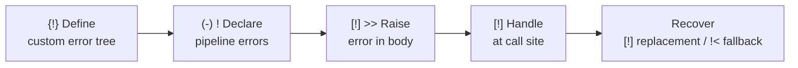
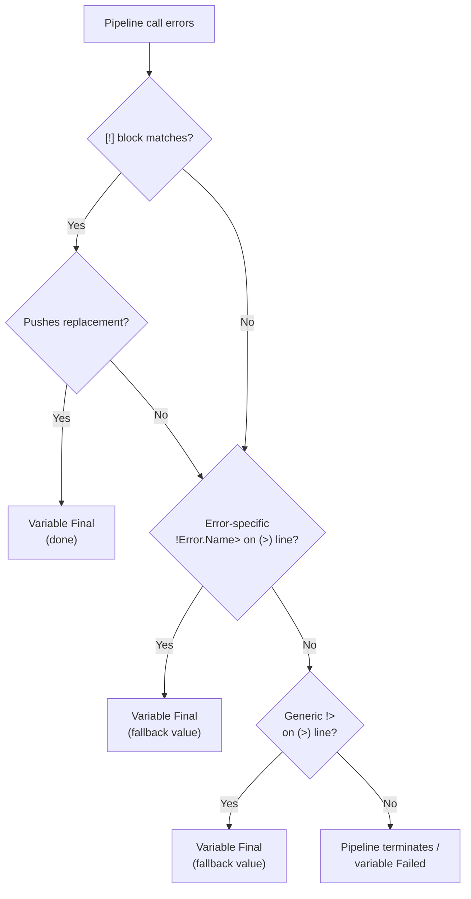

# Error Handling

<!-- @u:pipelines:Error Handling -->
<!-- @c:variable-lifecycle:Failed -->
<!-- @c:data-is-trees -->
<!-- @c:pglib/errors/errors -->

Errors in Polyglot Code use the `!` prefix and live at the `%!` branch of the metadata tree (see [[data-is-trees#How Concepts Connect]]). They follow the same [[identifiers]] rules as all Polyglot objects — `.` for fixed fields, `:` for flexible fields. Every error leaf is typed `#Error` (see [[pglib/errors/errors#`#Error` Struct]]). Error messages use `.MessageTemplate` with `{key}` interpolation — the compiler enforces that every `{key}` exists in `.Info#Record` (PGE07008). System diagnostics (`.Stderr`, `.StackTrace`, `.ExitCode`) are auto-filled by the runtime as `#NullableRecord` fields.



## Defining Custom Errors (`{!}`)

Custom errors are defined with `{!}` blocks (see [[blocks#Definition Elements]]). All user-defined errors live under the `!Error` namespace — `{!} !Name` implicitly creates `!Error:Name.*` in the metadata tree. Use `[:]` for extensible branches and `[.]` for terminal leaves (typed `#Error`):

```polyglot
{!} !Error
   [:] :Validation
      [.] .Empty#Error
      [.] .TooLong#Error
      [.] .InvalidEmail#Error
   [:] :Auth
      [.] .Expired#Error
      [.] .InvalidToken#Error
```

This creates five error identifiers under `!Error`: `!Error:Validation.Empty`, `!Error:Validation.TooLong`, `!Error:Validation.InvalidEmail`, `!Error:Auth.Expired`, `!Error:Auth.InvalidToken`. Tree paths use `:` for user-extensible branches and `.` for fixed leaves (e.g., `%!.Error:Validation.Empty`). Siblings at the same level must all use the same separator (PGE05001).

pglib error namespaces (`!File`, `!No`, `!Timeout`, `!Math`, `!Validation`, `!Field`, `!Alias`, `!Permission`, `!RT`) are built-in and require no definition — they use fixed `.` leaves and are **not** user-extensible. `!Error` is the only namespace with user-extensible children (see [[pglib/errors/errors#`!Error` — User-Extensible Namespace]]). See [[pglib/errors/errors#Built-in Error Namespaces]] for the complete list.

## Declaring Pipeline Errors (`(-) !`)

A pipeline that can raise errors **must** declare them in its IO section using `(-) !ErrorName`:

```polyglot
{-} -ValidateUser
   (-) <name#string
   (-) >validated#string
   (-) >status#string
   (-) !Validation.Empty
   (-) !Validation.TooLong
   [T] -T.Call
   [Q] -Q.Default
   [W] -W.Polyglot
   ...
```

Error declarations are mandatory — a pipeline without `(-) !...` is non-failable. The compiler uses this to enforce:
- **PGE07005** — `[!] >>` raises an error not declared by the pipeline
- **PGE07006** — `(-) !ErrorName` declared but never raised in the execution body
- **PGW07001** — caller adds `[!]` handler on a non-failable pipeline call (dead code)
- **PGW07004** — caller adds `(>) !>` fallback on output from a non-failable pipeline call (dead code)
- **PGE07007** — caller does not address all declared errors (exhaustive handling required)

## Raising Errors (`[!] >>`)

In the execution body, `[!] >> !ErrorName` raises a declared error. The raise block fills `#Error` fields with `(-)` lines:

```polyglot
[?] $name =? ""
   [!] >> !Validation.Empty
      (-) .Message << "Name is required"
      (-) .Info:field << "name"
[?] $name.length >? 100
   [!] >> !Validation.TooLong
      (-) .Message << "Name exceeds 100 characters"
      (-) .Info:field << "name"
      (-) .Info:maxLength << 100
[?] *?
   [-] >validated << $name
   [-] >status << "ok"
```

`.Name` is auto-filled by the runtime (e.g., `"Validation.Empty"`). `.Message` and `.Info` are set at the raise site.

**Default behavior:** When `[!] >>` fires, **all pipeline outputs go Failed** unless the raise block provides fallback values (see [[errors#Output Fallback on Raise]]).

## Output Fallback on Raise

Inside a `[!] >>` block, the author can push fallback values to specific outputs. Outputs not mentioned go Failed:

```polyglot
[!] >> !Validation.Empty
   (-) .Message << "Name is required"
   (-) >status << "invalid"
      (>) %FallbackMessage << "Pipeline returns invalid status on empty input"

   [ ] >validated not mentioned — goes Failed
```

`(>) %FallbackMessage` documents **why** this fallback exists. It is displayed by PGW07002 when a caller overrides the fallback with `(>) !>`.

### Fallback Warning Rules

| Author fallback? | `%FallbackMessage`? | Caller `!>`? | Result |
|-----------------|---------------------|-------------|--------|
| Yes | Missing | — | **PGW07003** to author: missing message |
| Yes | `""` (suppressed) | Yes | Override silently — author allows it |
| Yes | `"reason"` | Yes | **PGW07002** to caller: shows author's reason |
| Yes | `"reason"` | No | Normal — caller uses author's fallback |
| No | — | Yes | Normal `!<` / `!>` behavior |

- **PGW07002** — caller `(>) !>` overrides a pipeline-defined fallback that has `%FallbackMessage`. See [[compile-rules/PGW/PGW07002-caller-overrides-pipeline-fallback]].
- **PGW07003** — author sets output fallback in `[!] >>` without `(>) %FallbackMessage`. Suppress with `%FallbackMessage << ""`. See [[compile-rules/PGW/PGW07003-missing-fallback-message]].

## Error Scoping

`[!]` error blocks are scoped to the specific `[-]` call that can produce them (PGE07001), indented under the call (after its `(-)` IO lines). Under a single `[-]` call, no two `[!]` blocks may handle the same error name (PGE07004).

```polyglot
[-] @FS-File.Text.Read
   (-) <path << <filepath
   (-) >content >> >content
   [!] !File.NotFound
      [-] >content << "Error: file not found"
   [!] !File.ReadError
      [-] >content << "Error: could not read file"
```

The compiler enforces exhaustive error handling (PGE02005): every failable call must have either an `[!]` block that provides a replacement value, or `!<`/`!>` fallback operators on its IO lines. If neither is present, the compiler emits PGE02005.

## Error Recovery

Three patterns for error handling:

| Pattern | Pipeline continues? | Variable state |
|---------|-------------------|---------------|
| `[!]` pushes replacement (`<<`/`>>`) | Yes | Always Final |
| `(>) !>` fallback on IO line | Yes | Always Final — fallback value used |
| `(>) !ErrorName>` specific error fallback | Yes | Always Final — targeted fallback |

**`[!]` block replacement:**

```polyglot
[-] -Fetch
   (-) >payload >> >data
   [!] !FetchError
      [-] -LogError
         (-) <msg << "fetch failed"
      [-] >data << ""              [ ] replacement → Final
[-] -Process
   (-) <input << >data             [ ] ✓ always Final
```

**`!>` fallback on IO line:**

```polyglot
[-] -Fetch
   (-) >payload >> >data
   (>) !> "default"                [ ] catch-all fallback → Final
[-] -Process
   (-) <input << >data             [ ] ✓ always Final
```

**`!ErrorName>` specific error fallback:**

```polyglot
[-] -Fetch
   (-) >payload >> >data
   (>) !FetchError> "unavailable"  [ ] specific fallback
   (>) !> ""                       [ ] catch-all for remaining errors
```

## Chain Error Addressing

In chain execution (`[-] -A->-B->-C`), errors are prefixed with a step reference (PGE07002):

**Prefer numeric indices** — always unambiguous:

```polyglot
[-] -File.Text.Read->-Text.Parse.CSV
   (-) >0.path#path << $path
   (-) <1.rows#string >> >content
   [!] !0.File.NotFound
      [-] >content << "Error: file not found"
   [!] !1.Parse.InvalidFormat
      [-] >content << "Error: invalid CSV"
```

**Leaf name ambiguity:** When a leaf name shares a segment with the error name, extend the step reference by one level up to disambiguate:

```polyglot
[ ] Ambiguous — "Read" + "File.NotFound" looks like step "Read.File"
[!] !Read.File.NotFound

[ ] Unambiguous — extend step ref to "Text.Read"
[!] !Text.Read.File.NotFound

[ ] Always safe — numeric index
[!] !0.File.NotFound
```

See [[concepts/pipelines/chains#Error Handling in Chains]] for the full chain execution context.

## Standard Error Trees

Every pipeline exposes an error tree via `(-) !ErrorName` declarations — a structured list of every error it can raise. The pglib defines nine root namespaces (defined as `{!}` blocks by the runtime, all with fixed `.` leaves):

| Namespace | Covers |
|-----------|--------|
| `!File` | File system operations (NotFound, ReadError, WriteError, ParseError) |
| `!No` | Missing resource errors (Input, Output) |
| `!Timeout` | Operation timeouts (Connection, Read) |
| `!Math` | Arithmetic errors (DivideByZero) |
| `!Validation` | Data validation failures (Schema, Type, Regex) |
| `!Field` | Field access errors (NotFound, PathError) |
| `!Alias` | Alias resolution errors (Clash) |
| `!Permission` | Runtime system denials when OS/system blocks a granted permission |
| `!RT` | Runtime execution errors (CompileError, RuntimeError, Timeout, EnvironmentError) |
| `!Error` | **User-extensible** — the only namespace with `:` flexible children |

See [[pglib/errors/errors]] for the complete error tree listings.

## Failed State

When a pipeline responsible for producing a variable's value terminates with an error, that variable enters the **Failed** stage (see [[variable-lifecycle#Failed]]). A failed variable:

- Will **never resolve** — it cannot transition to any other stage
- Causes downstream pipelines waiting on it to **not fire** (IO implicit gate)
- Has its `live` metadata frozen and accessible in `[!]` error handlers

Query a variable's state via `$varName%state` — this reads from `%$:{name}:{instance}.state` in the metadata tree. The `#VarState` enum includes: Declared, Default, Final, Failed, Released. See [[metadata#Variable (`$`)]].

## Error Fallback Operators

<!-- @u:operators -->
<!-- @u:io:Fallback IO -->
<!-- @u:blocks:Data Flow -->
The `!<` and `!>` operators (see [[operators#Assignment Operators]]) provide inline fallback values on IO lines, preventing variables from entering the Failed state. The `!` error sigil always leads, with the direction arrow (`<` or `>`) following — optionally with an error name between (`!Error.Name<`, `!Error.Name>`). Fallback lines use the `(>)` / `(<)` IO parameter handling markers (see [[blocks#Data Flow]]) scoped under `(-)` IO lines (see [[io#IO Parameter Handling]]).

### Generic Fallback

A `(>) !> value` line catches **any** error not handled by an `[!]` block:

```polyglot
[-] -File.Text.Read
   (-) <path << $file
   (-) >content >> $out
      (>) !> "generic fallback"
```

If `-File.Text.Read` errors (any error), `$out` becomes Final with `"generic fallback"` instead of entering the Failed state.

### Error-Specific Fallback

`!Error.Name>` places the error name between `!` and the direction arrow, providing a fallback only for that specific error:

```polyglot
[-] -File.Text.Read
   (-) <path << $file
   (-) >content >> $out
      (>) !> "generic fallback"
      (>) !File.NotFound> "file not found"
      (>) !File.ReadError> "read error"
```

Error-specific fallbacks take priority over the generic fallback.

### Fallback Values

Fallback accepts any `value_expr` — not just literals:

```polyglot
(-) >profile >> $profile
   (>) !> $defaultProfile
   (>) !> -LoadCached"{$userId}"
```

(Only ONE of the above per output — duplicates are PGE07003.)

### Precedence: `[!]` Before `!<` / `!>`

When both `[!]` blocks and `!>` fallback exist on the same pipeline call:



1. Pipeline call errors
2. `[!]` blocks check — if a matching `[!]` exists, its body runs first
3. If `[!]` pushed a replacement value → variable is Final, done
4. If `[!]` did NOT push a replacement (or no `[!]` matched):
   - Error-specific `!Error.Name>` on `(>)` line → variable is Final with that value
   - Generic `!>` on `(>)` line → variable is Final with that value
   - No fallback exists → existing behavior (pipeline terminates or variable is Failed)
5. When any fallback activates: `$var%sourceError` is set to the error that occurred

```polyglot
[-] -File.Text.Read
   (-) <path << $file
   (-) >content >> $out
      (>) !> "last resort"
   [!] !File.NotFound
      [ ] Complex recovery — [!] handles this fully
      [-] -LogMissing
         (-) <path << $file
      [-] >content << "logged and handled"
   [!] !File.ReadError
      [ ] Simple fallback inside [!]
      (-) >content !< "read error"
```

Here `!File.NotFound` is fully handled by `[!]` (it pushes a replacement). `!File.ReadError` uses `!<` inside its `[!]` block. Any other error falls through to the generic `(>) !> "last resort"`.

### Metadata Exposure

When a fallback activates, the error that triggered it is accessible via `$var%sourceError` (`#live.error`). If no error occurred, `%sourceError` is `!NoError`. See [[metadata#Variable (`$`)]].

```polyglot
[?] $content%sourceError =!? !NoError
   [-] -LogWarning
      (-) <msg << "Used fallback for {$file}: {$content%sourceError}"
[?] *?
   [ ] Normal path — no error occurred
```

### Compiler Rules

- **PGE07003** — duplicate `!>` / `!<` on same output for same error (or duplicate generic). See [[compile-rules/PGE/PGE07003-duplicate-fallback-assignment]].

## Compile Rules

Error declaration, handling, and fallback rules enforced at compile time. See [[compile-rules/PGE/{code}|{code}]] for full definitions.

| Code | Name | Section |
|------|------|---------|
| PGE07001 | `[!]` Error Block Scoping | Error Scoping |
| PGE07002 | Chain Error Scoping | Chain Error Addressing |
| PGE07003 | Duplicate Fallback Assignment | Error Fallback Operators |
| PGE07004 | Duplicate Error Handler | Error Scoping |
| PGE07005 | Undeclared Error Raise | Raising Errors |
| PGE07006 | Unused Error Declaration | Declaring Pipeline Errors |
| PGE07007 | Error Handling Must Be Exhaustive | Declaring Pipeline Errors |
| PGW02004 | Pipeline Terminates on Error | Error Recovery |
| PGW07001 | Error Handler on Non-Failable Call | Declaring Pipeline Errors |
| PGW07002 | Caller Overrides Pipeline Fallback | Output Fallback on Raise |
| PGW07003 | Missing Fallback Message | Output Fallback on Raise |
| PGW07004 | Fallback on Non-Failable IO | Error Fallback Operators |
