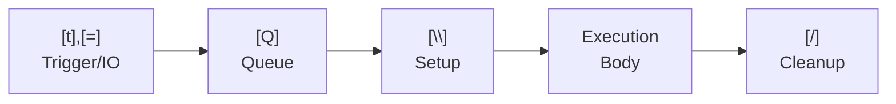
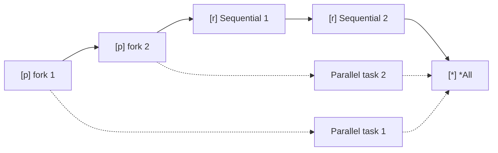
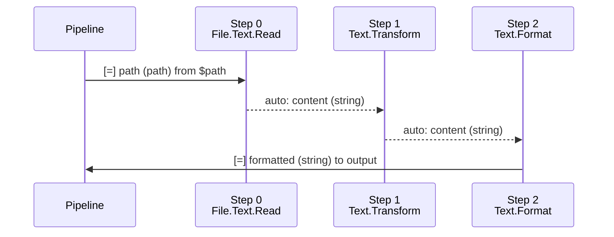
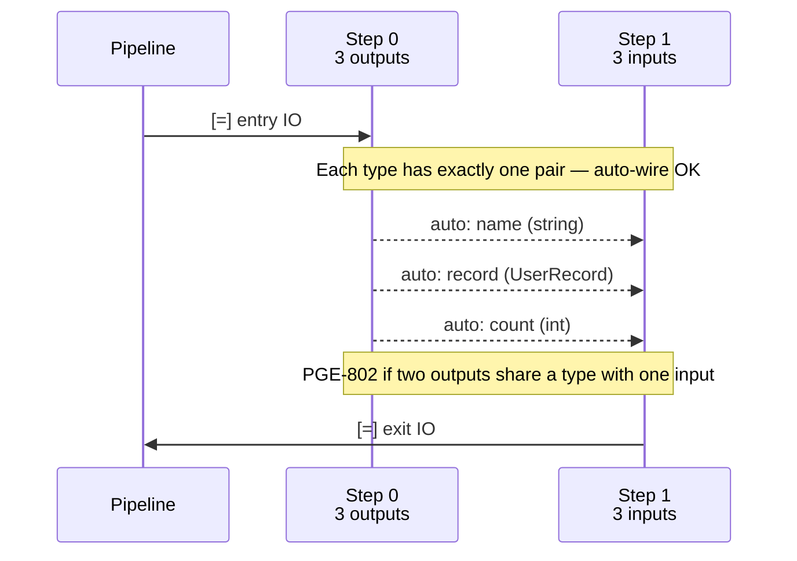
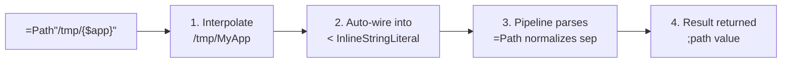

# Pipeline Structure

<!-- @blocks -->
<!-- @io -->
<!-- @operators -->
<!-- @variable-lifecycle -->
Every pipeline definition `{=}` (see [[blocks]]) must contain these elements in order. IO lines use [[io]] parameters with [[operators]] for assignment. Variable states follow [[variable-lifecycle]].

| Order | Element | Marker | Required |
|-------|---------|--------|----------|
| 0 | Metadata | `[%]` | Optional |
| 1 | Permissions | `[_]` | Optional |
| 2 | Trigger / IO / Errors | `[t]`, `[=]` | `[t]` mandatory, `[=]` optional |
| 3 | Queue | `[Q]` | Mandatory |
| 4 | Wrapper | `[W]` | Mandatory |
| 5 | Execution | `[r]`, `[p]`, `[b]`, `[s]`, `[?]` | Yes |

Misordering these sections is a compile error (PGE-101).

**Metadata:** `[%]` lines declare description, version, authors, license, deprecation, and aliases. `.info;serial` holds custom metadata. Duplicate metadata field names are a compile error (PGE-115). See [[blocks#Metadata]].

**Note:** `[t]` triggers, `[=]` IO declarations, and `[=] !ErrorName` error declarations form one section. IO declarations must appear **before** any trigger that pushes into them — the variable must exist before assignment (PGE-102). Error declarations (`[=] !ErrorName`) appear alongside IO declarations. When a trigger produces outputs (e.g., `=T.Folder.NewFiles`), its `[=]` IO lines are indented under the `[t]` line and wire trigger outputs to pipeline inputs.

## Pipeline Metadata

Every pipeline carries implicit `live` metadata fields populated by the Polyglot runtime. Pipeline metadata lives at `%=:{name}:{instance}` in the unified tree — see [[data-is-trees#How Concepts Connect]]. Query built-in metadata via the `%` accessor instead of creating custom booleans. See [[metadata]] for the full metadata tree, field listings, and access patterns.

### Error Trees

Every failable pipeline **must** declare its errors with `[=] !ErrorName` in the IO section. This is the pipeline's error tree — a structured list of every error it can raise:

```polyglot
{=} =ValidateUser
   [=] <name;string
   [=] >validated;string
   [=] !Validation.Empty
   [=] !Validation.TooLong
   [t] =T.Call
   [Q] =Q.Default
   [W] =W.Polyglot
   ...
```

Error declarations are mandatory for failable pipelines. A pipeline without `[=] !...` is non-failable — the compiler warns (PGW-701) if a caller adds `[!]` handlers on it. Errors are raised in the execution body with `[!] >> !ErrorName` (see [[errors#Raising Errors]]). Custom error types are defined with `{!}` blocks (see [[errors#Defining Custom Errors]]). For stdlib pipeline error trees, see [[stdlib/errors/errors#Pipeline Error Associations]].

## Error Handling

`[!]` error blocks are scoped to the specific `[r]` call that can produce them, indented under the call (after its `[=]` IO lines):

```polyglot
[r] @FS=File.Text.Read
   [=] <path << <filepath
   [=] >content >> >content
   [!] !File.NotFound
      [r] >content << "Error: file not found"
   [!] !File.ReadError
      [r] >content << "Error: could not read file"
```

| Pattern | Pipeline continues? | Variable state |
|---------|-------------------|---------------|
| `[!]` pushes replacement (`<<`/`>>`) | Yes | Always Final |
| `[!]` without replacement (default) | No — ends on error | Never Failed |
| `[!]` with `[*] *Continue >IsFailed >> $var` | Yes | May be Failed — handle via `$var` boolean |
| `[>] <!` fallback on IO line | Yes | Always Final — fallback value used |

For simple "on error, use this value" cases, use `[>] <!` fallback under the `[=]` output line:

```polyglot
[r] =File.Text.Read
   [=] <path << $file
   [=] >content >> $out
      [>] <! "fallback value"
      [>] <!File.NotFound "file not found"
```

`[!]` blocks run first; `<!` catches what `[!]` didn't handle. For the full error model — chain error addressing, `*Continue` recovery patterns, fallback operators, standard error trees, and the Failed state — see [[errors]]. Errors live at the `%!` branch of the metadata tree (see [[data-is-trees#How Concepts Connect]]).

## IO as Implicit Triggers

IO inputs act as implicit trigger gates based on their assignment operator:

| Assignment | Behavior |
|------------|----------|
| `<input << "value"` | **Constant** — always satisfied, value is locked |
| `<input <~ "value"` | **Has default** — uses default if all other triggers fire but nothing fills this input |
| `<input` (no assignment) | **Must be filled externally** — via caller or trigger wiring. Pipeline will not fire until this input reaches Final state |

There is no need to validate inputs with `[?]` checks — unfilled required inputs prevent the pipeline from triggering.

## Permissions

<!-- @permissions -->
Pipelines can declare `[_]` permission lines after the `{=}` header (and `[%]` metadata, if present), before `[t]`, `[Q]`, `[W]`, and IO. The same applies to all `{x}` definitions (`{M}` macros, etc.). See [[permissions]] for the full permission system.

```polyglot
{=} =AnalyzeLogs
   [_] _File.read"/var/log/*.log"
   [t] =T.Manual
   [Q] =Q.Default
   [W] =W.Polyglot
   [=] <logPath;path
   [=] >summary;string
   [r] $content << =File.Text.Read >> "{$logPath}"
   [r] >summary << ...
```

- **Subset of ceiling** — every `[_]` in a pipeline must fall within the package `{@}` ceiling (PGE-915). See [[packages#Permissions]] for ceiling rules.
- **No `[_]` = pure computation** — a pipeline with no `[_]` lines cannot perform IO, even if the package has a ceiling. Any IO call is a compile error.
- **Explicit request** — permissions are never inherited from the package. Each pipeline must declare what it needs.

## Triggers

Every pipeline must have at least one `[t]` trigger — omitting it is a compile error (PGE-105).

- `=T.Call` — invoked when called from another pipeline
- Standard library triggers live under `=T.*` namespace — no `[@]` import needed (see [[packages#Usage]])
- Triggers with arguments: `=T.Daily"3AM"`, `=T.Webhook"/path"`, `=T.Folder.NewFiles"/dir/"`
If a trigger's boolean expression evaluates to the same value for all combinations of trigger states, it is a tautology or contradiction (PGE-118).

- Triggers that produce outputs wire them to pipeline inputs via indented `[=]` IO lines:

```polyglot
[=] <NewFiles;array.path
[t] =T.Folder.NewFiles"/inbox/"
   [=] >NewFiles >> <NewFiles
```

## Queue

Every pipeline must declare a `[Q]` line — omitting it is a compile error (PGE-106). Polyglot uses a two-queue execution model:

- **Pending Queue** — pipelines awaiting dispatch after all triggers fire. Strategies control ordering (FIFO, LIFO, Priority).
- **Active Queue** — pipelines currently executing. Controls include pause, resume, and kill operations.

### Defining a Queue (`{Q}`)

Custom queues are defined with `{Q}`, which both defines the queue struct and instantiates it. The identifier must use the `#Queue:` prefix (PGE-112). Queue-level defaults apply to all pipelines assigned to this queue.

```polyglot
{Q} #Queue:GPUQueue
   [.] .strategy;#QueueStrategy << #LIFO
   [.] .maxInstances;int << 1
   [.] .retrigger;#RetriggerStrategy << #Disallow
   [ ] Queue-level default: kill after 4 hours
   [Q] =Q.Kill.Graceful
      [=] <ExecutionTime.MoreThan;string << "4h"
```

`=Q.Default` is the only stdlib-provided queue and does not require a `{Q}` definition. All other queues must be defined via `{Q}` first. Referencing an undefined queue is a compile error (PGE-114).

### Using a Queue (`[Q]`)

The `[Q]` line in a pipeline declares which queue it uses. It accepts optional `[=]` IO lines and nested `[Q]` lines for pipeline-specific active controls:

```polyglot
[Q] =Q.Default
```

```polyglot
[Q] #Queue:GPUQueue
   [=] <maxConcurrent;int << 2
   [ ] Pipeline-specific: pause/resume based on RAM
   [Q] =Q.Pause.Hard
      [=] <RAM.Available.LessThan;float << 3072.0
   [Q] =Q.Resume
      [=] <RAM.Available.MoreThan;float << 5120.0
```

| IO Parameter | Type | Description |
|-------------|------|-------------|
| `<maxInstances;int` | int | Max parallel instances of this pipeline |
| `<maxConcurrent;int` | int | Max other pipelines running alongside |
| `<retrigger;#RetriggerStrategy` | enum | Behavior on re-trigger while active |

Pipeline-specific `[Q]` controls must not contradict the queue's `{Q}` defaults (PGE-113). See [[Q]] for the full stdlib queue pipeline catalog.

## Wrappers

Wrappers invoke a macro (see [[blocks]] `{M}`) that provides setup/cleanup scope. Every pipeline requires `[W]` — the compiler rejects pipelines without it (PGE-107). The `[W]` line must reference a valid macro (PGE-108), and the IO wired at the `[W]` site must match the macro's `[{]`/`[}]` declarations (PGE-109).

Macros (`{M}`) cannot contain `[t]`, `[Q]`, `[=]`, `[p]`, `[b]`, or `[*]` — these are pipeline-only elements (PGE-104). See [[blocks]] for macro structural constraints.

- `[\]` — macro setup, runs before the execution body
- `[/]` — macro cleanup, runs after the execution body
- `[{]` — macro input (typed variable from pipeline scope)
- `[}]` — macro output (variable exposed back to pipeline scope)

At the `[W]` usage site, macro IO is wired using `[=]` with `$` variables:

```polyglot
[W] =W.DB.Connection
   [=] $connectionString << $connStr
   [=] $dbConn >> $dbConn
```

After `[W]` wiring, the macro's `[}]` outputs (e.g., `$dbConn`) become available as `$` variables in the execution body.

Execution order: `[t],[=]` → `[Q]` → `[\]` → Execution Body → `[/]`



### Parallel Forking in Setup

`[p]` or `[b]` inside `[\]` forks a parallel execution path:

- **`[p]` with no `[*] *All` in setup** — the forked path outlives setup and runs **concurrently with the execution body**. `[/]` uses `[*] *All` with `[*] << $var` to collect the result before proceeding.
- **`[b]` in setup** — fire-and-forget. No collection in `[/]` is possible.
- Variables produced in `[\]` (including by `[p]`) are accessible in `[/]` — same principle as `$dbConn` flowing from `[\]` to `[/]` in `=W.DB.Connection`.



**Pairing constraint:** A `[p]` started in `[\]` and its `[*] *All` collector form an exclusive pair — the collection **must** appear in `[/]`, never in the execution body. The execution body runs while the `[p]` is still in-flight; only `[/]` runs after execution completes and can safely collect.

| Started in | Collected in | Valid? |
|------------|--------------|--------|
| `[\]` `[p]` | `[/]` `[*] *All` | ✓ |
| `[\]` `[p]` | Execution body `[*] *All` | ✗ — body runs while `[p]` is still in-flight |
| Execution body `[p]` | Execution body `[*] *All` | ✓ — normal parallel pattern |

```polyglot
{M} =W.Tracing
   [{] $traceId;string
   [}] $duration;string

   [\]
      [ ] Sequential: open session — blocks before body starts
      [r] =Tracer.Open
         [=] <id << $traceId
         [=] >session >> $session

      [ ] Parallel: no *All after — timer runs concurrently with body
      [p] =Tracer.StartTimer
         [=] <session << $session
         [=] >handle >> $timerHandle

   [ ] body executes here while timer is running

   [/]
      [ ] Collect the timer started in setup
      [*] *All
         [*] << $timerHandle

      [r] =Tracer.StopTimer
         [=] <handle << $timerHandle
         [=] >elapsed >> $duration

      [r] =Tracer.Close
         [=] <session << $session
```

Common wrappers:
- `[W] =W.Polyglot` — default, pure Polyglot Code (calls `=DoNothing` for setup/cleanup)
- `[W] =W.DB.Transaction` — database connection + transaction lifecycle
- `[W] =W.HTTP.Session` — HTTP client lifecycle

See [[STDLIB#Wrappers]] for the full wrapper catalog.

## Execution

The execution section contains `[r]`, `[p]`, `[b]`, `[s]`, `[?]` lines — see [[blocks#Execution]]. For collection operations within execution, see [[collections]].

### Execution Rules

Every line in the execution body must begin with a block element marker — `[r]`, `[p]`, `[b]`, `[?]`, `[s]`, or an expand operator (PGE-116). Use `[r]` for process steps and assignment, not `[=]` — the `[=]` marker is reserved for IO declarations (PGE-117).

## Chain Execution

<!-- @io:Chain IO Addressing -->
<!-- @operators -->
Every step in a chain must be a pipeline reference — non-pipeline values are a compile error (PGE-806). Chain execution wires multiple pipelines in sequence on a single `[r]` line, with `=>` separating each step (no spaces — the chain is one continuous expression). IO lines under the chain address individual steps by **numeric index** (0-based) or **leaf name** (the last segment of the pipeline's dotted name).

```polyglot
[r] =Pipeline1=>=Pipeline2=>=Pipeline3
   [=] >0.inputParam;path << $file
   [=] <0.outputResult >> <1.inputParam
   [=] <2.outputResult >> >output
```

### Step Addressing

IO parameters in a chain are prefixed with a step reference and `.`:

| Syntax | Meaning |
|--------|---------|
| `>N.param` | Push into step N's input (caller perspective) |
| `<N.param` | Pull from step N's output (caller perspective) |
| `>LeafName.param` | Same as `>N` but using pipeline's leaf name |
| `<LeafName.param` | Same as `<N` but using pipeline's leaf name |

The direction convention is **caller-perspective**: `>` means data flows *toward* the step (its input), `<` means data flows *from* the step (its output). This is consistent with how `[=]` IO works in regular pipeline calls. See [[io#Chain IO Addressing]].

**Leaf name alternative:** When pipeline names are long, use the leaf name (last segment) instead of numeric index. Leaf names must be unambiguous within the chain — duplicate leaf names require numeric indices. An ambiguous step reference is PGE-804; an unresolved step reference is PGE-805.

```polyglot
[r] =File.List=>=Data.Transform.Rows=>=Report.Format
   [=] >List.folder;path << $folder
   [=] <List.files >> <Rows.input
   [=] <Format.result >> >report
```

Numeric and leaf name references can be mixed in the same chain.

### Auto-Wire



When a step has exactly one output and the next step has exactly one input, and both share the same data type, the wire between them is implicit — no `[=]` line is needed. Only entry IO (first step's inputs) and exit IO (last step's outputs) must be declared.

```polyglot
[r] =File.Text.Read=>=Text.Transform=>=Text.Format
   [ ] Each step: one output;string → one input;string — auto-wired
   [=] >0.path;path << $path
   [=] <2.formatted;string >> >formatted
```

Auto-wire requires:
- Exactly one output on the source step
- Exactly one input on the target step
- Matching data types between them

When multiple ports exist, auto-wire succeeds only if each type has exactly one match on each side — no ambiguity:



A type mismatch between auto-wired ports is PGE-801. When multiple ports could match, the wire is ambiguous (PGE-802). An unmatched parameter with no valid auto-wire candidate is PGE-803. Note that successful auto-wire emits a warning (PGW-801) — explicit `[=]` wiring is preferred.

If any condition is not met, explicit `[=]` wiring is required.

### Error Handling in Chains

Errors in chains use the `!` prefix with a step index or leaf name, followed by the error name. `[!]` blocks are scoped under the chain `[r]` call, after the `[=]` IO lines. See [[pipelines#Error Handling]] for standard error scoping rules.

**Prefer numeric indices** — they are always unambiguous:

```polyglot
[r] =File.Text.Read=>=Text.Parse.CSV
   [=] >0.path;path << $path
   [=] <1.rows;string >> >content
   [!] !0.File.NotFound
      [r] >content << "Error: file not found"
   [!] !1.Parse.InvalidFormat
      [r] >content << "Error: invalid CSV"
```

**Leaf name ambiguity:** When a leaf name shares a segment with the error name, the boundary is ambiguous. For example, `!Read.File.NotFound` is unclear — is the step `Read` (with error `File.NotFound`) or `Read.File` (with error `NotFound`)? In these cases, extend the step ref by one level up to disambiguate:

```polyglot
[ ] Ambiguous — "Read" + error "File.NotFound" looks like step "Read.File"
[!] !Read.File.NotFound

[ ] Unambiguous — extended step ref "Text.Read" is distinct from error "File.NotFound"
[!] !Text.Read.File.NotFound

[ ] Always safe — numeric index avoids all ambiguity
[!] !0.File.NotFound
```

### Fallback in Chains

In chain execution, `[>]`/`[<]` markers cannot carry step addressing. Use the `[=]` explicit form with `<!` instead:

```polyglot
[r] =File.Text.Read=>=Text.Parse.CSV
   [=] >0.path << $file
   [=] <1.rows >> $rows
   [=] <0.content <! ""
   [=] <1.rows <! ""
   [!] !0.File.NotFound
      [=] <0.content <! "missing"
```

See [[errors#Error Fallback Operators]] for the full fallback model.

### Type Annotations on Wires

Type annotations (`;type`) on chain IO lines are **optional**. When present, the compiler validates that connected ports have matching types. When omitted, types are inferred from the pipeline definitions.

## Inline Pipeline Calls

<!-- @types -->
An inline pipeline call evaluates a pipeline as a single value. The syntax is `=Pipeline"string"` — a pipeline reference immediately followed by a string literal. Inline calls are valid anywhere a `value_expr` is expected: assignment RHS, comparison operands, etc. See [[types#`=Path"..."` Inline Notation]] for the `=Path` example.

```polyglot
[r] $dir;path << =Path"/tmp/MyApp"
[r] $msg;string << =Greeting"Hello {$name}"
[?] $dir =? =Path"/expected"
```

### Reserved Parameter: `<InlineStringLiteral;string`

Every pipeline has a reserved parameter name `InlineStringLiteral`. To accept inline calls, a pipeline must explicitly declare it in its `[=]` IO:

```polyglot
[=] <InlineStringLiteral;string <~ ""
```

The default value is `""`. When the pipeline is called inline (`=Pipeline"..."`), the compiler auto-wires the rendered string into this parameter. When called normally (via `[r]`), the default `""` applies.

### Mechanism

1. **String interpolation** — `{$var}` inside the string literal resolves first
2. **Auto-wire** — the rendered string is pushed into `<InlineStringLiteral;string`
3. **Pipeline-specific parsing** — the pipeline body interprets the string its own way (e.g., `=Path` normalizes separators, `=T.Daily` parses a time)
4. **Result returned** — the pipeline's output becomes the value of the expression



### Return Value

| Pipeline outputs | Value type |
|------------------|-----------|
| One `>output` | That output's type directly |
| Multiple `>outputs` | `;serial` with output parameter names as keys |

If the target type does not match the inline pipeline's output type, the compiler raises a type or schema mismatch error.

### Dual-Mode Pipelines

Since `<InlineStringLiteral;string` defaults to `""`, a pipeline can support both normal calls and inline calls. Guard inline-specific logic with a conditional:

```polyglot
{=} =Greeting
   [%] .description << "Generates a greeting message"
   [=] <InlineStringLiteral;string <~ ""
   [=] <name;string <~ ""
   [=] >message;string
   [t] =T.Call
   [Q] =Q.Default
   [W] =W.Polyglot
   [?] $InlineStringLiteral =!? ""
      [ ] Inline call — parse the string
      [r] $name << $InlineStringLiteral
   [?] *?
      [ ] Normal call — $name filled by caller
   [r] >message << "Hello {$name}"
```

Both calling forms work:

```polyglot
[ ] Inline call
[r] $msg;string << =Greeting"World"

[ ] Normal call
[r] =Greeting
   [=] <name << "World"
   [=] >message >> $msg
```

### Where Inline Calls Are NOT Valid

- **Chain calls** — `=>` connects pipeline references, not values. `[r] =Path"/tmp"=>=Other` is invalid (both sides would be values).
- **LHS of assignments** — inline calls produce values, they are not assignable targets.

## Call Site Rules

When calling a pipeline (via `[r]`, `[p]`, `[b]`, or chain step), the compiler enforces IO wiring constraints:

- **Assignment target** — the LHS of an assignment must be a variable, output port, or field path, not a value expression (PGE-807).
- **Required inputs** — every required `<input` (no default) must be wired by the caller. Missing a required input is PGE-808.
- **Required outputs** — every required `>output` must be captured or explicitly discarded with `$*`. Failing to capture is PGE-809.
- **IO direction** — inputs use `<<`, outputs use `>>`. Reversing the direction operator is a compile error (PGE-810).
- **IO name matching** — the parameter name at the call site must match a declared IO name on the target pipeline (PGE-110).
- **Duplicate IO** — the same IO parameter cannot be wired twice in a single call (PGE-111).

Inputs with defaults that are not addressed by the caller emit a warning (PGW-808). Outputs with defaults or fallbacks that are not captured emit a warning (PGW-809).

## Compile Rules

Pipeline structure, chain execution, and call site rules enforced at compile time. See [[compile-rules/PGE/{code}|{code}]] for full definitions.

| Code | Name | Section |
|------|------|---------|
| PGE-101 | Pipeline Section Misordering | Pipeline Structure |
| PGE-102 | IO Before Trigger | Pipeline Structure |
| PGE-104 | Macro Structural Constraints | Wrappers |
| PGE-105 | Missing Pipeline Trigger | Triggers |
| PGE-106 | Missing Pipeline Queue | Queue |
| PGE-107 | Missing Pipeline Setup/Cleanup | Wrappers |
| PGE-108 | Wrapper Must Reference Macro | Wrappers |
| PGE-109 | Wrapper IO Mismatch | Wrappers |
| PGE-110 | Pipeline IO Name Mismatch | Call Site Rules |
| PGE-111 | Duplicate IO Parameter Name | Call Site Rules |
| PGE-112 | Queue Definition Must Use #Queue: Prefix | Queue |
| PGE-113 | Queue Control Contradicts Queue Default | Queue |
| PGE-114 | Unresolved Queue Reference | Queue |
| PGE-115 | Duplicate Metadata Field | Pipeline Metadata |
| PGE-116 | Unmarked Execution Line | Execution Rules |
| PGE-117 | Wrong Block Element Marker | Execution Rules |
| PGE-118 | Tautological Trigger Condition | Triggers |
| PGE-801 | Auto-Wire Type Mismatch | Auto-Wire |
| PGE-802 | Auto-Wire Ambiguous Type | Auto-Wire |
| PGE-803 | Auto-Wire Unmatched Parameter | Auto-Wire |
| PGE-804 | Ambiguous Step Reference | Step Addressing |
| PGE-805 | Unresolved Step Reference | Step Addressing |
| PGE-806 | Non-Pipeline Step in Chain | Chain Execution |
| PGE-807 | Invalid Assignment Target | Call Site Rules |
| PGE-808 | Missing Required Input at Call Site | Call Site Rules |
| PGE-809 | Uncaptured Required Output at Call Site | Call Site Rules |
| PGE-810 | IO Direction Mismatch | Call Site Rules |
| PGW-701 | Error Handler on Non-Failable Call | Error Handling |
| PGW-801 | Auto-Wire Succeeded | Auto-Wire |
| PGW-808 | Unaddressed Input With Default | Call Site Rules |
| PGW-809 | Uncaptured Output With Default/Fallback | Call Site Rules |
