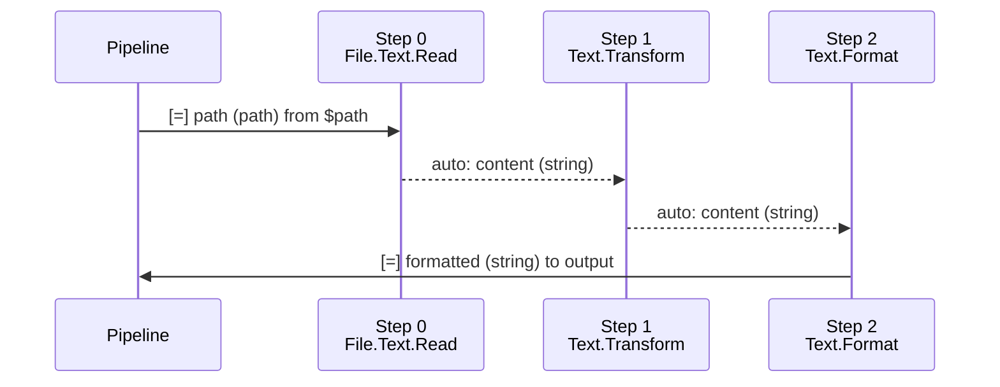
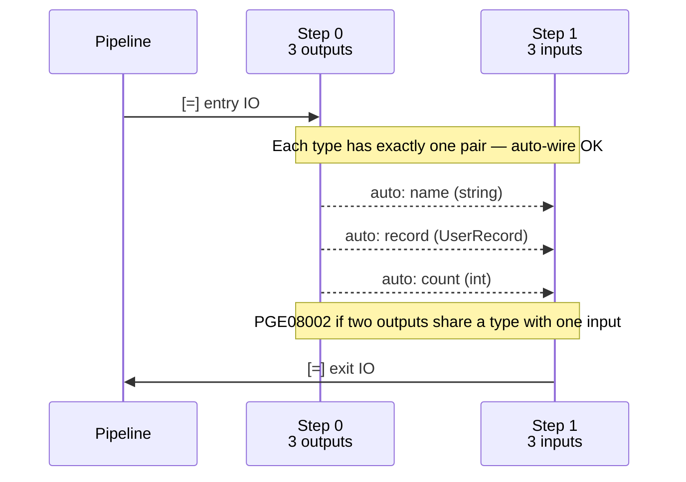

<!-- @concepts/pipelines/INDEX -->

## Chain Execution

<!-- @io:Chain IO Addressing -->
<!-- @operators -->
Every step in a chain must be a pipeline reference — non-pipeline values are a compile error (PGE08006). Chain execution wires multiple pipelines in sequence on a single `[r]` line, with `=>` separating each step (no spaces — the chain is one continuous expression). IO lines under the chain address individual steps by **numeric index** (0-based) or **leaf name** (the last segment of the pipeline's dotted name).

```polyglot
[r] =Pipeline1=>=Pipeline2=>=Pipeline3
   [=] >0.inputParam#path << $file
   [=] <0.outputResult >> <1.inputParam
   [=] <2.outputResult >> >output
```

### Step Addressing

IO parameters in a chain are prefixed with a step reference and `.`:

| Syntax | Meaning |
|--------|---------|
| `>N.param` | Push into step N's input (caller perspective) |
| `<N.param` | Pull from step N's output (caller perspective) |
| `>LeafName.param` | Same as `>N` but using pipeline's leaf name |
| `<LeafName.param` | Same as `<N` but using pipeline's leaf name |

The direction convention is **caller-perspective**: `>` means data flows *toward* the step (its input), `<` means data flows *from* the step (its output). This is consistent with how `[=]` IO works in regular pipeline calls. See [[io#Chain IO Addressing]].

**Leaf name alternative:** When pipeline names are long, use the leaf name (last segment) instead of numeric index. Leaf names must be unambiguous within the chain — duplicate leaf names require numeric indices. An ambiguous step reference is PGE08004; an unresolved step reference is PGE08005.

```polyglot
[r] =File.List=>=Data.Transform.Rows=>=Report.Format
   [=] >List.folder#path << $folder
   [=] <List.files >> <Rows.input
   [=] <Format.result >> >report
```

Numeric and leaf name references can be mixed in the same chain.

### Auto-Wire



When a step has exactly one output and the next step has exactly one input, and both share the same data type, the wire between them is implicit — no `[=]` line is needed. Only entry IO (first step's inputs) and exit IO (last step's outputs) must be declared.

```polyglot
[r] =File.Text.Read=>=Text.Transform=>=Text.Format
   [ ] Each step: one output#string → one input#string — auto-wired
   [=] >0.path#path << $path
   [=] <2.formatted#string >> >formatted
```

Auto-wire requires:
- Exactly one output on the source step
- Exactly one input on the target step
- Matching data types between them

When multiple ports exist, auto-wire succeeds only if each type has exactly one match on each side — no ambiguity:



A type mismatch between auto-wired ports is PGE08001. When multiple ports could match, the wire is ambiguous (PGE08002). An unmatched parameter with no valid auto-wire candidate is PGE08003. Note that successful auto-wire emits a warning (PGW08001) — explicit `[=]` wiring is preferred.

If any condition is not met, explicit `[=]` wiring is required.

### Error Handling in Chains

Errors in chains use the `!` prefix with a step index or leaf name, followed by the error name. `[!]` blocks are scoped under the chain `[r]` call, after the `[=]` IO lines. See [[concepts/pipelines/error-handling|error handling]] for standard error scoping rules.

**Prefer numeric indices** — they are always unambiguous:

```polyglot
[r] =File.Text.Read=>=Text.Parse.CSV
   [=] >0.path#path << $path
   [=] <1.rows#string >> >content
   [!] !0.File.NotFound
      [r] >content << "Error: file not found"
   [!] !1.Parse.InvalidFormat
      [r] >content << "Error: invalid CSV"
```

**Leaf name ambiguity:** When a leaf name shares a segment with the error name, the boundary is ambiguous. For example, `!Read.File.NotFound` is unclear — is the step `Read` (with error `File.NotFound`) or `Read.File` (with error `NotFound`)? In these cases, extend the step ref by one level up to disambiguate:

```polyglot
[ ] Ambiguous — "Read" + error "File.NotFound" looks like step "Read.File"
[!] !Read.File.NotFound

[ ] Unambiguous — extended step ref "Text.Read" is distinct from error "File.NotFound"
[!] !Text.Read.File.NotFound

[ ] Always safe — numeric index avoids all ambiguity
[!] !0.File.NotFound
```

### Fallback in Chains

In chain execution, `[>]`/`[<]` markers cannot carry step addressing. Use the `[=]` explicit form with `<!` instead:

```polyglot
[r] =File.Text.Read=>=Text.Parse.CSV
   [=] >0.path << $file
   [=] <1.rows >> $rows
   [=] <0.content <! ""
   [=] <1.rows <! ""
   [!] !0.File.NotFound
      [=] <0.content <! "missing"
```

See [[errors#Error Fallback Operators]] for the full fallback model.

### Type Annotations on Wires

Type annotations (`#type`) on chain IO lines are **optional**. When present, the compiler validates that connected ports have matching types. When omitted, types are inferred from the pipeline definitions.

## See Also

- [[concepts/pipelines/error-handling|Error Handling]] — `[!]` block scoping rules referenced by chain errors
- [[concepts/pipelines/execution|Execution]] — execution body markers and rules
- [[concepts/pipelines/inline-calls|Inline Calls]] — where inline calls are not valid in chains
