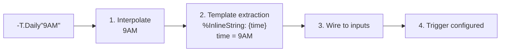

<!-- @concepts/pipelines/INDEX -->
<!-- @u:technical/ebnf/08-expressions -->

## Inline Pipeline Calls (Infrastructure Configuration)

Inline pipeline calls (`-Pipeline"string"`) configure pipeline infrastructure — triggers, queues, and wrappers. They appear exclusively on `[T]`, `[Q]`, and `[W]` lines. A trigger wrapping a schedule, a queue wrapping a Redis config, or a wrapper wrapping an environment all look the same at the call site. The caller writes `-T.Daily"3AM"` and expresses intent; Polyglot handles the wiring underneath.

For value construction in the execution body, use `{$}` **Constructor blocks** — see [[syntax/constructors]]. For dynamic value parsing, use standard `[-]` pipeline calls with error handling. See [[syntax/constructors#The Three-Context Rule|The Three-Context Rule]].

<!-- @c:types -->
An inline pipeline call configures pipeline infrastructure as a single value on `[T]`, `[Q]`, and `[W]` lines. The syntax is `-Pipeline"string"` — a pipeline reference immediately followed by a string literal. These calls configure pipeline behavior at definition time — they are not execution body operations.

```polyglot
[ ] Infrastructure lines — inline calls valid
[T] -T.Daily"9AM"
[Q] -Q.Name"my-queue-config"
[W] -W.Env
   (-) <env#; << ;MyEnv
```

### `%InlineString` Template Declaration (Infrastructure Pipelines)

`%InlineString` is used by trigger (`{T}`), queue (`{Q}`), and wrapper (`{W}`) pipeline definitions to accept inline configuration strings. It is **not** used by `{-}` execution pipelines — value construction in execution body uses `{$}` constructors instead (see [[syntax/constructors]]).

To accept inline calls, an infrastructure pipeline declares a `%InlineString` template in its `(-)` IO section:

```polyglot
(-) %InlineString << "{path}"
```

The template string contains **placeholders** that map to declared `(-)` inputs by name:

- `{name}` — **required** placeholder. Must match a declared `<name` input.
- `{name?}` — **optional** placeholder. The matched `<name` input **must** have a `<~` default.

When the pipeline is called inline (`-Pipeline"..."`), the compiler matches the rendered string against the template, extracts named values, and wires them to the corresponding inputs. When called normally (via `[-]`), `%InlineString` is ignored — callers wire inputs directly.

The compiler validates the template at compile time — a malformed inline call is rejected before your code ever runs, not when your system is under load.

### Mechanism

1. **String interpolation** — `{$var}` inside the caller's string literal resolves first (caller scope)
2. **Template extraction** — the compiler matches the rendered string against the pipeline's `%InlineString` template and extracts named values from placeholder positions
3. **Input wiring** — extracted values are pushed to the corresponding `<name` inputs (type coercion applied)
4. **Pipeline executes** — the pipeline runs with its inputs populated from the template extraction
5. **Result returned** — the pipeline's output becomes the value of the expression

Polyglot builds on the async foundations of languages like Python, Rust, and JavaScript — but abstracts away the concurrency mechanism complexity. You express intent; the platform handles synchronization.



### Cross-Language Inline Calls

Inline calls shine when wrapping legacy code from other languages. The caller does not need to know whether `-Py.Path.Resolve` runs Python underneath or `-Crypto.SHA256` calls Rust — the inline syntax is identical. You get the battle-tested reliability of existing libraries with the composability and compile-time safety of Polyglot.

**Python — resolve a filesystem path using `pathlib`:**

```polyglot
{-} -Py.Path.Resolve
   [%] .description << "Resolve a filesystem path using Python pathlib"
   (-) %InlineString << "{path}"
   (-) <path#string
   (-) >resolved#path
   (-) ;PyPathEnv
   [T] -T.Call
   [Q] -Q.Default
   [W] -W.Env
      (-) <env#; << ;PyPathEnv
   [-] -RT.Python.Function.File
      (-) <env#PyEnv << $env
      (-) <func#string << "resolve_path"
      (-) <arg#array.string << [$path]
      (-) >return#serial >> >resolved
      (-) <file#path << -Path"./scripts/path_utils.py"
```

```polyglot
[ ] Caller on infrastructure line — one line, no knowledge of Python underneath
[W] -W.Env
   (-) <resolved#path << -Py.Path.Resolve"/tmp/{$app}/data"
```

> **Execution body:** For known paths, use `$Path` constructor. For dynamic resolution, call `-Py.Path.Resolve` via `[-]` with error handling.

**Rust — SHA-256 hash via a crypto library:**

```polyglot
{-} -Crypto.SHA256
   [%] .description << "SHA-256 hash via Rust crypto library"
   (-) %InlineString << "{input}"
   (-) <input#string
   (-) >hash#string
   (-) ;RsCryptoEnv
   [T] -T.Call
   [Q] -Q.Default
   [W] -W.Env
      (-) <env#; << ;RsCryptoEnv
   [-] -RT.Rust.Function.File
      (-) <env#RsEnv << $env
      (-) <func#string << "sha256_hex"
      (-) <arg#array.string << [$input]
      (-) >return#serial >> >hash
      (-) <file#path << -Path"./lib/crypto.rs"
```

```polyglot
[ ] Caller on infrastructure line — same inline syntax, Rust runs underneath
[W] -W.Env
   (-) <hash#string << -Crypto.SHA256"{$password}{$salt}"
```

> **Execution body:** For dynamic hashing, call `-Crypto.SHA256` via `[-]` with error handling.

Both pipelines {-} define a `%InlineString` template, both use [-] to call `-RT.<Lang>.Function.File` with the appropriate `-W.Env` wrapper, and both produce a single output. The caller sees only `-Pipeline"value"` — the language boundary is invisible.

### Return Value

| Pipeline outputs | Value type |
|------------------|-----------|
| One `>output` | That output's type directly |
| Multiple `>outputs` | `#serial` with output parameter names as keys |

If the target type does not match the inline pipeline's output type, the compiler raises a type or schema mismatch error.

### Optional Placeholders

Use `{name?}` for optional parts of the template. The matched input **must** have a `<~` default:

```polyglot
{-} -DB.Connect
   [%] .description << "Connect to a database"
   (-) %InlineString << "{host}:{port?}/{db}"
   (-) <host#string
   (-) <port#string <~ "5432"
   (-) <db#string
   (-) >connection#DBConnection
   [T] -T.Call
   [Q] -Q.Default
   [W] -W.Polyglot
   [ ] ... connection logic using $host, $port, $db ...
```

```polyglot
[ ] All placeholders filled — infrastructure line
[W] -W.DB
   (-) <conn << -DB.Connect"myhost:3306/mydb"

[ ] Optional placeholder omitted — $port uses default "5432"
[W] -W.DB
   (-) <conn << -DB.Connect"myhost:/mydb"
```

The compiler enforces that optional placeholders have defaults (`<~`) — every code path produces a value. You handle the edge case at definition time, not when a production connection fails silently.

### Dual-Mode Pipelines

Since `%InlineString` is only used during inline calls, an infrastructure pipeline can support both normal calls and inline calls with no special branching. The same inputs are wired either way:

```polyglot
{-} -MyTrigger
   [%] .description << "Custom trigger with configurable topic"
   (-) %InlineString << "{topic}"
   (-) <topic#string <~ "default"
   (-) >triggered#boolean
   [T] -T.NATS
   [Q] -Q.Default
   [W] -W.Polyglot
   [-] >triggered << #True
```

Both calling forms work — inline on infrastructure lines, or normal `[-]` wiring:

```polyglot
[ ] Inline call on infrastructure line
[T] -MyTrigger"orders"

[ ] Normal call — caller wires <topic directly
[-] -MyTrigger
   (-) <topic << "orders"
   (-) >triggered >> $result
```

### Where Inline Calls Are NOT Valid

- **Chain calls** — `->` connects pipeline references, not values. `[-] -Path"/tmp"->-Other` is invalid (both sides would be values).
- **LHS of assignments** — inline calls produce values, they are not assignable targets.

These restrictions exist because the compiler must resolve whether an expression is a value or a pipeline reference at compile time — ambiguity here would mean bugs that surface only at runtime.

## Call Site Rules

Call site rules are the compiler's contract with you: wire your IO correctly, and the pipeline executes correctly. This is Polyglot's barrier against the parallel programming bugs that plague concurrent code — missing inputs, uncaptured outputs, direction mismatches. Yes, satisfying the compiler is a headache. It is a dramatically smaller headache than debugging silent data loss in production at 3 AM when you have no time or energy to handle it.

When calling a pipeline (via `[-]`, `[=]`, `[b]`, or chain step), the compiler enforces IO wiring constraints:

- **Assignment target** — the LHS of an assignment must be a variable, output port, or field path, not a value expression (PGE08007).
- **Required inputs** — every required `<input` (no default) must be wired by the caller. Missing a required input is PGE08008.
- **Required outputs** — every required `>output` must be captured or explicitly discarded with `$*`. Failing to capture is PGE08009.
- **IO direction** — inputs use `<<`, outputs use `>>`. Reversing the direction operator is a compile error (PGE08010).
- **IO name matching** — the parameter name at the call site must match a declared IO name on the target pipeline (PGE01010).
- **Duplicate IO** — the same IO parameter cannot be wired twice in a single call (PGE01011).

Inputs with defaults that are not addressed by the caller emit a warning (PGW08002). Outputs with defaults or fallbacks that are not captured emit a warning (PGW08003).

## Compile Rules

Pipeline structure and call site rules enforced at compile time. These rules apply to infrastructure inline calls on `[T]`/`[Q]`/`[W]` lines. For constructor compile rules (`{$}` blocks and `$Constructor"..."` calls in execution body), see [[syntax/constructors#Compile Rules|Constructor Compile Rules]] (PGE14xxx category).

| Code | Name | Section |
|------|------|---------|
| PGE01001 | Pipeline Section Misordering | Pipeline Structure |
| PGE01002 | IO Before Trigger | Pipeline Structure |
| PGE01004 | Definition Structural Constraints | Wrappers |
| PGE01005 | Missing Pipeline Trigger | Triggers |
| PGE01006 | Missing Pipeline Queue | Queue |
| PGE01007 | Missing Pipeline Setup/Cleanup | Wrappers |
| PGE01008 | Wrapper Must Reference Wrapper Definition | Wrappers |
| PGE01009 | Wrapper IO Mismatch | Wrappers |
| PGE01010 | Pipeline IO Name Mismatch | Call Site Rules |
| PGE01011 | Duplicate IO Parameter Name | Call Site Rules |
| PGE01012 | Queue Definition Must Use #Queue: Prefix | Queue |
| PGE01013 | Queue Control Contradicts Queue Default | Queue |
| PGE01014 | Unresolved Queue Reference | Queue |
| PGE01015 | Duplicate Metadata Field | Pipeline Metadata |
| PGE01016 | Unmarked Execution Line | Execution Rules |
| PGE01017 | Wrong Block Element Marker | Execution Rules |
| PGE01018 | Tautological Trigger Condition | Triggers |
| PGE08001 | Auto-Wire Type Mismatch | Auto-Wire |
| PGE08002 | Auto-Wire Ambiguous Type | Auto-Wire |
| PGE08003 | Auto-Wire Unmatched Parameter | Auto-Wire |
| PGE08004 | Ambiguous Step Reference | Step Addressing |
| PGE08005 | Unresolved Step Reference | Step Addressing |
| PGE08006 | Non-Pipeline Step in Chain | Chain Execution |
| PGE08007 | Invalid Assignment Target | Call Site Rules |
| PGE08008 | Missing Required Input at Call Site | Call Site Rules |
| PGE08009 | Uncaptured Required Output at Call Site | Call Site Rules |
| PGE08010 | IO Direction Mismatch | Call Site Rules |
| PGW07001 | Error Handler on Non-Failable Call | Error Handling |
| PGW08001 | Auto-Wire Succeeded | Auto-Wire |
| PGW08002 | Unaddressed Input With Default | Call Site Rules |
| PGW08003 | Uncaptured Output With Default/Fallback | Call Site Rules |

## See Also

- [[syntax/constructors]] — `{$}` constructor blocks for execution body value construction
- [[concepts/pipelines/INDEX|Pipeline Structure]] — required pipeline elements and ordering
- [[syntax/types/strings|String Interpolation]] — string interpolation and `$Path"..."` constructor notation
- [[concepts/pipelines/chains|Chain Execution]] — where inline calls are not valid
