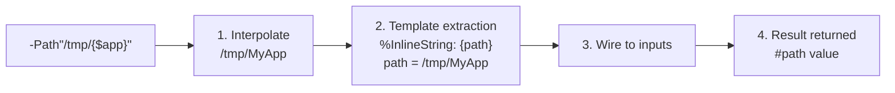

<!-- @concepts/pipelines/INDEX -->

## Inline Pipeline Calls

<!-- @c:types -->
An inline pipeline call evaluates a pipeline as a single value. The syntax is `-Pipeline"string"` — a pipeline reference immediately followed by a string literal. Inline calls are valid anywhere a `value_expr` is expected: assignment RHS, comparison operands, etc. See [[syntax/types/strings#`-Path"..."` Inline Notation]] for the `-Path` example.

```polyglot
[-] $dir#path << -Path"/tmp/MyApp"
[-] $msg#string << -Greeting"Hello {$name}"
[?] $dir =? -Path"/expected"
```

### `%InlineString` Template Declaration

To accept inline calls, a pipeline declares a `%InlineString` template in its `(-)` IO section:

```polyglot
(-) %InlineString << "{path}"
```

The template string contains **placeholders** that map to declared `(-)` inputs by name:

- `{name}` — **required** placeholder. Must match a declared `<name` input.
- `{name?}` — **optional** placeholder. The matched `<name` input **must** have a `<~` default.

When the pipeline is called inline (`-Pipeline"..."`), the compiler matches the rendered string against the template, extracts named values, and wires them to the corresponding inputs. When called normally (via `[-]`), `%InlineString` is ignored — callers wire inputs directly.

### Mechanism

1. **String interpolation** — `{$var}` inside the caller's string literal resolves first (caller scope)
2. **Template extraction** — the compiler matches the rendered string against the pipeline's `%InlineString` template and extracts named values from placeholder positions
3. **Input wiring** — extracted values are pushed to the corresponding `<name` inputs (type coercion applied)
4. **Pipeline executes** — the pipeline runs with its inputs populated from the template extraction
5. **Result returned** — the pipeline's output becomes the value of the expression



### Return Value

| Pipeline outputs | Value type |
|------------------|-----------|
| One `>output` | That output's type directly |
| Multiple `>outputs` | `#serial` with output parameter names as keys |

If the target type does not match the inline pipeline's output type, the compiler raises a type or schema mismatch error.

### Optional Placeholders

Use `{name?}` for optional parts of the template. The matched input **must** have a `<~` default:

```polyglot
{-} -DB.Connect
   [%] .description << "Connect to a database"
   (-) %InlineString << "{host}:{port?}/{db}"
   (-) <host#string
   (-) <port#string <~ "5432"
   (-) <db#string
   (-) >connection#DBConnection
   [T] -T.Call
   [Q] -Q.Default
   [W] -W.Polyglot
   [ ] ... connection logic using $host, $port, $db ...
```

```polyglot
[ ] All placeholders filled
[-] $conn << -DB.Connect"myhost:3306/mydb"

[ ] Optional placeholder omitted — $port uses default "5432"
[-] $conn << -DB.Connect"myhost:/mydb"
```

### Dual-Mode Pipelines

Since `%InlineString` is only used during inline calls, a pipeline can support both normal calls and inline calls with no special branching. The same inputs are wired either way:

```polyglot
{-} -Greeting
   [%] .description << "Generates a greeting message"
   (-) %InlineString << "{name}"
   (-) <name#string <~ "World"
   (-) >message#string
   [T] -T.Call
   [Q] -Q.Default
   [W] -W.Polyglot
   [-] >message << "Hello {$name}"
```

Both calling forms work:

```polyglot
[ ] Inline call — compiler extracts "Alice" and wires to <name
[-] $msg#string << -Greeting"Alice"

[ ] Normal call — caller wires <name directly
[-] -Greeting
   (-) <name << "Alice"
   (-) >message >> $msg
```

### Where Inline Calls Are NOT Valid

- **Chain calls** — `->` connects pipeline references, not values. `[-] -Path"/tmp"->-Other` is invalid (both sides would be values).
- **LHS of assignments** — inline calls produce values, they are not assignable targets.

## Call Site Rules

When calling a pipeline (via `[-]`, `[=]`, `[b]`, or chain step), the compiler enforces IO wiring constraints:

- **Assignment target** — the LHS of an assignment must be a variable, output port, or field path, not a value expression (PGE08007).
- **Required inputs** — every required `<input` (no default) must be wired by the caller. Missing a required input is PGE08008.
- **Required outputs** — every required `>output` must be captured or explicitly discarded with `$*`. Failing to capture is PGE08009.
- **IO direction** — inputs use `<<`, outputs use `>>`. Reversing the direction operator is a compile error (PGE08010).
- **IO name matching** — the parameter name at the call site must match a declared IO name on the target pipeline (PGE01010).
- **Duplicate IO** — the same IO parameter cannot be wired twice in a single call (PGE01011).

Inputs with defaults that are not addressed by the caller emit a warning (PGW08002). Outputs with defaults or fallbacks that are not captured emit a warning (PGW08003).

## Compile Rules

Pipeline structure, chain execution, and call site rules enforced at compile time. See [[compile-rules/PGE/{code}|{code}]] for full definitions.

| Code | Name | Section |
|------|------|---------|
| PGE01001 | Pipeline Section Misordering | Pipeline Structure |
| PGE01002 | IO Before Trigger | Pipeline Structure |
| PGE01004 | Definition Structural Constraints | Wrappers |
| PGE01005 | Missing Pipeline Trigger | Triggers |
| PGE01006 | Missing Pipeline Queue | Queue |
| PGE01007 | Missing Pipeline Setup/Cleanup | Wrappers |
| PGE01008 | Wrapper Must Reference Wrapper Definition | Wrappers |
| PGE01009 | Wrapper IO Mismatch | Wrappers |
| PGE01010 | Pipeline IO Name Mismatch | Call Site Rules |
| PGE01011 | Duplicate IO Parameter Name | Call Site Rules |
| PGE01012 | Queue Definition Must Use #Queue: Prefix | Queue |
| PGE01013 | Queue Control Contradicts Queue Default | Queue |
| PGE01014 | Unresolved Queue Reference | Queue |
| PGE01015 | Duplicate Metadata Field | Pipeline Metadata |
| PGE01016 | Unmarked Execution Line | Execution Rules |
| PGE01017 | Wrong Block Element Marker | Execution Rules |
| PGE01018 | Tautological Trigger Condition | Triggers |
| PGE08001 | Auto-Wire Type Mismatch | Auto-Wire |
| PGE08002 | Auto-Wire Ambiguous Type | Auto-Wire |
| PGE08003 | Auto-Wire Unmatched Parameter | Auto-Wire |
| PGE08004 | Ambiguous Step Reference | Step Addressing |
| PGE08005 | Unresolved Step Reference | Step Addressing |
| PGE08006 | Non-Pipeline Step in Chain | Chain Execution |
| PGE08007 | Invalid Assignment Target | Call Site Rules |
| PGE08008 | Missing Required Input at Call Site | Call Site Rules |
| PGE08009 | Uncaptured Required Output at Call Site | Call Site Rules |
| PGE08010 | IO Direction Mismatch | Call Site Rules |
| PGW07001 | Error Handler on Non-Failable Call | Error Handling |
| PGW08001 | Auto-Wire Succeeded | Auto-Wire |
| PGW08002 | Unaddressed Input With Default | Call Site Rules |
| PGW08003 | Uncaptured Output With Default/Fallback | Call Site Rules |

## See Also

- [[concepts/pipelines/INDEX|Pipeline Structure]] — required pipeline elements and ordering
- [[syntax/types/strings|String Interpolation]] — `-Path"..."` inline notation example
- [[concepts/pipelines/chains|Chain Execution]] — where inline calls are not valid
