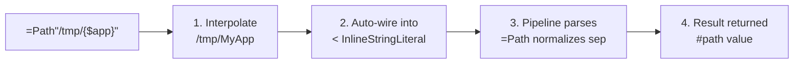

<!-- @concepts/pipelines/INDEX -->

## Inline Pipeline Calls

<!-- @types -->
An inline pipeline call evaluates a pipeline as a single value. The syntax is `=Pipeline"string"` — a pipeline reference immediately followed by a string literal. Inline calls are valid anywhere a `value_expr` is expected: assignment RHS, comparison operands, etc. See [[syntax/types/strings#`=Path"..."` Inline Notation]] for the `=Path` example.

```polyglot
[r] $dir#path << =Path"/tmp/MyApp"
[r] $msg#string << =Greeting"Hello {$name}"
[?] $dir =? =Path"/expected"
```

### Reserved Parameter: `<InlineStringLiteral#string`

Every pipeline has a reserved parameter name `InlineStringLiteral`. To accept inline calls, a pipeline must explicitly declare it in its `[=]` IO:

```polyglot
[=] <InlineStringLiteral#string <~ ""
```

The default value is `""`. When the pipeline is called inline (`=Pipeline"..."`), the compiler auto-wires the rendered string into this parameter. When called normally (via `[r]`), the default `""` applies.

### Mechanism

1. **String interpolation** — `{$var}` inside the string literal resolves first
2. **Auto-wire** — the rendered string is pushed into `<InlineStringLiteral#string`
3. **Pipeline-specific parsing** — the pipeline body interprets the string its own way (e.g., `=Path` normalizes separators, `=T.Daily` parses a time)
4. **Result returned** — the pipeline's output becomes the value of the expression



### Return Value

| Pipeline outputs | Value type |
|------------------|-----------|
| One `>output` | That output's type directly |
| Multiple `>outputs` | `#serial` with output parameter names as keys |

If the target type does not match the inline pipeline's output type, the compiler raises a type or schema mismatch error.

### Dual-Mode Pipelines

Since `<InlineStringLiteral#string` defaults to `""`, a pipeline can support both normal calls and inline calls. Guard inline-specific logic with a conditional:

```polyglot
{=} =Greeting
   [%] .description << "Generates a greeting message"
   [=] <InlineStringLiteral#string <~ ""
   [=] <name#string <~ ""
   [=] >message#string
   [t] =T.Call
   [Q] =Q.Default
   [W] =W.Polyglot
   [?] $InlineStringLiteral =!? ""
      [ ] Inline call — parse the string
      [r] $name << $InlineStringLiteral
   [?] *?
      [ ] Normal call — $name filled by caller
   [r] >message << "Hello {$name}"
```

Both calling forms work:

```polyglot
[ ] Inline call
[r] $msg#string << =Greeting"World"

[ ] Normal call
[r] =Greeting
   [=] <name << "World"
   [=] >message >> $msg
```

### Where Inline Calls Are NOT Valid

- **Chain calls** — `=>` connects pipeline references, not values. `[r] =Path"/tmp"=>=Other` is invalid (both sides would be values).
- **LHS of assignments** — inline calls produce values, they are not assignable targets.

## Call Site Rules

When calling a pipeline (via `[r]`, `[p]`, `[b]`, or chain step), the compiler enforces IO wiring constraints:

- **Assignment target** — the LHS of an assignment must be a variable, output port, or field path, not a value expression (PGE-807).
- **Required inputs** — every required `<input` (no default) must be wired by the caller. Missing a required input is PGE-808.
- **Required outputs** — every required `>output` must be captured or explicitly discarded with `$*`. Failing to capture is PGE-809.
- **IO direction** — inputs use `<<`, outputs use `>>`. Reversing the direction operator is a compile error (PGE-810).
- **IO name matching** — the parameter name at the call site must match a declared IO name on the target pipeline (PGE-110).
- **Duplicate IO** — the same IO parameter cannot be wired twice in a single call (PGE-111).

Inputs with defaults that are not addressed by the caller emit a warning (PGW-808). Outputs with defaults or fallbacks that are not captured emit a warning (PGW-809).

## Compile Rules

Pipeline structure, chain execution, and call site rules enforced at compile time. See [[compile-rules/PGE/{code}|{code}]] for full definitions.

| Code | Name | Section |
|------|------|---------|
| PGE-101 | Pipeline Section Misordering | Pipeline Structure |
| PGE-102 | IO Before Trigger | Pipeline Structure |
| PGE-104 | Macro Structural Constraints | Wrappers |
| PGE-105 | Missing Pipeline Trigger | Triggers |
| PGE-106 | Missing Pipeline Queue | Queue |
| PGE-107 | Missing Pipeline Setup/Cleanup | Wrappers |
| PGE-108 | Wrapper Must Reference Macro | Wrappers |
| PGE-109 | Wrapper IO Mismatch | Wrappers |
| PGE-110 | Pipeline IO Name Mismatch | Call Site Rules |
| PGE-111 | Duplicate IO Parameter Name | Call Site Rules |
| PGE-112 | Queue Definition Must Use #Queue: Prefix | Queue |
| PGE-113 | Queue Control Contradicts Queue Default | Queue |
| PGE-114 | Unresolved Queue Reference | Queue |
| PGE-115 | Duplicate Metadata Field | Pipeline Metadata |
| PGE-116 | Unmarked Execution Line | Execution Rules |
| PGE-117 | Wrong Block Element Marker | Execution Rules |
| PGE-118 | Tautological Trigger Condition | Triggers |
| PGE-801 | Auto-Wire Type Mismatch | Auto-Wire |
| PGE-802 | Auto-Wire Ambiguous Type | Auto-Wire |
| PGE-803 | Auto-Wire Unmatched Parameter | Auto-Wire |
| PGE-804 | Ambiguous Step Reference | Step Addressing |
| PGE-805 | Unresolved Step Reference | Step Addressing |
| PGE-806 | Non-Pipeline Step in Chain | Chain Execution |
| PGE-807 | Invalid Assignment Target | Call Site Rules |
| PGE-808 | Missing Required Input at Call Site | Call Site Rules |
| PGE-809 | Uncaptured Required Output at Call Site | Call Site Rules |
| PGE-810 | IO Direction Mismatch | Call Site Rules |
| PGW-701 | Error Handler on Non-Failable Call | Error Handling |
| PGW-801 | Auto-Wire Succeeded | Auto-Wire |
| PGW-808 | Unaddressed Input With Default | Call Site Rules |
| PGW-809 | Uncaptured Output With Default/Fallback | Call Site Rules |

## See Also

- [[concepts/pipelines/INDEX|Pipeline Structure]] — required pipeline elements and ordering
- [[syntax/types/strings|String Interpolation]] — `=Path"..."` inline notation example
- [[concepts/pipelines/chains|Chain Execution]] — where inline calls are not valid
