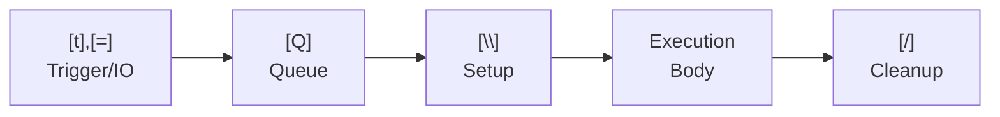

<!-- @concepts/pipelines/INDEX -->

## Wrappers

Wrappers invoke a wrapper definition (`{W}`) that provides setup/cleanup scope. Every pipeline requires `[W]` — the compiler rejects pipelines without it (PGE01007). The `[W]` line must reference a valid wrapper (PGE01008), and the IO wired at the `[W]` site must match the wrapper's `[{]`/`[}]` declarations (PGE01009).

`{W}` is a separate entity from `{M}` — wrappers are not macros. `{W}` defines wrappers (setup/cleanup scope with `[\]`/`[/]` and `[{]`/`[}]` IO), while `{M}` defines type macros (compile-time `{#}` generation). Wrappers (`{W}`) cannot contain `[t]`, `[Q]`, `[=]`, `[p]`, `[b]`, or `[*]` — these are pipeline-only elements (PGE01004). See [[blocks]] for wrapper structural constraints.

- `[\]` — macro setup, runs before the execution body
- `[/]` — macro cleanup, runs after the execution body
- `[{]` — macro input (typed variable from pipeline scope)
- `[}]` — macro output (variable exposed back to pipeline scope)

At the `[W]` usage site, macro IO is wired using `[=]` with `$` variables:

```polyglot
[W] =W.DB.Connection
   [=] $connectionString << $connStr
   [=] $dbConn >> $dbConn
```

After `[W]` wiring, the macro's `[}]` outputs (e.g., `$dbConn`) become available as `$` variables in the execution body.

Execution order: `[t],[=]` → `[Q]` → `[\]` → Execution Body → `[/]` (see [[concepts/pipelines/execution|execution]])



### Parallel Forking in Setup

`[p]` or `[b]` inside `[\]` forks a parallel execution path:

- **`[p]` with no `[*] *All` in setup** — the forked path outlives setup and runs **concurrently with the execution body**. `[/]` uses `[*] *All` with `[*] << $var` to collect the result before proceeding.
- **`[b]` in setup** — fire-and-forget. No collection in `[/]` is possible.
- Variables produced in `[\]` (including by `[p]`) are accessible in `[/]` — same principle as `$dbConn` flowing from `[\]` to `[/]` in `=W.DB.Connection`.


**Pairing constraint:** A `[p]` started in `[\]` and its `[*] *All` collector form an exclusive pair — the collection **must** appear in `[/]`, never in the execution body. The execution body runs while the `[p]` is still in-flight; only `[/]` runs after execution completes and can safely collect.

| Started in | Collected in | Valid? |
|------------|--------------|--------|
| `[\]` `[p]` | `[/]` `[*] *All` | ✓ |
| `[\]` `[p]` | Execution body `[*] *All` | ✗ — body runs while `[p]` is still in-flight |
| Execution body `[p]` | Execution body `[*] *All` | ✓ — normal parallel pattern |

```polyglot
{W} =W.Tracing
   [{] $traceId#string
   [}] $duration#string

   [\]
      [ ] Sequential: open session — blocks before body starts
      [r] =Tracer.Open
         [=] <id << $traceId
         [=] >session >> $session

      [ ] Parallel: no *All after — timer runs concurrently with body
      [p] =Tracer.StartTimer
         [=] <session << $session
         [=] >handle >> $timerHandle

   [ ] body executes here while timer is running

   [/]
      [ ] Collect the timer started in setup
      [*] *All
         [*] << $timerHandle

      [r] =Tracer.StopTimer
         [=] <handle << $timerHandle
         [=] >elapsed >> $duration

      [r] =Tracer.Close
         [=] <session << $session
```

Common wrappers:
- `[W] =W.Polyglot` — default, pure Polyglot Code (calls `=DoNothing` for setup/cleanup)
- `[W] =W.DB.Transaction` — database connection + transaction lifecycle
- `[W] =W.HTTP.Session` — HTTP client lifecycle

See [[stdlib/INDEX#Pipeline Namespaces|Wrappers]] for the full wrapper catalog.

## See Also

- [[concepts/pipelines/execution|Execution]] — execution body that runs between setup and cleanup
- [[concepts/pipelines/queue|Queue]] — `[Q]` queue that precedes the wrapper declaration
- [[concepts/collections/collect|Collect Operators]] — `*All` sync barrier used in `[/]` cleanup for parallel forking
