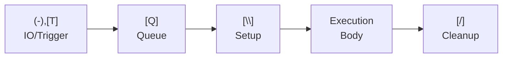
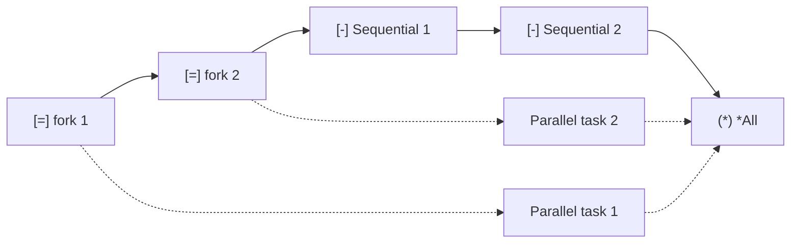

<!-- @concepts/pipelines/INDEX -->

## Wrappers

Wrappers invoke a wrapper definition (`{W}`) that provides setup/cleanup scope. Every pipeline requires `[W]` — the compiler rejects pipelines without it (PGE01007). The `[W]` line must reference a valid `{W}` wrapper definition (PGE01008), and the IO wired at the `[W]` site must match the wrapper's `(-)` IO declarations (PGE01009).

**Wrappers are THE mechanism for all runtime environments.** For Polyglot Code, wrappers provide lifecycle hooks (setup/cleanup). For foreign code (via `-RT.*` pipelines), wrappers provide the runtime environment — Python interpreter, Rust toolchain, database connections, HTTP sessions, etc. There is no other mechanism for runtime setup.

Wrappers (`{W}`) cannot contain `[T]`, `[Q]`, or `(-)` pipeline-level IO — these are pipeline-only elements (PGE01004). See [[blocks]] for wrapper structural constraints.

- `[\]` — wrapper setup, runs before the execution body
- `[/]` — wrapper cleanup, runs after the execution body
- `(-)` — wrapper IO (inputs and outputs declared with `<`/`>` prefixes)

At the `[W]` usage site, wrapper IO is wired using `(-)` with `$` variables:

```polyglot
[W] -W.DB.Connection
   (-) $connectionString << $connStr
   (-) $dbConn >> $dbConn
```

After `[W]` wiring, the wrapper's output variables (e.g., `$dbConn`) become available as `$` variables in the execution body.

Execution order: `(-),​[T]` → `[Q]` → `[\]` → Execution Body → `[/]` (see [[concepts/pipelines/execution|execution]])



### Parallel Forking in Setup

`[=]` or `[b]` inside `[\]` forks a parallel execution path:

- **`[=]` with no `(*) *All` in setup** — the forked path outlives setup and runs **concurrently with the execution body**. `[/]` uses `(*) *All` with `(*) << $var` to collect the result before proceeding.
- **`[b]` in setup** — fire-and-forget. No collection in `[/]` is possible.
- Variables produced in `[\]` (including by `[=]`) are accessible in `[/]` — same principle as `$dbConn` flowing from `[\]` to `[/]` in `-W.DB.Connection`.



**Pairing constraint:** A `[=]` started in `[\]` and its `(*) *All` collector form an exclusive pair — the collection **must** appear in `[/]`, never in the execution body. The execution body runs while the `[=]` is still in-flight; only `[/]` runs after execution completes and can safely collect.

| Started in | Collected in | Valid? |
|------------|--------------|--------|
| `[\]` `[=]` | `[/]` `(*) *All` | ✓ |
| `[\]` `[=]` | Execution body `(*) *All` | ✗ — body runs while `[=]` is still in-flight |
| Execution body `[=]` | Execution body `(*) *All` | ✓ — normal parallel pattern |

```polyglot
{W} -W.Tracing
   (-) <traceId;string
   (-) >duration;string

   [\]
      [ ] Sequential: open session — blocks before body starts
      [-] -Tracer.Open
         (-) <id << $traceId
         (-) >session >> $session

      [ ] Parallel: no *All after — timer runs concurrently with body
      [=] -Tracer.StartTimer
         (-) <session << $session
         (-) >handle >> $timerHandle

   [ ] body executes here while timer is running

   [/]
      [ ] Collect the timer started in setup
      (*) *All
         (*) << $timerHandle

      [-] -Tracer.StopTimer
         (-) <handle << $timerHandle
         (-) >elapsed >> $duration

      [-] -Tracer.Close
         (-) <session << $session
```

Common wrappers:
- `[W] -W.Polyglot` — default, pure Polyglot Code (no-op: calls `-DoNothing` for setup/cleanup)
- `[W] -W.DB.Transaction` — database connection + transaction lifecycle
- `[W] -W.HTTP.Session` — HTTP client lifecycle

See [[pglib/INDEX#Pipeline Namespaces|Wrappers]] for the full wrapper catalog.

## See Also

- [[concepts/pipelines/execution|Execution]] — execution body that runs between setup and cleanup
- [[concepts/pipelines/queue|Queue]] — `[Q]` queue that precedes the wrapper declaration
- [[concepts/collections/collect|Collect Operators]] — `*All` collect-all used in `[/]` cleanup for parallel forking
