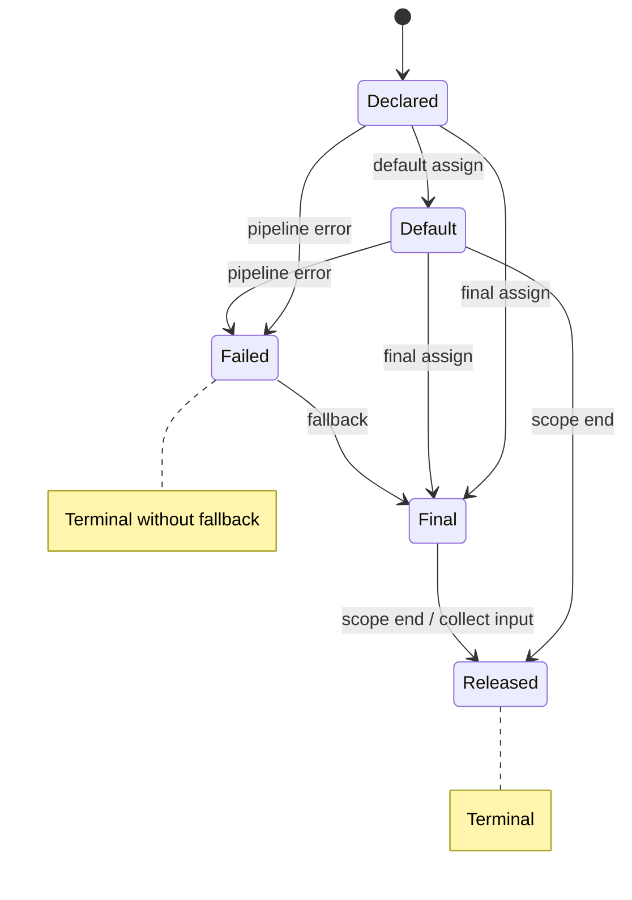

# Variable Lifecycle

<!-- @c:glossary:Polyglot Code -->
<!-- @c:identifiers -->
<!-- @c:pipelines -->
<!-- @u:technical/ebnf/14-lifecycle -->
<!-- @u:technical/edge-cases/14-lifecycle -->
<!-- @u:technical/edge-cases/20-lifecycle-gaps -->
<!-- @u:errors#Failed State -->
<!-- @u:collections/collect#Collect Operators -->
Variables in Polyglot Code ([[glossary#Polyglot Code]]) move through five lifecycle stages. Variables are [[identifiers]] with the `$` prefix. For how lifecycle applies to IO parameters, see [[concepts/pipelines/io-triggers#IO as Implicit Triggers]].

## Stages

| Stage | Description | Transitions to |
|-------|-------------|----------------|
| Declared | Variable exists but has no value | Default or Final |
| Default | Assigned via `<~` or `~>` — allows one more reassignment | Final or Released |
| Final | Assigned via `<<` or `>>` — no further assignment allowed | Released |
| Failed | The pipeline responsible for producing this variable failed with an error. The variable will never resolve. Check the source pipeline's error tree for details. **Exception:** if a `!<` fallback is declared, the variable becomes Final with the fallback value instead — see [[errors#Error Fallback Operators]] | — |
| Released | Variable is out of scope and no longer accessible | — |



### Declared

A variable enters the Declared stage when it appears in a block without an assignment operator. It exists but holds no value. Pulling (reading) from a Declared variable is a compile error (PGE02002).

### Default

A variable enters the Default stage when assigned with a default assignment operator (`<~` or `~>`). A default-assigned variable allows **one more** push (which promotes it to Final). A second default assignment without a Final in between is a compile error (PGE02004).

**Pull promotes to Final:** When a Default variable is pulled (read by another operation), it automatically transitions to Final — the default value is accepted as the resolved value. No explicit final push is needed.

### Final

A variable enters the Final stage when assigned with a final assignment operator (`<<` or `>>`). Once final:
- **No more pushes** are allowed — any further assignment is a compile error (PGE02003)
- **Pulling** values is allowed unlimited times, as long as the variable is not released

### Failed

A variable enters the Failed stage when the pipeline responsible for producing its value terminates with an error. A failed variable will never resolve — it cannot transition to any other stage (PGE02005). Downstream pipelines waiting on a failed variable will not fire. Inspect the source pipeline's error tree (see [[concepts/pipelines/metadata#Error Trees]]) for details on the failure.

**Fallback override:** If the IO line has a `!<` / `!>` fallback declared (see [[errors#Error Fallback Operators]]), the variable bypasses the Failed stage entirely and becomes **Final** with the fallback value. The error that would have caused the Failed state is accessible via `$var%sourceError` metadata (see [[metadata#Variable (`$`)]]).

### Released

A variable is released when:
- Its definition scope ends (block indentation returns to parent level)
- It is collected via a `*` collection operator — see [[concepts/collections/collect#Collect Operators]]

Any access to a Released variable is a compile error (PGE02008). Code that can only execute after a variable is released is flagged as unreachable (PGE02009).

## Querying Lifecycle State

Variable lifecycle state is queryable at runtime via the `%` metadata accessor:

```polyglot
[?] $myVar%state =? #VarState.Default
   [-] ...
[?] $myVar%state =? #VarState.Failed
   [-] ...
[?] *?
   [-] ...
```

`$varName%state` returns a `#live.#VarState` value — reading from `%$:{name}:{instance}.state` in the metadata tree (see [[data-is-trees#How Concepts Connect]]). The `live` field is always readable and does not follow the standard lifecycle (it is managed by the runtime). The `#VarState` enum maps directly to the stages above: Declared, Default, Final, Failed, Released. See [[metadata]] for the full metadata tree and all `live` fields.

## Assignment Operators

<!-- @u:operators -->
All assignment operators are directional — the arrow indicates data flow direction between source and destination. See [[operators]] for the full operator table.

| Operator | Type | Direction | Example | Reading |
|----------|------|-----------|---------|---------|
| `<<` | Final (PushLeft) | Right to left | `$x#int << 3` | "PushLeft 3 into $x" |
| `>>` | Final (PushRight) | Left to right | `>array >> $arr` | "PushRight >array into $arr" |
| `<~` | DefaultPushLeft | Right to left | `.field#string <~ "value"` | "DefaultPushLeft \"value\" to .field" |
| `~>` | DefaultPushRight | Left to right | `>output#string ~> ""` | "DefaultPushRight >output to empty string" |
| `!<` | FallbackPushLeft (Error) | Right to left | `!< "fallback"` | "On error, FallbackPushLeft into output" |
| `!>` | FallbackPushRight (Error) | Left to right | `"fallback" !> >output` | "On error, FallbackPushRight outward" |

## Examples

### Default Assignment — Pipeline IO

```polyglot
...
{-} -Example1
[ ] Daily trigger at 3AM
[T] -DT.Daily"3AM"
[ ] Pipeline IO
(-) <file#path <~ "\tmp\example1.txt"
(-) >output#string ~> ""
...
```

### Default and Final Assignment — Data Fields

```polyglot
...
{#} #CustomDataType
[ ] Data fields with default values
[.] .field1#string <~ "default value"
[.] .field2#int <~ 0
[ ] Data fields with final values
[.] .field3#string << "final value"
[.] .field4#int << 100
...
```
