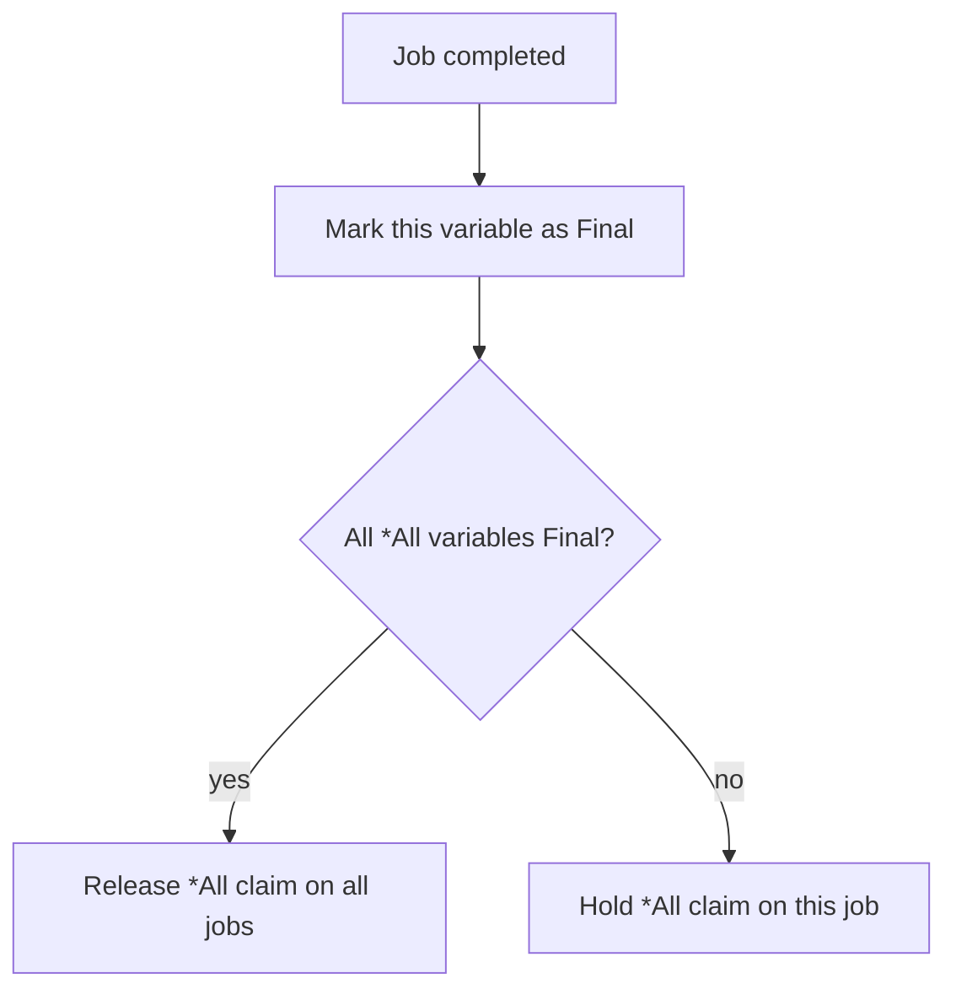

# *All

Waits for ALL listed variables to reach Final state. Uses `(*) <<` only -- no `(*) >>` output. All variables stay accessible after the barrier completes.

No type constraint on inputs.

## Syntax

```polyglot
(*) *All
   (*) << $profile
   (*) << $history
```

## Inputs

| Name | Type | Description |
|------|------|-------------|
| `<< $var` | any | Variable to wait for (repeat for each) |

## Outputs

None. All waited variables remain accessible in their original bindings.

## Job Reconciliation

Algorithm for THIS job when it completes:



- **Not last:** `*All` holds its claim — this job stays referenced
- **Last to arrive:** `*All` releases claims on all jobs; variables stay accessible

The TM sends a kill signal to a job only when all collector claims on it have been released. See [[concepts/collections/collect#Compound Collector Strategies]].

## Errors

None.

## Permissions

None.

## Related

- [[pglib/collectors/Sync/INDEX|Collect-All & Race Collectors]]
- [[pglib/collectors/Sync/First|*First]] -- race alternative
- [[concepts/collections/collect|Collect Operators]]
