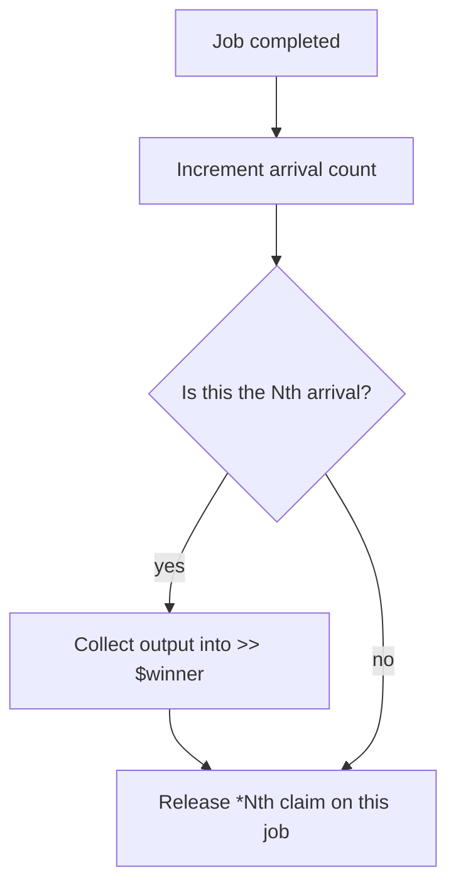

# *Nth

Generic race collector -- waits for the Nth arriving value and cancels all remaining inputs. All `(*) <<` inputs must be the same type.

`*First` is sugar for `*Nth` with n=1. `*Second` is sugar for `*Nth` with n=2.

## Syntax

```polyglot
[*] *Nth
   (*) <n << 2
   (*) << $candidateA
   (*) << $candidateB
   (*) << $candidateC
   (*) >> $winner
```

## Inputs

| Name | Type | Description |
|------|------|-------------|
| `<n` | `#int` | Which arrival to capture (1-based) |
| `<< $var` | same type | Race candidate (repeat for each) |

## Outputs

| Name | Type | Description |
|------|------|-------------|
| `>> $var` | same as inputs | The Nth value to arrive |

## Aliases

| Alias | Equivalent |
|-------|-----------|
| `*First` | `*Nth` with n=1 |
| `*Second` | `*Nth` with n=2 |

## Job Reconciliation

Algorithm for THIS job when it completes:



- **Nth arrival:** output collected, claim released
- **Before Nth:** claim released, output unused by this collector

The TM sends a kill signal to a job only when all collector claims on it have been released. See [[concepts/collections/collect#Compound Collector Strategies]].

## Errors

None.

## Permissions

None.

## Related

- [[pglib/collectors/Sync/INDEX|Collect-All & Race Collectors]]
- [[pglib/collectors/Sync/First|*First]] -- n=1 sugar
- [[pglib/collectors/Sync/All|*All]] -- collect-all alternative
