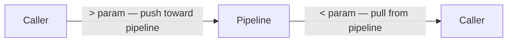

# IO Parameters

<!-- @operators -->
<!-- @pipelines -->
<!-- @identifiers -->
Input and output parameters bind data into and out of operators. IO labels are [[identifiers#Serialized Identifiers]]. Assignment uses [[operators]] (`<<`, `>>`, `<~`, `~>`). For how IO assignment mode controls pipeline triggering, see [[concepts/pipelines/io-triggers#IO as Implicit Triggers]]. IO ports live as nested typed sections in the metadata tree at `%-:{name}:{instance}.<` (inputs) and `.>` (outputs) — see [[data-is-trees#IO Ports — Nested Typed Sections]].

## IO Labels

| Prefix | Direction | Example |
|--------|-----------|---------|
| `<` | Input | `<array`, `<InputParameter1` |
| `>` | Output | `>item`, `>OutputParameter1` |

IO labels are serialized identifiers — like all Polyglot identifiers, they follow the `.` (fixed) and `:` (flexible) field separator rules. See [[identifiers#Serialization Rules]].



## IO Line Pattern

```polyglot
[operator-ref] <param << source
[operator-ref] >param >> target
```

The statement marker echoes the parent operator's prefix:
- `(-)` — IO line for a pipeline (`-`)
- `(=)` — IO line for a collection-expand operator (`=ForEach`)
- `(*)` — IO line for a collection-collect operator (`*`)

**Scoping rule:** IO markers (`(-)`, `(=)`, `(*)`) always scope to their parent operator via indentation — they are not tied to a fixed structural position. `(-)` means "IO for a pipeline reference (`-`)" wherever it appears: top-level pipeline IO, nested under `[Q]` for queue parameters, under `[W]` for wrapper wiring, or under `[-]`/`[=]`/`[b]` for call-site IO. The same principle applies to `(=)` (expand operator IO) and `(*)` (collect operator IO).

## IO Inputs as Variables

IO inputs declared with `(-)` become `$`-prefixed variables in the execution body once filled. There is no need to redeclare them:

```polyglot
(-) <incoming#Alert
[ ] ...execution...
[ ] Use directly as $incoming — it's already Final
[?] $incoming.level >? 5
```

IO inputs with no assignment must be filled externally and are in Final state when the pipeline fires. See [[concepts/pipelines/io-triggers#IO as Implicit Triggers]], [[variable-lifecycle]].

## Error Declaration

<!-- @errors:Declaring Pipeline Errors -->
Pipelines that can raise errors declare them in the IO section using `(-) !ErrorName`:

```polyglot
(-) <name#string
(-) >validated#string
(-) !Validation.Empty
(-) !Validation.TooLong
```

Error declarations use the same `(-)` marker as inputs (`<`) and outputs (`>`). The `!` prefix identifies them as error declarations. See [[errors#Declaring Pipeline Errors]] for compiler enforcement rules.

## Pipeline Call

<!-- @pipelines:Error Handling -->
Pipeline calls use `[-]` execution with `(-)` IO lines. Error blocks `[!]` scope under the call — see [[concepts/pipelines/error-handling#Error Handling]]. For pglib pipelines that need no import, see [[packages#Usage]].

```polyglot
[-] -Pipeline.Name
   (-) <InputParameter1 << ...
   (-) >OutputParameter1 >> ...
```

## Chain IO Addressing

<!-- @pipelines:Chain Execution -->
In chain execution (`[-] -A->-B->-C`), IO parameters are addressed by step reference — a numeric index (0-based) or pipeline leaf name, followed by `.` and the parameter name. See [[concepts/pipelines/chains#Chain Execution]] for full chain semantics.

`<` and `>` always describe the port from the pipeline's own viewpoint — `<` marks the pipeline's input, `>` marks its output — whether in a definition, a call site, or a chain step reference.

The direction convention is **pipeline-perspective**:

| Prefix | Meaning | Example |
|--------|---------|---------|
| `>N.param` | Push into step N's input | `>0.path << $file` |
| `<N.param` | Pull from step N's output | `<1.result >> >output` |
| `>LeafName.param` | Push into step by leaf name | `>Read.path << $file` |
| `<LeafName.param` | Pull from step by leaf name | `<Parse.rows >> >output` |

**Wiring between steps:** Connect one step's output to the next step's input with a single `(-)` line:

```polyglot
(-) <0.outputResult >> <1.inputParam
```

This reads: "from step 0's output, feed step 1's input." Both sides use the pipeline-perspective `<`/`>` convention.

**Auto-wire:** When adjacent steps have exactly one output and one input of the same type, the `(-)` wire line can be omitted. See [[concepts/pipelines/chains#Auto-Wire]].

**Error references** in chains also use step addressing: `!0.ErrorName` or `!LeafName.ErrorName`. See [[concepts/pipelines/chains#Error Handling in Chains]].

## Collection Operators

<!-- @collections -->
Two operator prefixes for collection processing. For the full operator reference and semantics, see [[concepts/collections/INDEX|collections]].

| Prefix | Operation | Example |
|--------|-----------|---------|
| `=ForEach` | Expand (iterate) | `=ForEach.Array` — iterate over collection |
| `*` | Collect (aggregate) | `*Into.Array` — collect results into collection |

These are **operators**, not identifier prefixes. The 5 identifier prefixes (`@`, `#`, `-`, `$`, `!`) remain unchanged.

### Example: Transform an Array

```polyglot
[-] =ForEach.Array
   (=) <Array << $SomeArray
   (=) >item >> $item
   [ ]
   [ ] Here we can do something with the $item
   ...
   [-] *Into.Array
      (*) <item << $item
      (*) >Array >> $NewArray
   [ ] $NewArray can be used one level up in the pipeline
```

### Wait and Collect IO

Inside `(*)` collector blocks, the `<<`/`>>` direction operators distinguish wait inputs from collect outputs:

| Form | Semantics |
|------|-----------|
| `(*) << $var` | **Wait input** — waits for `$var` to be Final. Variable **stays accessible** after. |
| `(*) >> $var` | **Collect output** — in race collectors, losing inputs are **cancelled**; only the `>>` output survives. |

This is the same `<<`/`>>` direction convention used throughout the language:

| Context | `<<` (input / push-left) | `>>` (output / push-right) |
|---------|--------------------------|----------------------------|
| Pipeline IO `(-)` | `<input << $var` — push-left value, waits for Final | `>output >> $result` — push-right, makes Final |
| Expand IO `(=)` | `<Array << $items` — push-left collection in | `>item >> $item` — push-right each item out |
| Collect IO `(*)` | `(*) << $var` — waits for Final, var stays accessible | `(*) >> $out` — receives collected value, inputs cancelled |

See [[concepts/collections/collect#Collect-All & Race Collectors]] for the collectors that use these forms.

> **Disambiguation:** `(*) <<` / `(*) >>` (collector IO) and `(>)` / `(<)` (IO parameter handling) are distinct marker sets. `(*) <<` / `(*) >>` appear inside `(*)` collector blocks for wait/race semantics. `(>)` / `(<)` appear under `(-)` IO lines for parameter handling (e.g., error fallback). See [[#IO Parameter Handling]].

### Direct Output Port Writing

Collector outputs can write directly to a pipeline output port using the `>` prefix:

```polyglot
[-] *Agg.Concatenate
   (*) <string << $value
   (*) >result >> >pipelineOutput
```

The target output port reaches **Final** state after the collector writes to it — no other push to that port is allowed. See [[variable-lifecycle#Final]].

## IO Parameter Handling

<!-- @errors:Error Fallback Operators -->
<!-- @operators -->
The `(>)` (output) and `(<)` (input) block markers handle IO parameters scoped under `(-)` IO lines (see [[blocks#Data Flow]]). Currently, fallback is the primary use case: providing a value when a pipeline call errors, preventing the variable from entering the Failed state. Fallback uses the `<!` / `!>` operators (see [[operators#Assignment Operators]]).

### Fallback Line Pattern

```polyglot
(>) <! value_expr
(>) <!Error.Name value_expr
```

`(>)` lines are indented under the `(-)` output line they belong to — the output reference is implicit from indentation scope:

```polyglot
[-] -File.Text.Read
   (-) <path << $file
   (-) >content >> $out
      (>) <! "generic fallback"
      (>) <!File.NotFound "file not found"
      (>) <!File.ReadError "read error"
```

| Form | Meaning |
|------|---------|
| `(>) <! value` | **Generic fallback** — activates for any unhandled error |
| `(>) <!Error.Name value` | **Error-specific fallback** — activates only for the named error |

When a fallback activates, the target variable becomes **Final** with the fallback value (not Failed). The error is accessible via `$var%sourceError` metadata. See [[errors#Error Fallback Operators]] for the full execution model and [[variable-lifecycle#Fallback]] for lifecycle semantics.

### Scoping Rules

- `(>)` / `(<)` must be **indented under** an `(-)` IO line — they inherit the output/input reference
- One generic `<!` per output — duplicates are PGE07003
- One `<!Error.Name` per specific error per output — duplicates are PGE07003
- Fallback values can be any `value_expr`: literals, `$` variables, inline pipeline calls

### Chain Execution Exception

In chain execution, fallback uses the `(-)` explicit form with step addressing (since `(>)`/`(<)` cannot carry step references):

```polyglot
[-] -File.Text.Read->-Text.Parse.CSV
   (-) >0.path << $file
   (-) <1.rows >> $rows
   (-) <0.content <! ""
   (-) <1.rows <! ""
   [!] !0.File.NotFound
      (-) <0.content <! "missing"
```
