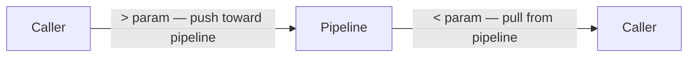

# IO Labels & Line Pattern

<!-- @u:operators -->
<!-- @c:pipelines -->
<!-- @c:identifiers -->
<!-- @u:technical/ebnf/07-io-parameters -->

## IO Labels

| Prefix | Direction | Example |
|--------|-----------|---------|
| `<` | Input | `<array`, `<InputParameter1` |
| `>` | Output | `>item`, `>OutputParameter1` |

IO labels are serialized identifiers — like all Aljam3 identifiers, they follow the `.` (fixed) and `:` (flexible) field separator rules. See [[identifiers#Serialization Rules]].



## IO Line Pattern

```aljam3
[operator-ref] <param << source
[operator-ref] >param >> target
```

The statement marker echoes the parent operator's prefix:
- `(-)` — IO line for a pipeline (`-`)
- `(=)` — IO line for a collection-expand operator (`=ForEach`)
- `(*)` — IO line for a collection-collect operator (`*`)
- `(_)` — IO line for a generic permission template (`__`). See [[permissions#__ Generic Permissions]]

**Scoping rule:** IO markers (`(-)`, `(=)`, `(*)`, `(_)`) always scope to their parent operator via indentation — they are not tied to a fixed structural position. `(-)` means "IO for a pipeline reference (`-`)" wherever it appears: top-level pipeline IO, nested under `[Q]` for queue parameters, under `[W]` for wrapper wiring, or under `[-]`/`[=]`/`[b]` for call-site IO. The same principle applies to `(=)` (expand operator IO), `(*)` (collect operator IO), and `(_)` (permission IO for `__` generic permission templates).
